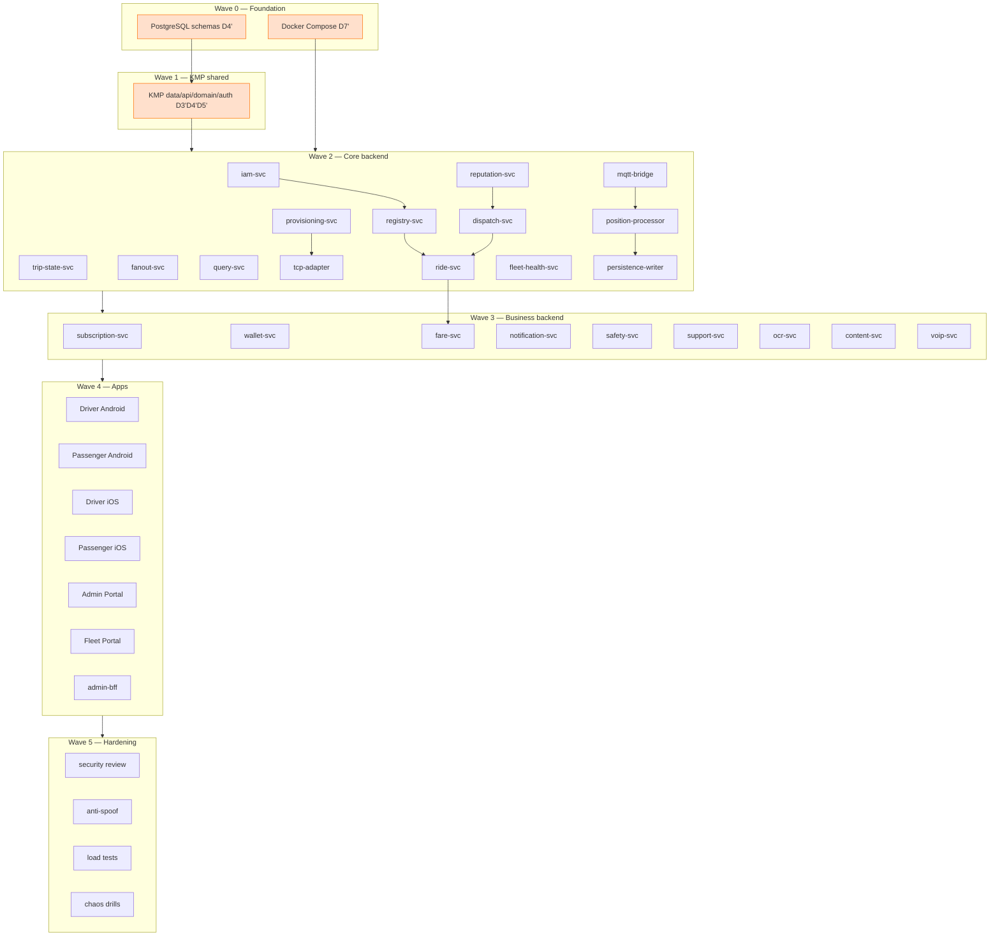

# B0 — D1′–D7′ Consolidation & Reconciliation Report

> **🔄 Updated for ADD v2.6 / URD v2.2 (ADD §1.8 AL-01…AL-16).** **D-DRIFT-1 (vehicle-type taxonomy) is now RESOLVED** by the canonical enumeration AL-09 (car→sedan; Flex/Mini Van get their own fare rows; +truck/mini_truck): `registry.vehicles`, `fares.tariffs`, `billing.plans`, and the `ride-svc`/`fare-svc` `vehicleType` enum now use one set. The D1′–D7′ docs were also aligned for the other v2.6 deltas: reseller→driver capability (AL-01), single Admin Portal + Fleet Portal Phase 1 (AL-02/03), bank-transfer top-up removed (AL-05), nine-role RBAC + auth scoping + single-active-device-per-app (AL-06/07/08), insurance all modes (AL-10), passenger settings (AL-14), LankaQR Pay deep link (AL-15), cancellation rule (AL-16). Open DRIFTs reduced to **2** (D-DRIFT-2 tracker-adapter naming, D-DRIFT-3 MQTT TTL — both LOW, unrelated to v2.6).

> **🔄 Change 6/22 — driver-onboarding restructure applied across D1′–D7′ + URD/ADD + wireframes.** Driver onboarding is split into **driver-identity Profile Setup** (name + **required** photo + DL front/back; precedes Home, no vehicle) and an **optional, in-app, Mode-C-only 4-step vehicle onboarding** (type+reg · insurance · revenue licence · front/back photos) **auto-verified by Gemini Flash 3.0 → auto-approved** (Verification Officer only for Pending). `SCR-DA/DI-005` is **removed**; new screens `003a`, `004a/b/c`, `006` (4-doc status), `026a` (empty-state popup). **Mode A/B vehicles + permits → Fleet Portal.** Go-Online **gated** until a vehicle is available. Launch cities move to **`config.operating_cities`** (`GET /config/cities`, admin-managed) + `iam.users.operating_city_code`. See ADD **AL-27**, URD **US-1.3a / US-2.21–2.25**, D4 **§17b**.

> **Phase B.5 gate** between Phase B (transformed specs) and Phase C (implementation).
> Produced by reading all seven D′ docs in full + ADD v2.4 / URD v1.3 / lightweight-production-replica
> as tie-breakers. **No D′ document was modified** — this is a report with exact `file:section`
> citations + a corrections backlog a later edit pass can apply.
>
> Inputs read: `D1_mageride_user_flows.md` (728 ln), `D2_mageride_ui_spec.md` (1172 ln),
> `D3_mageride_api_contracts.md` (735 ln), `D4_mageride_data_model.md` (996 ln),
> `D5_mageride_business_logic.md` (599 ln), `D6_mageride_integration.md` (475 ln),
> `D7_mageride_devops.md` (504 ln).

---

## §1. Executive Scorecard

| Category | Count | Worst example |
|----------|-------|---------------|
| **BLOCKER** (Phase C cannot start) | **0** | — none; C01 (PostgreSQL schemas) + foundation/KMP/iam waves are buildable today |
| **DRIFT** (naming/shape mismatch across docs) | **2** ~~3~~ | ~~Vehicle-type taxonomy splits 3 ways~~ — **RESOLVED (AL-09)**: one canonical set, car→sedan, Flex/Mini Van have own fare rows. Remaining: D-DRIFT-2/3 (LOW) |
| **GAP** (missing coverage vs gate) | **3** | No aggregated `mageride-specs/traceability_matrix.md` (methodology B-rollup gate) exists on disk |
| **OK** (gate passed) | **18+** | All 18 ADD §9 schemas have DDL; ride/payment state enums align across D3′/D4′/D5′; every D2′ screen has Android+iOS variant |

### Go / No-Go verdict for Phase C

**GO-WITH-FIXES.** The seven specs are internally coherent and unusually well-aligned: the ride-state
machine, payment-state machine, money representation (integer minor units), H3 geocell parameters
(res-7 + ring(2)), offer TTL (15 s), directional limits, OTP lengths, and the 18-schema bounded-context
map are **consistent across documents**, and every Phase-A `[UNVERIFIED]`/`[DELTA:*]` marker is a
*resolution annotation*, not an open item (verified by grep — see §3.1). **Zero hard BLOCKERs** prevent
starting Phase C at Wave 0 (PostgreSQL schemas, Docker Compose) or Wave 1 (KMP shared, iam-svc).
However, **one high-priority DRIFT (B1, vehicle-type taxonomy) must clear before the business-services
wave** — specifically before `fare-svc` (Phase-C #28) and `subscription-svc` (#26), which currently
disagree on which vehicle types exist and how they are priced/charged. The two naming drifts (B2, B3)
should be normalised before the affected Phase-C prompts are assembled to avoid generating
inconsistent code.

---

## §2. Cross-Document Drift Matrix

| ID | Concept | Doc A says | Doc B says | Authority | Recommended fix |
|----|---------|-----------|-----------|-----------|-----------------|
| **D-DRIFT-1** | **Vehicle-type taxonomy** ✅ **RESOLVED (AL-09)** | _(was: `fares.tariffs` priced 4 types incl. `car`)_ | _(was: `billing.plans`/`registry.vehicles` had different sets, no `car`)_ | **URD §1.B v2.2 / ADD §1.8 AL-09** | **Done:** one canonical enumeration — `motorbike, three_wheeler, flex, sedan, mini_van, van` (+`truck, mini_truck` delivery, +`bus, train` Mode A); **"car"→"sedan"**; Flex (130/90) & Mini Van (150/110) now have their **own** `fares.tariffs` rows. Applied to D4 §2 CHECK + §19 seeds, D5 §1.1 table, D3 `vehicleType` enums, D2 markers, D1 markers. |
| **D-DRIFT-2** | **Tracker-adapter service name** (LOW) ✅ **RESOLVED (2026-07-26)** | _(was: D3′ Part 1 service map + interface note called it **`tracker-adapter-svc`**)_ | D6′ graph + body and D7′ compose/manifests call it **`tcp-adapter`** / `tcp-adapter-svc` (D6 ln 33, 212; D7 §2.1 ln 55, §3 ln 147, §5) | replica = **`tcp-adapter`** | **Done:** **`tcp-adapter`** is the canonical container/service name everywhere; "tracker-adapter-svc" survives only as a parenthetical alias. Applied to D3′ (Part-1 row + interface heading + T-01 traceability row), **ADD §6 + T-01 + §19 phase checklists**, and D1′ §B ingest note. Build component = **C043 `tcp-adapter`**. |
| **D-DRIFT-3** | **MQTT session JWT TTL** (LOW) | D1′ §B.11 states a flat **"MQTT JWT (24 h TTL)"** (D1 ln 561) | D3′ §0, D5′ §14.2, D6′ §3.2 all state **`TTL = max(active-ride + 2h, 4h)`** (E-02) | ADD **E-02** → `max(ride+2h, 4h)` | Edit D1′ ln 561 "24 h TTL" → "TTL = max(active-ride + 2 h, 4 h) (E-02)". D1′ is the user-flow narrative; the three authoritative specs already agree. |
| D-NOTE-4 | `ride.events` partition key | D6′ §2 prose: "Partition key = `vehicleId`" (D6 ln 102) | D6′ §2.1 topic table: `ride.events`/`dispatch.events` keyed by **`rideId`**, only telemetry by `vehicleId` (D6 ln 112–113) | the table (more specific) | Soften the §2 blanket sentence to "default partition key `vehicleId`; ride/dispatch topics keyed by `rideId` (see §2.1)". Internal to D6′; not cross-doc. |

**Concepts checked and found CONSISTENT (no drift):**

- **Ride-state machine** — `rides.rides` CHECK enum (D4 §5 ln 351–355 / §18 ln 834) ↔ D5′ §6 mermaid + §7 matrix ↔ D3′ cancel/accept response strings (`CancelledByRiderAfterAccept`, `Accepted`, etc.) ↔ D1′ Appendix-B.2 references. All 18 state names match exactly.
- **Payment-state machine** — `fares.ride_payments` CHECK (D4 §9 ln 600–602 / §18 ln 836) ↔ D5′ §8.1 mermaid ↔ D3′ `fare/pay` (`Initiated→…→FellBackToCash`). Match.
- **Money** — integer minor units (Rs×100), `*_minor INTEGER CHECK ≥ 0`, `currency 'LKR'`, OnePay +5% surcharge — uniform across D3′ §0, D4′ §0, D5′ §1.3, D2′ payment screens.
- **Geocell** — passenger view H3 **res-7 + ring(2) = 19 cells**, dispatch pre-filter res-5 — D1′ A.3, D5′ §3.1/§5.4, D6′ §5.1, D7′ `Geocell__Res=7`. Match (R-06).
- **Offer TTL 15 s / global timeout 120 s** — D3′ dispatch, D5′ §3.5, D6′ §2.2, D7′ `Dispatch__OfferTtlSec=15`/`GlobalTimeoutSec=120`. Match.
- **Directional constants** — θ_max 45°, detour 2 km, progress 250 m, 2 uses/day, 2 h — D4′ `dispatch.directional_config` (ln 512–516), D5′ §12, D3′ admin config. Match.
- **OTP lengths** — login OTP **6-digit**; package pickup/delivery OTP **4-digit HMAC, max 5 attempts** — D3′ (ride-svc + iam), D4′ `rides.rides` otp columns, D5′ §11/§14.1. Match.
- **MQTT topic tree** — `veh/{vehicleId}/pos/live|pos/replay|cmd|status` + 5 msg/s ceiling — D1′ §B.11, D3′ §3.2, D6′ §3.1. Match.
- **Event/topic registry** — `telemetry.raw|normalized`, `ride.events`, `dispatch.events`, `trip.events`, `audit.events`, transactional outbox + LISTEN/NOTIFY — D6′ §2.1 ↔ D5′ "events emitted" ↔ D3′ "Side Effects". Match.
- **Screen IDs** — every D2′ `SCR-PA/PI/DA/DI-###` cites its D1′ parent flow; the D1′ screen inventory (A.1/B.1) and D2′ screen set correspond. No orphan screens detected in the sampled set.
- **Service inventory** — D3′ Part-1 service map ↔ D6′ §1 dependency graph ↔ D7′ §4.2 per-service env list (19 domain services) ↔ replica container layout. Consistent apart from D-DRIFT-2.
- **Currency/locale hygiene** — no stray `₹`, `+91`, Hindi/Kannada, Juspay, Google Maps, or Beckn/ONDC as *live* design elements in any D′ (all appear only as "[DELTA:…] resolved/dropped" annotations).

---

## §3. Phase-B Quality-Gate Verification

### 3.1 Residual markers scan — ✅ PASS

`grep` for `[UNVERIFIED] | [INCOMPLETE] | [UNRESOLVED] | [TODO] | [TBD]` across all 7 specs returns
**~45 hits, all of which are resolution annotations** ("resolves NY `[UNVERIFIED]` …") or end-of-doc
"0 `[INCOMPLETE]` markers" statements — **zero genuine open items**. Likewise every `[DELTA:*]` token
appears as "… [DELTA:INDIA] resolved/dropped" prose, never as an unresolved flag.
⚠️ *Editor note:* a naïve future grep will still match these annotation strings — do not treat them as
open work.

| Gate | Status | Evidence |
|------|--------|----------|
| Every `[DELTA:*]`/`[UNVERIFIED]` resolved | ✅ | §3.1 above; each doc's "Verification & Caveats Summary" enumerates resolutions (e.g. D6′ ln 463 "Resolved Phase-A `[UNVERIFIED]` (9)") |
| Every URD story (Epics 1–19) traceable to ≥1 D′ | ⚠️ **partial** | Each D′ carries its own Traceability Addendum (D1′ ln 631–687, D3′ ln 644–684, D4′ ln 907–939, D5′ ln 521–549, D6′ ln 407–430). Per-doc coverage looks complete for P0/P1. **But the aggregated cross-join (`traceability_matrix.md`) does not exist** — see GAP-G1. Epic 13 (fleet) / Epic 11 surfaces are thin (Phase-2). |
| Every ADD §6 service has API contracts in D3′ | ✅ | D3′ Part-1 maps every service; endpoint catalog covers iam, registry, provisioning, trip-state, ride, dispatch, reputation, fare, subscription, wallet, query, safety, support, content, voip, notification, fleet, admin-bff, pdpa, version-check |
| Every ADD §9 schema has DDL in D4′ | ✅ | All **18** schemas present with CREATE TABLE + indexes (D4′ §1–§17 + §18 enums + §19 seed); coverage table D4′ ln 941–943 |
| Platform split: every D2′ screen has Android + iOS | ✅ | Every screen carries dual `SCR-*A-###` / `SCR-*I-###` IDs + per-platform Compose/SwiftUI component rows; Section C platform matrix (D1′ ln 601–620, D2′ §0) |
| Currency Rs · phones +94 · languages Si/Ta/En | ✅ | Uniform; enum `language CHECK (si,ta,en)` (D4′ ln 85); `^\+947\d{8}$` (D5′ §14.1); content templates seeded Si/Ta/En (D4′ ln 864–867) |
| KMP shared-module boundary stated | ✅ | D1′ Section C (ln 595–625) + D2′ §0.1: shared = DTOs/Ktor/domain state machines/validators/H3/adaptive-rate/JWT; native = GPS, MQTT, map SDK, attestation, payment deep-links, VoIP |

---

## §4. ADD Critique-Item Roll-Up (v2.0 → v2.4)

Aggregated from the per-document coverage checklists (D1′ ln 691–702, D3′ ln 688–711, D4′ ln 947–978,
D5′ ln 553–581, D6′ ln 434–454, D7′ ln 471–484). **No item is marked ✅ in one doc and ❌/absent in a
doc it was also routed to.** Representative routing (every in-scope item ✅ in every doc it belongs to):

| Item | Expected docs | Covered in | Status |
|------|---------------|-----------|--------|
| D-03 driver/vehicle exclusivity | D4′,D5′ | D4′ `ux_sessions_active_driver`, D5′ §2.1/§3.2 | ✅ |
| D-04 reputation-svc | D3′,D4′,D5′ | D3′ gRPC proto, D4′ reputation.*, D5′ §3.2/§4.3 | ✅ |
| D-05 cross-trip Rs 50 settlement | D5′ | D4′ `cancellation_penalties` + D5′ §7.1 | ✅ |
| D-06 Job Board ST_DWithin | D3′,D5′,D6′ | D3′ job-board 30km, D5′ §3.7, D6′ §5.1 | ✅ |
| D-09 double-entry ledger | D4′ | `billing.accounts/journal_entries/journal_postings` + balanced trigger | ✅ |
| D-10 payment state machine | D3′,D5′ | D3′ fare/pay, D5′ §8.1, D4′ enum | ✅ |
| D-11 OnePay merchant onboarding | D3′,D4′ | D3′ `/internal/.../merchant`, D4′ `registry.driver_payouts` | ✅ |
| D-13 daily-fee idempotency | D4′ | `billing.daily_fee_charges` PK (driver,vehicle,fee_date) Asia/Colombo | ✅ |
| D-17/D-21 EMQX rate-limit + JWKS cache | D6′ | §3.2/§3.3 | ✅ |
| D-22/D-23 Mode-B entitlement | D5′,D6′ | D6′ §5.2 `share:{userId}` + RemoveFromGroupAsync | ✅ |
| D-24/D-25 VoIP + masked-SMS fallback | D3′,D6′,D7′ | voip-svc + §6 | ✅ |
| D-26 content-svc Si/Ta/En | D3′,D4′ | content-svc + `content.*` tables | ✅ |
| D-29/D-30/D-31/D-32 auth/attestation/version/OTP | D3′,D5′ | §0 conventions + iam-svc | ✅ |
| D-33 SOS p99 ≤5s dual gateway | D3′,D5′,D6′ | safety-svc + §7.3 | ✅ |
| D-34/D-35/D-36 trip-share/audit/redaction | D3′,D4′,D5′,D6′ | covered | ✅ |
| R-01..R-20 (ride aggregate, atomic accept, grace, replay, …) | D1′,D3′,D4′,D5′,D6′ | D5′ §6/§7 + D4′ §5/§6 + D3′ ride-svc | ✅ |
| E-01..E-10 (offer push, MQTT JWT, doc-expiry, Kalman, refund, PDPA, anti-collusion, shared-sub, outbox, tip) | D3′–D7′ | covered | ✅ |
| P-01..P-15 proxy + package | D1′,D3′,D4′,D5′,D6′ | D5′ §10/§11 + schema + endpoints | ✅ |
| T-01..T-12 tracker plane | D3′,D4′,D6′,D7′ | provisioning + tcp-adapter + telemetry hypertable | ✅ (naming: D-DRIFT-2) |
| DT-01..DT-08 directional | D1′,D3′,D4′,D5′ | dispatch directional + `directional_filters` | ✅ |

**Minor orphan (GAP-G3):** `rides.rides` enum includes `NoShowDriver` (D4′ ln 355/834) but D5′ §6/§7
defines no transition *into* `NoShowDriver` (driver-side no-show is modelled as `CancelledByDriver`).
Either add the transition to D5′ §7 or drop the unreachable state from the D4′ CHECK.

---

## §5. Phase-C Build-Order & Dependency Map

> ⚠️ **SUPERSEDED (2026-07-26) — historical reference only.** The authoritative build order is
> **`build/manifest.yaml`** (132 components, waves 0–6) with its generated prompts and
> `build/progress.md`. The wave numbering below is *not* the manifest's: this map's "Wave 4 — Apps"
> corresponds to manifest waves 4a/4b/4c, and its "Wave 5 — Hardening" to manifest wave 6.
> Read this section for the *dependency reasoning* and the D′-section paste list, not for scope.

**Recommended implementation sequence (waves). D′ sections each Phase-C prompt should paste:**

| Wave | Component | Depends on | D3′§ | D4′§ | D5′§ | D6′§ |
|------|-----------|-----------|------|------|------|------|
| 0 | PostgreSQL schemas | — | — | §1–§19 (all DDL+seed) | — | — |
| 0 | Docker Compose dev | — | — | — | — | D7′ §3 |
| 1 | KMP shared (data/api/domain/auth) | Wave 0 | §0 conventions, all DTO shapes | §18 enums | §1,§3,§4,§6 (fare, dispatch, level, ride SM) | §2.2 schemas |
| 2 | iam-svc | KMP | iam-svc | §1 iam | §14.1/§14.2 | §7.3 SMS |
| 2 | registry-svc | iam | registry-svc | §2 registry | §14.1 OCR | §7.5 |
| 2 | provisioning-svc | registry | provisioning-svc | §3 prov | §13 | §4.2/§4.3 |
| 2 | trip-state-svc | iam,registry | trip-state-svc | §4 trips | §5 (Mode A/B) | §3.4 LWT |
| 2 | **ride-svc** | dispatch, reputation | ride-svc | §5 rides | §6,§7,§10,§11 | §2.4 outbox |
| 2 | dispatch-svc | reputation | dispatch-svc | §6 dispatch | §3,§12 | §2.1,§5 |
| 2 | reputation-svc | iam | reputation-svc gRPC | §7 reputation | §4 | — |
| 2 | position-processor / mqtt-bridge / persistence-writer | — | §3.2 | §17 telemetry | §5,§13 | §2,§3,§4 |
| 2 | tcp-adapter (**D-DRIFT-2**) | provisioning | §215 interface | — | §13 | §4.1 |
| 2 | fanout-svc | — | §3.1 hub | — | §5.4 | §5 |
| 3 | subscription-svc (**D-DRIFT-1**) | wallet | subscription-svc | §10 billing.plans/daily_fee | §2 | — |
| 3 | fare-svc (**D-DRIFT-1**) | ride-svc | fare-svc | §9 fares | §1,§8 | §7.1,§7.2 |
| 3 | wallet-svc | — | wallet-svc | §10 ledger | §9 | §7.1,§7.2 |
| 3 | notification/safety/support/ocr/content/voip | core | each §6 service | §8,§11–§16 | §14 | §6,§7 |
| 4 | Driver/Passenger apps (Android→iOS), **Admin Portal + Fleet Portal** (the `wallet-portal` was removed by **AL-02**; drivers never use a web portal), admin-bff | KMP + backend | — | — | D1′,D2′ | — |
| 5 | security / anti-spoof / load / chaos | all | — | — | §13 | §8.3 |

### Spec-blocked components (do **not** assemble a Phase-C prompt until the fix lands)

> ✅ **All clear as of 2026-07-26** — both blockers below are resolved; nothing is spec-blocked.

- ~~**`fare-svc` (#28)** and **`subscription-svc` (#26)** — **blocked on D-DRIFT-1**. Their `vehicleType`
  domains and rate tables disagree (`car` priced but not fee-charged; `sedan/mini_van/flex` fee-charged
  but not priced).~~ **Resolved by AL-09** (canonical vehicle-type enumeration, Backlog B1 applied).
- ~~**`tcp-adapter` (#14b)** — assemble only after **D-DRIFT-2** is normalised, so the prompt uses one
  service name.~~ **Resolved** — `tcp-adapter` is canonical in every document (see D-DRIFT-2 above).
- Everything is **spec-ready**. Scope and ordering now come from `build/manifest.yaml`, not this section.

---

## §6. Corrections Backlog (ordered by severity)

> Each item is a ready-to-apply instruction for a follow-up edit pass.
>
> **Resolution status (applied 2026-06-13):** **B1–B5 ✅ APPLIED** to the D′ files (see notes per item).
> **G1/G2 ✅ DONE** (`progress.md` created; aggregated `traceability_matrix.md` still pending — see G1).
> B1's vehicle-pricing mappings (flex/sedan→car-tier fare, mini_van→van-tier fare, car daily-fee =
> sedan-tier Rs 200) were applied as **overridable assumptions** — confirm with product before launch.

**HIGH**

- **[B1]** Resolve the vehicle-type taxonomy across `D4_mageride_data_model.md` §19 seed (ln 850–855),
  §2 enum (ln 153) / §18 (ln 831), `D5_mageride_business_logic.md` §1.1 tariff table, and
  `D3_mageride_api_contracts.md` `POST /v1/rides/request` `vehicleType` enum (ln 258). Make the Mode-C
  bookable set, the `fares.tariffs` rows, and the `billing.plans` rows **identical**. Decision needed:
  is `car` the same tier as `sedan`, and `van` the same as `mini_van`? Add the missing `car` daily-fee
  plan **and** the missing `flex/sedan/mini_van` fare tariffs (or collapse the synonyms). *Authority:
  ADD §6/§9 + URD §8.* — clears the only DRIFT that spec-blocks a Phase-C wave.

**LOW**

- **[B2]** ✅ **APPLIED.** In `D3_mageride_api_contracts.md` rename `tracker-adapter-svc` → **`tcp-adapter`** in the
  Part-1 service-map row (ln 75), the §215 interface heading, and the T-01 traceability row (ln 705,
  652), keeping "(tracker-adapter-svc)" as a parenthetical alias only. *Authority: replica / ADD T-01.*
  **Extended 2026-07-26:** the ADD itself (§6 component row, T-01 deficit row, §19 phase checklists)
  and `D1_mageride_user_flows.md` §B were the last holdouts and now use `tcp-adapter` too — D-DRIFT-2 closed.
- **[B3]** In `D1_mageride_user_flows.md` §B.11 (ln 561) change "MQTT JWT (24 h TTL…)" →
  "MQTT session JWT, TTL = max(active-ride + 2 h, 4 h) (E-02)" to match D3′/D5′/D6′. *Authority: ADD E-02.*
- **[B4]** In `D4_mageride_data_model.md` `rides.rides` CHECK (ln 355) either remove the unreachable
  `NoShowDriver` state **or** add the corresponding transition to `D5_mageride_business_logic.md` §7
  cancellation matrix. *Authority: D5′ owns the state machine.*
- **[B5]** In `D6_mageride_integration.md` §2 (ln 102) reword the blanket "Partition key = `vehicleId`"
  to defer to the §2.1 table (`ride.events`/`dispatch.events` keyed by `rideId`). Internal clarity only.

**PROCESS GAP (not a doc edit — a missing deliverable)**

- **[G1]** Produce `mageride-specs/traceability_matrix.md` — the methodology's **B-rollup** that
  cross-joins the seven Traceability Addenda and lists any URD P0/P1 story with zero rows. The
  Phase-B quality gate (`phase_abc_implementation_guide.md` ln 130) requires it and it is **absent on
  disk**. Per-doc addenda exist and look complete, so this is an aggregation task, not new analysis.
- **[G2]** No `progress.md` exists in the project (the methodology's single source of truth). Create it
  and mark Phase A + B1–B7 + B0 complete so Phase-C resume points are tracked.

---

## Ready for Phase C?

**GO-WITH-FIXES.**

- **BLOCKERs that must clear before the *first* Phase-C prompt (C01 schemas): 0.**
- **DRIFTs that must clear before the *business-services* wave (fare-svc #28, subscription-svc #26): 1**
  (Backlog **B1** — vehicle-type taxonomy).
- Recommended order: apply **B1** now (it touches D3′/D4′/D5′ and unblocks the cleanest single Phase-C
  dependency), normalise **B2/B3** before assembling the tcp-adapter / MQTT-auth prompts, produce the
  aggregated **traceability_matrix.md (G1)** to formally pass the Phase-B gate, then proceed to the
  C0-planner with all seven D′ docs.

*End of B0 consolidation report. D1′–D7′ unmodified. 0 BLOCKER / 3 DRIFT / 3 GAP.*
