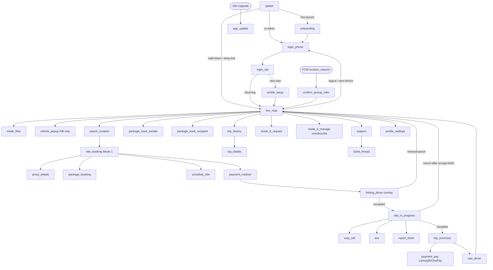
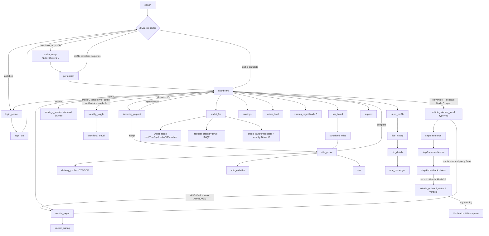

# D1′ — MageRide User Flow Maps (Passenger App & Driver App)

> **🔄 Aligned to ADD v2.6 / URD v2.2 (ADD §1.8 AL-01…AL-16).** This pass: **single active device per app** (US-1.11 merged into US-1.12, AL-08); **reseller = driver capability** in the Driver App (AL-01); **bank-transfer top-up + portal deep-link removed** (AL-05), LankaQR = Pay deep link (AL-15); **canonical vehicle markers** (car→sedan, +truck/mini_truck, AL-09); Fleet Portal flows (Phase 1, AL-03); passenger settings (Home/Work, default payment, AL-14). Web back-office is the **Admin Portal** (`admin.mageride.lk`); drivers never open a web portal.

> **Phase B deliverable (Prompt B1).** Functional flow map of the **MageRide** mobile frontend,
> transformed from the Namma Yatri Phase-A extraction (`nammayatri-extraction/D1_user_flow_maps.md`)
> against MageRide's ADD v2.4 (`architecture-design-document.md`) and URD v1.3
> (`user-requirements-document.md`). Canonical service map: `lightweight-production-replica.md`.
>
> **Stack delta (binding):** Namma Yatri = PureScript-Presto FlowBT (one imperative `Flow.purs`
> state machine) + Haskell/Beckn backend + Juspay + Google Maps + India context. **MageRide =
> Kotlin Multiplatform (KMP) shared business logic + Jetpack Compose (Android UI) + SwiftUI (iOS UI)
> + .NET 10 LTS microservices + MapLibre GL Native/PMTiles + OnePay/LankaQR/Cash + Sri Lanka
> context.** **No source code transfers.** Every flow is tagged `[KEEP]` / `[ADAPT]` / `[REPLACE]` /
> `[NEW]` (semantic-only — `[KEEP]` reuses *intent / flow shape / state transitions*, never code).
> All `[DELTA:INDIA]` resolved to Sri Lanka (Rs, +94, Si/Ta/En); all `[DELTA:JUSPAY]` resolved to
> native OnePay/LankaQR/Cash; all Phase-A `[UNVERIFIED]` items resolved against ADD/URD or dropped.

## Methodology & architecture note (read first)

Unlike Namma Yatri's single imperative `Flow.purs` orchestrator, MageRide is built on a **declarative
navigation model**: Jetpack Compose `NavHost`/`NavController` (Android) and SwiftUI
`NavigationStack` + state-driven `.sheet`/`.navigationDestination` (iOS), sharing one **KMP
view-model / state-reducer layer** (`shared/commonMain/domain/*`, ADD §18.2). A *screen* is a Compose
`@Composable` route or a SwiftUI `View`; a *navigation edge* is a `navController.navigate(route)` /
`NavigationLink`-or-`path.append(...)` triggered by a KMP-emitted UI intent. The ride/booking and
driver-onboarding lifecycles are **explicit state machines in the shared KMP `domain/trip`,
`domain/dispatch`, `domain/fare` modules** (ADD §18.2), driven by domain events from the backend —
*not* a `Stage`-enum sub-state-machine buried in one Home screen. This means the Home screen's ride
overlay is a Compose state hoist / SwiftUI `@Observable` driven by the KMP ride aggregate state
(Appendix B.2), reconstructable from the backend after process death.

**Real-time channels (mirrors NY's gRPC+FCM+HTTP, re-platformed):**
- **Passenger live state** = **SignalR WebSocket** (geocell groups) for vehicle positions +
  **FCM/APNs** for ride/booking/SOS events (ADD §6 `fanout-svc`, §18.2). (NY customer used FCM+HTTP
  polling — `[ADAPT]`: MageRide adds a real SignalR socket, resolving NY's `[UNVERIFIED as WebSocket]`.)
- **Driver dispatch** = **FCM high-priority push** (Android, bypasses Doze) + **APNs `apns-priority:10`
  silent `content-available:1`** (iOS, wakes app), with 3 s no-ack → SMS fallback (ADD E-01). The
  persistent push channel concept maps from NY's gRPC duplex stream → MageRide FCM/APNs + SignalR.
- **Device GPS publish** = **MQTT 5 over TLS (EMQX)** from a native foreground service (NY used a
  native gRPC/HTTP location service — `[ADAPT]` to MQTT QoS1 + persistent session, ADD §7, §18.2).

**Platform parity:** KMP shares 60–70% (DTOs, Ktor HTTP, domain state machines, validators, H3,
adaptive-rate engine). Background GPS, MQTT, map, attestation, payment deep-links, VoIP are **native
per platform** (ADD §18.2). Unlike NY (Android-only host, no iOS tree), **MageRide ships all four
targets** (Passenger Android/iOS, Driver Android/iOS) from Phase 1 (ADD §1.3 scope, Phase-1 roadmap).
Per-screen Android(Compose/Material 3) vs iOS(SwiftUI/HIG) UX notes appear inline and in Section C.

---

# SECTION A — PASSENGER APP FLOWS

## A.1 Screen Inventory

| Screen ID | Name | Purpose | Entry Condition | Exit Points | Tag |
|---|---|---|---|---|---|
| `splash` | Splash / Boot | Boot, token validation (KMP `auth`), route to onboarding/login/map | App cold start | Onboarding / Login / LiveMap (deep-link/active-ride) | [KEEP] |
| `onboarding` | Onboarding Carousel | 3-slide tutorial (US-1.2) + language pick (Si/Ta/En, US-1.3) | First launch, no token | Login | [ADAPT] |
| `login_phone` | Phone Entry | +94 phone entry → request OTP via SMS gateway (US-1.1) | No valid token | OTP | [ADAPT] |
| `login_otp` | OTP Entry | 6-digit OTP verify; 60 s resend cooldown (US-1.10) | After phone submit | ProfileSetup / LiveMap | [ADAPT] |
| `profile_setup` | Profile Setup | Name, photo, language, notif prefs (US-1.5) | New user (no name) | LiveMap | [KEEP] |
| `live_map` | Live Map (Home) | MapLibre hub: nearby Mode A/B/C vehicles, filter, search, booking entry | Logged-in landing | ~20 targets (A.2) | [REPLACE] |
| `mode_filter` (sheet) | Mode/Type Filter | Filter map by Mode A (bus/**train**) / B / C / vehicle type (US-7.7) | Tap filter FAB on map | LiveMap | [NEW] |
| `vehicle_popup` (sheet) | Vehicle Detail Popup | Mode A/B only: route, distance, ETA, driver info (US-7.4, US-7.11) | Tap Mode A/B marker | LiveMap | [ADAPT] |
| `search_location` | Location Search | Source/dest search via Nominatim/Photon (US-8.2) | Tap search bar / "Where to?" | LiveMap (route set) / SavedAddr | [REPLACE] |
| `ride_booking` | Ride Booking (Mode C) | Pickup/drop, vehicle type, upfront fare, For-Me/Someone, Person/Package, payment, Book/Schedule | From search w/ route, Mode C | Confirm / Schedule / LiveMap | [REPLACE] |
| `proxy_details` (sheet) | Proxy Rider Details | "For Someone Else": phone+name / contact picker; 3 pickup methods (US-8.16–8.18) | Toggle "For Someone Else" | RideBooking | [NEW] |
| `confirm_pickup_rider` | Confirm Pickup (Rider) | Rider receives FCM loc-request; adjustable pin, Share/Decline (US-8.18) | FCM `location_request` push | LiveMap (after confirm/decline) | [NEW] |
| `package_booking` | Package Booking | Size S/M/L, description, recipient phone+name, COD option (US-20.1, 20.2) | Toggle "Package" in booking | Confirm / LiveMap | [NEW] |
| `schedule_ride` | Schedule Ride | Pick future date/time for Mode C ride (US-6A.4) | Tap "Schedule" in booking | Confirm / LiveMap | [NEW] |
| `finding_driver` (overlay) | Finding Driver | Dispatch in-progress (Requested→Matching→Offered), 2-min timeout (US-6A.11) | After confirm booking | DriverAssigned / NoDriver / LiveMap | [REPLACE] |
| `ride_in_progress` (overlay) | Active Ride | Driver live position, ETA, driver card, call/SOS/cancel; ride state machine | Ride Accepted (US-6A.12) | TripSummary / Cancel | [REPLACE] |
| `payment_method` (sheet) | Payment Method | Cash / LankaQR / OnePay(+5%) select; upfront total (US-8.10, 8.11) | During booking / pre-pay | Booking / Payment | [REPLACE] |
| `payment_pay` (sheet) | Pay Fare | LankaQR link or OnePay sheet; retry/fallback-to-cash (US-8.15) | Trip complete, in-app pay | TripSummary | [REPLACE] |
| `trip_summary` | Trip Summary | Route, distance, fare breakdown, payment status, rating prompt | Ride completed | RateDriver / LiveMap | [KEEP] |
| `rate_driver` (sheet) | Rate Driver | 1–5 stars + optional text comment (US-18.1) | After trip / pending rating | LiveMap | [ADAPT] |
| `package_track_sender` | Package Tracking (Sender) | Live driver pos + status bar (Pending→PickedUp→InTransit→Delivered) + Pickup OTP (US-20.7) | Active package as sender | LiveMap / TripSummary | [NEW] |
| `package_track_recipient` | Package Tracking (Recipient) | Live driver pos + status + Delivery OTP + driver details (US-20.5, 20.7) | FCM package push (recipient) | LiveMap | [NEW] |
| `trip_history` | Trip / Schedule History | Past trips + upcoming scheduled + past packages (US-8.7, 20.11) | Nav menu | TripDetails | [KEEP] |
| `trip_details` | Trip Details | One trip's detail + invoice/receipt | From history | ReportIssue / Support | [KEEP] |
| `mode_b_request` | Private Transport Request | Enter Vehicle ID to request Mode B access (US-4.5) | Nav menu / map | LiveMap | [NEW] |
| `mode_b_manage` | My Private Subscriptions | List Mode B grants; unsubscribe (US-NEW.1) | Nav menu | LiveMap | [NEW] |
| `saved_addresses` | Saved Addresses | Manage Home/Work/favourites (US-7.13, P2) | Nav menu / search | AddAddress | [KEEP] |
| `add_address` (sheet) | Add Address | Tag a favourite (map pin / search) | From Saved/Search | back | [KEEP] |
| `profile_settings` | Profile & Settings | User ID, name, photo, language, notif prefs, logout, delete account (US-1.5,1.7,1.8) | Nav menu | EditProfile / Login | [KEEP] |
| `voip_call` (overlay) | VoIP Call | In-app voice call w/ driver, no numbers exposed (US-6A.16) | Tap call on active ride | back | [NEW] |
| `sos` (overlay) | SOS | Send GPS + trip to emergency contact via SMS (US-12.1) | SOS button on active ride | back | [ADAPT] |
| `emergency_contacts` | Emergency Contacts | Manage SOS contacts | Safety / settings | back | [KEEP] |
| `report_block` (sheet) | Report / Block Driver | Report vehicle (US-12.5) / block driver (US-12.10) | Active ride / trip details | back | [ADAPT] |
| `support` | In-App Support | FAQ (US-16.1) + raise/track ticket (US-16.2) | Nav menu / trip details | TicketThread | [ADAPT] |
| `ticket_thread` | Support Ticket | Ticket detail + messages, attach trip ID/screenshot | From Support | back | [KEEP] |
| `app_update` (dialog) | App Update Prompt | Mandatory (block) / soft (dismiss) upgrade (US-17.1, 17.2) | Version gate (426 from gateway) | Store / continue | [NEW] |
| `permission` | Location Permission | Request foreground location (Android 8+/iOS) | Permission missing | LiveMap | [ADAPT] |
| `offline_banner` (state) | Offline / No-Connectivity | Last-known positions + "connection lost" banner (US-15.2, 15.6) | Network lost | auto-restore | [ADAPT] |

**Dropped from NY (not in MageRide URD):** `metro_ticket_*`, `bus_ticket_booking`, `place/zoo
ticket`, `aadhaar_verification`, `referral_*`, `rental_screen`, `follow_ride` (friend-follow share).
`[DROPPED: India ticketing/Aadhaar/referral-payout/rental — no MageRide URD story.]` Bus *tracking*
is preserved but folded into `live_map` + `vehicle_popup` (Mode A is map-native, not a ticketed
product). `[DROPPED: parcel-image-only screen → superseded by full Package Delivery flow (Epic 20).]`

## A.2 Navigation Graph

| Source | Target | Trigger | Guard |
|---|---|---|---|
| Splash | Onboarding | auto | first launch, no token |
| Splash | Login | auto | no/expired token (US-1.9) |
| Splash | LiveMap | deep-link / valid token | token valid; resumes active ride if any |
| Onboarding | Login | "Get Started" | — |
| Login(phone) | Login(otp) | "Get OTP" → `iam-svc` send OTP | valid +94 number |
| Login(otp) | ProfileSetup | OTP verified, no profile | new user |
| Login(otp) | LiveMap | OTP verified, existing profile | returning user |
| Login(otp) | Login(otp) | Resend (60 s cooldown) / wrong OTP | US-1.10 |
| ProfileSetup | LiveMap | profile saved (`registry/iam` updateProfile) | — |
| LiveMap | ModeFilter / VehiclePopup | tap filter FAB / tap Mode A·B marker | popup: Mode A/B only (US-7.4) |
| LiveMap | SearchLocation | tap "Where to?" | — |
| LiveMap | RideBooking | dest set, Mode C product | source+dest set |
| RideBooking | ProxyDetails / PackageBooking / ScheduleRide | toggles | — |
| RideBooking | PaymentMethod → FindingDriver | "Book Now" | wallet/eligibility n/a (passenger free) |
| FindingDriver | RideInProgress | driver accepts (FCM `DRIVER_ASSIGNED`) | offer accepted (US-6A.13) |
| FindingDriver | LiveMap | 2-min timeout / cancel before accept | no penalty (US-6A.9, 6A.11) |
| RideInProgress | VoIP / SOS / ReportBlock | tap call / SOS / report | active ride |
| RideInProgress | LiveMap | cancel after accept | **Rs 50 penalty** (US-6A.10), next-ride debit |
| RideInProgress | TripSummary | driver completes | — |
| TripSummary | PaymentPay | pay in-app (LankaQR/OnePay) | method≠Cash |
| TripSummary | RateDriver | rate prompt | post-trip (US-18.1) |
| LiveMap | PackageTrack(Sender/Recipient) | active package / FCM recipient push | — |
| LiveMap | ModeBRequest / ModeBManage | nav menu | — |
| LiveMap | TripHistory / Profile / Support / SavedAddr | nav menu | — |
| Any | Login | logout / token revoked (new-device login US-1.11) | — |
| Any | AppUpdate | gateway `426 Upgrade Required` | version below min |
| Rider(any) | ConfirmPickupRider | FCM `location_request` (proxy) | rider is registered (P-03) |

## A.3 Per-Screen User Actions (key screens)

**Login Phone / OTP** `[ADAPT]` (NY Indian-phone+Juspay-OTP → SL SMS gateway):

| Action | Trigger | What Happens | Loading | Success | Failure |
|---|---|---|---|---|---|
| Request OTP | tap "Get OTP" | KMP `auth` → `POST /auth/otp/request` (`iam-svc`, SMS gateway Fit SMS) | inline spinner + toast "OTP sent" | OTP view; 60 s cooldown timer | rate-limited (5/h, D-32) → snackbar/alert |
| Verify OTP | enter 6 digits | `POST /auth/otp/verify` → mints RS256 JWT (30 min) + refresh | "Verifying…" | route by profile presence | invalid/expired → attempts shown |
| Resend OTP | tap resend (≥60 s) | re-request; new authId | — | new OTP | cooldown not elapsed → disabled |

*Android:* Material 3 OTP `TextField` + auto-read via SMS Retriever; Snackbar errors. *iOS:* SwiftUI
`TextField` `.oneTimeCode`; `.alert` errors; `.notification` haptic on success.

**Live Map** `[REPLACE]` (NY Google Maps → MapLibre GL Native + PMTiles/R2, ADD §3, hard-rule
map=REPLACE):

| Action | Trigger | What Happens | Loading | Success | Failure |
|---|---|---|---|---|---|
| Show nearby vehicles | map open / pan | SignalR join geocell group (H3 res-7 + ring(2), R-06) → live markers (canonical, AL-09: bus=green, **train=red rail icon**, motorbike=purple, TW=yellow, flex=teal, sedan=blue, mini_van=pink, van=orange, truck=brown, mini_truck=olive, private=grey; MAP-03) | skeleton markers | interpolated markers (US-7.3, 2–8 s) | offline → last-known + banner (US-15.2) |
| Filter by mode/type | filter FAB | KMP filter state; markers re-query (US-7.7); **trains filterable separately** | — | filtered set | empty → "no X active nearby" (US-7.14) |
| Tap marker | tap A/B vehicle | popup: route, dist, ETA, driver (US-7.4); **Mode C engaged vehicles hidden (US-7.16); stale removed (US-7.17)** | — | popup sheet | C marker → no popup (US-7.4) |
| Start booking | "Where to?" | → SearchLocation (Nominatim) → RideBooking | — | route drawn (MAP-08) | geocoder down → manual pin |

*Android:* Material 3 Bottom Nav + bottom sheets (drag handle), FAB bottom-end. *iOS:* `TabView`,
sheet detents (.medium/.large), SF Symbols markers.

**Ride Booking (Mode C)** `[REPLACE]`/payment `[REPLACE]`:

| Action | Trigger | What Happens | Loading | Success | Failure |
|---|---|---|---|---|---|
| Upfront fare estimate | pickup+drop set | `fare-svc` 1st-km + per-km + peak/night (US-8.4, 8.9); **total only** | "Estimating…" | fare shown per vehicle type | fare-svc down → retry |
| For-Me / Someone Else | toggle | reveal `proxy_details` (phone+name/contacts + 3 pickup methods, US-8.16) | — | proxy fields | — |
| Person / Package | toggle | reveal `package_booking` (size, desc, recipient, COD) | — | package form | — |
| Payment method | sheet | Cash(default) / LankaQR(no surcharge) / OnePay(+5%, US-8.11) | — | method set; OnePay shows +5% | — |
| Book Now | tap | `POST /rides/request` (Idempotency-Key, R-14,R-18) → FindingDriver | "Finding driver…" | rideId; dispatch starts | dup retry → same ride (R-18) |
| Schedule | tap | `schedule_ride` → advance booking; Job Board dispatch 30 min prior (US-6A.4,6A.5) | — | scheduled; reminders (US-10.9) | — |

## A.4 Conditional Flows

- **First-time vs returning** `[KEEP]`: KMP `auth` validates token at splash; missing name →
  ProfileSetup, else LiveMap. Onboarding carousel gated by first-launch flag.
- **Logged-in vs out / session** `[ADAPT]`: 30-min access JWT + 30-day refresh; silent refresh on
  401; **single active device PER APP** (AL-08, US-1.12) — a new-device login revokes only that app's
  prior session → forced logout, but the same person may run the Driver App and Passenger App at once.
  (NY token-validate intent kept; token semantics re-platformed to `iam-svc` JWKS.)
- **Active ride vs none** `[REPLACE]`: ride state is the **KMP `domain/trip` reduction of the
  `ride-svc` aggregate** (Appendix B.2: Requested→Matching→Offered→Accepted→DriverArrived→InProgress→
  Completed→PaymentPending→Paid/CashSettled). On resume, app calls `GET /rides/active` and
  reconstructs the overlay — not a persisted local `Stage` enum. (NY `LOCAL_STAGE` resume intent
  kept; mechanism = server aggregate.)
- **Scheduled vs immediate** `[NEW]`: scheduled rides live in `dispatch-svc` Job Board; reminders at
  1 h + 15 min (US-10.9). History shows upcoming + past.
- **Proxy registered vs unregistered rider** `[NEW]` (P-03): `iam-svc` lookup-by-phone; unregistered
  → no FCM, booker falls back to map-pin/search (US-8.19); if Cash, rider pays driver, notified (US-8.21).
- **Payment** `[REPLACE]` (NY Juspay → native): Cash needs no flow; LankaQR = in-app payment link
  (any LankaQR bank app); OnePay = in-app sheet/redirect (+5%). On mid-trip failure → notify, retry,
  or fall back to cash without losing history (US-8.15; state machine §11.8 `Initiated→Pending→
  Succeeded/Failed/Retried/FellBackToCash`).
- **Cancellation penalty** `[NEW]`: cancel **before** accept = free (US-6A.9); **after** accept =
  Rs 50 accrued, settled against next trip (§11.7); **3 continuous cancellations → booking disabled**
  (US-6A.10b) — booking entry shows blocked state.
- **Mode B entitlement** `[NEW]`: map shows Mode B vehicle only if an accepted, non-expired sharing
  grant exists (Redis `share:{userId}`, D-23); revocation pushes removal < 200 ms (D-22, §11.10).

## A.5 Background Behaviors

- **Foreground/background** `[REPLACE]`: ride/booking state reconstructed from `ride-svc` via
  `GET /rides/active` on resume; SignalR re-joins geocell groups. No client-held long socket assumed
  across process death (re-established on resume).
- **Network lost/restored** `[ADAPT]` (resolves NY `[UNVERIFIED]` no-internet re-entry): explicit
  offline banner state (US-15.6) distinguishes "no connectivity" from "no vehicles nearby"; map shows
  **last-known positions** dimmed (US-15.2). SignalR auto-reconnects < 5 s (NFR-05, US-15.4); no
  forced full-screen takeover — banner only, current screen preserved.
- **GPS permission** `[ADAPT]`: `permission` screen gates LiveMap; Android `FusedLocationProvider`
  runtime prompt; iOS `CLLocationManager` When-In-Use. Accuracy circle (MAP-02).
- **Push received (open vs closed)** `[ADAPT]` (NY FCM types → MageRide FCM/APNs): open → KMP routes
  by `kind`; closed → system notification deep-links. Passenger types: `DRIVER_ASSIGNED`,
  `DRIVER_ARRIVED`, `TRIP_STARTED`, `RIDE_CANCELLED`, `PAYMENT_CONFIRMED`, `location_request` (proxy,
  P-02), `package_picked_up`/`package_delivered` (recipient, US-10.12/13), `SCHEDULED_REMINDER`,
  `SOS_*`, `LOW_BALANCE` (n/a passenger). iOS via APNs (ADD §18.2).
- **SignalR disconnect/reconnect** `[ADAPT]` (resolves NY "no WebSocket"): MageRide **does** use a
  SignalR socket; on drop, markers freeze + banner; auto-reconnect rejoins groups, resync from
  `query-svc` snapshot.
- **Stale-data indication** `[KEEP]`: in-progress spinners (Finding driver, Estimating fare) and the
  "connection lost" banner communicate stale vs live.

## A.6 Deep Links & Entry Points `[ADAPT]`

- **Push tap / notification** → KMP deep-link router by `kind` (NY `handleDeepLinks` intent kept).
- **Proxy `location_request`** → `confirm_pickup_rider` regardless of current screen (P-02, P-13);
  5-min TTL; declining never leaks GPS.
- **Package recipient link** → `package_track_recipient` (registered: FCM data-message; unregistered:
  SMS web-share token, P-09).
- **Payment callback return** → reconcile via `fare-svc` payment state (no Juspay return; OnePay/
  LankaQR webhook is server-side, app polls/receives `PAYMENT_CONFIRMED`).
- **App-update gate** → `app_update` dialog on `426 Upgrade Required` (D-31, US-17.1/17.2).
- **Android** = `App Links` (intent filters, verified domains); **iOS** = `Universal Links` (ADD §18.2).

---

# SECTION B — DRIVER APP FLOWS

## B.1 Screen Inventory

| Screen ID | Name | Purpose | Entry Condition | Exit Points | Tag |
|---|---|---|---|---|---|
| `splash` | Splash / Boot | Boot + driver-info fetch + route | cold start | Login / Onboarding / Dashboard | [KEEP] |
| `onboarding_lang_city` | Language / City | First-run **vertical** Si/Ta/En (**Sinhala first & default**) + operating city loaded from `config.operating_cities` (Change 6/22) | first run | Login | [ADAPT] |
| `login_phone`/`login_otp` | Phone + OTP | +94 phone → SMS-gateway OTP (Phone-OTP **only**, no Google Sign-In, US-11.5) | no token | DriverInfo router | [ADAPT] |
| `profile_setup` | Profile Setup | Driver name, **required** profile photo, driving license front/back (Gemini extract); **precedes Home — no vehicle required** (Change 6/22, SCR-DA/DI-003a) | new driver (no profile) | Permission / Dashboard | [NEW] |
| `vehicle_onboard_step1` | Vehicle Onboarding · Step 1/4 (Mode C) | Vehicle **type + Registration No** (SCR-DA/DI-004). **Optional**, in-app; entered from My Vehicles empty-state popup or nav drawer (Change 6/22) | driver opts to onboard | Step 2/4 | [REPLACE] |
| `vehicle_onboard_insurance` | Step 2/4 · Insurance | Capture insurance card/paper; Gemini Flash 3.0 extracts expiry (SCR-DA/DI-004a) | step 1 done | Step 3/4 | [NEW] |
| `vehicle_onboard_revenue` | Step 3/4 · Revenue Licence | Capture revenue licence; extract no + expiry (SCR-DA/DI-004b) | step 2 done | Step 4/4 | [NEW] |
| `vehicle_onboard_photos` | Step 4/4 · Vehicle Photos | Front & back, plate visible → Submit for review (SCR-DA/DI-004c) | step 3 done | OnboardingStatus | [NEW] |
| `vehicle_onboard_status` | Vehicle Onboarding Status | 4-doc Verified/Pending (SCR-DA/DI-006); all Verified → **auto-APPROVED** → My Vehicles; any Pending → Verification Officer (US-2.10/2.15) | submitted | Dashboard / My Vehicles | [REPLACE] |
| `permission` | Permissions | Location (always/background), overlay, battery, notifications | missing perms | Dashboard | [ADAPT] |
| `dashboard` | Driver Dashboard (Home) | Map hub: status, today's earnings, fee status, wallet, Driver Level, vehicle list | **profile complete + permitted (no vehicle required)** | many (B.2) | [REPLACE] |
| `vehicle_mgmt` | Vehicle Management | List vehicles, add, status, deactivate (US-2.8,2.16); **empty → Mode-C onboarding popup** (SCR-DA/DI-026a, Change 6/22) | nav | VehicleOnboarding | [ADAPT] |
| `mode_a_session` | Start/End Journey (Mode A) | Route select, Start/End Journey, session timer/distance (US-5.1–5.6) | bus vehicle live | Dashboard | [NEW] |
| `standby_toggle` | Standby (Mode C) | Online/Offline switch; first-trip-free indicator; Directional entry (US-6A.1) | Mode C vehicle | Dashboard | [NEW] |
| `directional_travel` | Directional Travel | Set destination (search/pin/Home), remaining uses + max duration, heading marker, Set/Turn-Off (US-6A.17–23) | standby online | Dashboard | [NEW] |
| `incoming_request` (overlay) | Incoming Dispatch | Pickup, dist, vehicle cat, payment, fare, **15 s** Accept/Reject; proxy/package/directional badges (US-6A.2,6A.3) | dispatch push | Dashboard / RideActive | [REPLACE] |
| `job_board` | Job Board (Mode C) | Scheduled rides ≤30 km, post intent, accept (US-6A.5) | nav | ScheduledRides | [NEW] |
| `scheduled_rides` | Scheduled Rides | Upcoming accepted scheduled rides; 30-min reminder (US-6A.15) | nav / Job Board | RideActive | [NEW] |
| `ride_active` (overlay) | Active Ride/Trip | Navigation, OTP-to-start, session timer, live earnings, SOS, call; ride state machine | ride accepted | Dashboard | [REPLACE] |
| `delivery_confirm` (sheet) | Delivery Confirmation | Pickup OTP entry, Delivery OTP entry or photo proof, COD collect (US-20.4,20.6, P-07) | package ride | RideActive | [NEW] |
| `driver_level` | Driver Level & Stats | Level, points, acceptance rate, no-show history (US-6A.6,6A.14) | profile | back | [NEW] |
| `earnings` | Earnings Dashboard | Today's earnings, per-trip breakdown, payment stats, daily fee deducted (US-9.22) | nav | back | [ADAPT] |
| `wallet_fee` | Wallet & Fee Status | Wallet balance (read-only), today's fee status, vehicle rate, Top-Up / Buy credit, request/transfer credit (US-9.1,9.7) | nav | TopUp / RequestCredit / CreditTransfer | [REPLACE] |
| `wallet_topup` (sheet) | Top Up / Buy credit | Card/OnePay/LankaQR in-app; bulk credit voucher — per-tier DB discount at purchase, credited to wallet (**no bank transfer, no portal** — AL-05) (US-9.18,9.19) | wallet | confirmation | [REPLACE] |
| `request_credit` (sheet) | Request Credit | Enter **Driver ID** / scan QR → request a credit transfer from another driver (US-9.10) | wallet | confirmation | [NEW] |
| `credit_transfer` (sheet) | Credit Transfer + Requests | Incoming credit requests (push) approve/reject; send credit directly by **Driver ID** — exact value, no commission (US-9.11/9.12/9.20/9.21) | wallet | confirmation | [NEW] |
| `payment_history` | Payment / Fee History | Daily fee deductions, top-ups, transfers (US-9A.6) | wallet | back | [ADAPT] |
| `sharing_mgmt` | Sharing Management (Mode B) | Share by User ID, set expiry, accept/reject requests, list grantees (US-4.1–4.4,4.7) | nav | back | [ADAPT] |
| `tracker_pairing` | GPS Tracker Pairing | Bind IMEI to vehicle (enter/QR/bind-code); fleet CSV via portal (US-3.1,3.2, T-02/T-09) | vehicle mgmt | back | [NEW] |
| `driver_profile` | Driver Profile | Personal/vehicle details, overall rating (US-18.3) | nav | sub-screens | [KEEP] |
| `ride_history` | Ride History | Completed/scheduled trips | nav | TripDetails | [KEEP] |
| `trip_details` | Trip Details | One trip + fare to driver (US-8.8), rate passenger (US-18.2) | history | RatePassenger | [ADAPT] |
| `rate_passenger` (sheet) | Rate Passenger | 1–5 stars (US-18.2) | post-trip | back | [NEW] |
| `voip_call` (overlay) | VoIP Call | In-app call w/ rider (not booker for proxy, P-05); no numbers | active ride | back | [NEW] |
| `sos` (overlay) | SOS (Driver) | GPS + trip → emergency contact SMS during active trip (US-12.8) | active trip | back | [NEW] |
| `support` | In-App Support | FAQ + raise/track ticket (US-16.2); daily-fee refund request (US-9.23) | nav | TicketThread | [ADAPT] |
| `notifications` | Alerts | Dispatch/fee/registration/sharing alerts | nav / deep link | detail | [KEEP] |
| `app_update` (dialog) | App Update | Mandatory/soft upgrade (US-17.1,17.2) | version gate | Store / continue | [NEW] |
| `no_internet` | Offline | Network lost; queued GPS replay indicator (US-15.1, R-17) | network lost | retry | [ADAPT] |

**Dropped from NY:** `aadhaar_screen`, `upload_aadhar`, `bank_details/UPI`, `subscription_screen`
(Juspay plans), `onboarding_subscription`, `customer_referral_tracker/addUPI`, `yatri_coins`,
`metro_warriors`, `meter_ride`, `gullak`, `lms_video/quiz`, `hotspot`. `[DROPPED: India KYC/UPI/
Juspay-subscription/coins/warrior/Gullak/LMS — no MageRide URD story.]` NY subscription→payment is
**replaced** by in-app wallet + daily-fee model (Epic 9). `rate_card` folded into fare display.

## B.2 Navigation Graph

| Source | Target | Trigger | Guard |
|---|---|---|---|
| Splash | Login | no token | — |
| Splash | ProfileSetup | registered, no profile | new driver (Change 6/22) |
| Splash | Permission | profile complete, perms missing | — |
| Splash | Dashboard | profile complete + perms | resumes active ride/session; **no vehicle required** |
| Login | OTP → DriverInfo | verify | Phone-OTP only (US-11.5) |
| OTP / DriverInfo | ProfileSetup | new driver (no profile) | name + **required photo** + DL front/back (Change 6/22) |
| ProfileSetup | Permission → Dashboard | profile saved | reaches Home with no vehicle |
| Dashboard / VehicleMgmt | VehicleOnboarding (Step 1/4) | "onboard Mode C" popup (SCR-DA/DI-026a) or nav drawer | optional, Mode C only |
| VehicleOnboarding | OnboardingStatus | Step 4/4 submitted | Gemini Flash 3.0 auto-verify |
| OnboardingStatus | MyVehicles / Dashboard | all 4 Verified → **auto-APPROVED** | else any Pending → Verification Officer (US-2.10) |
| Dashboard | StandbyToggle | Mode C vehicle live | **go-online gated until ≥1 vehicle available** — owned Mode C APPROVED or shared/assigned A/B (US-9.6) |
| StandbyToggle | DirectionalTravel | "Set Direction" | online, uses remaining (US-6A.18) |
| Dashboard | ModeASession | bus vehicle live | Mode A |
| Dashboard(online) | IncomingRequest | dispatch FCM/APNs | online, wallet ok for 2nd+ trip (US-9.1) |
| IncomingRequest | RideActive | Accept within 15 s | atomic single-winner (R-02) |
| IncomingRequest | Dashboard | Reject / 15 s timeout | re-offered to next driver (US-6A.2) |
| RideActive | DeliveryConfirm | package kind | OTP gate (P-07) |
| RideActive | VoIP / SOS | tap | active ride |
| RideActive | Dashboard | Complete / cancel | payment terminal first (R-05) |
| Dashboard | JobBoard → ScheduledRides | nav | Level > 1 (US-6A.8) |
| Dashboard | Wallet/Earnings/Profile/Sharing/Support/VehicleMgmt | nav | — |
| Wallet | TopUp / ResellerTransfer / VoucherRedeem | actions | — |
| Any | Login | logout / new-device | — |
| Any | AppUpdate | `426` | below min version |

## B.3 Per-Screen User Actions (key)

**Dashboard / Standby** `[REPLACE]` (NY single online toggle → mode-aware):

| Action | Trigger | What Happens | Loading | Success | Failure |
|---|---|---|---|---|---|
| Go Online (Mode C) | switch | KMP `dispatch` → `POST /standby/online`; start native GPS foreground svc + MQTT publish; `geo:drivers:available` registered (R-08) | "Going online…" | Online; first-trip-free chip | wallet/eligibility blocked → reason |
| Go Online (Mode A) | Start Journey | `POST /sessions/start` (`trip-state-svc`); adaptive MQTT cadence (US-5.5: 4 s moving/10 s idle/60 s standby) | "Starting journey…" | session active, timer/distance (US-5.6) | active-session lock held (D-03) → blocked |
| End Journey (Mode A) | End Journey | `POST /sessions/end`; stop GPS+MQTT; **no fee** (Mode A free) | — | summary | — |
| Set Directional | "Set Direction" | choose dest; `POST /standby/directional` (DT-01); consumes 1 daily use (US-6A.19, even on manual off) | — | persistent banner: dest, time left, uses left (US-6A.21) | uses exhausted → disabled |

**Incoming Request** `[REPLACE]` (NY popup, gRPC offer → MageRide FCM/APNs offer, 15 s):

| Action | Trigger | What Happens | Loading | Success | Failure |
|---|---|---|---|---|---|
| View offer | dispatch push | card: pickup, dist-to-pickup, vehicle cat, payment (Cash/Card), fare; **15 s countdown** (US-6A.2). Badges: "Third-party booking" (P-05), "Package" + size (US-20.3), "Directional" (DT-08) | — | offer shown | E-01: no-ack 3 s → SMS fallback |
| Accept | tap within 15 s | `POST /rides/{id}/offer/{drv}/accept` (Idempotency-Key) → **atomic single-winner** (§11.11, R-02) | "Accepting…" | RideActive; ride=Accepted | 409/410 → "offer taken/expired" → next offer |
| Reject / timeout | tap / 15 s | offer released → re-offered to next eligible (US-6A.2,6A.3); no reputation hit on first timeout | — | back to Dashboard | — |
| **2nd-trip fee** | accept 2nd trip | wallet auto-deducted (vehicle rate) before accept; 1st trip free (US-9.1) | — | fee deducted; balance shown | insufficient → request missed, low-balance warning (US-9.1,9.9) |

**Wallet & Fee / Top-Up** `[REPLACE]`/`[NEW]` (NY Juspay subscription → native wallet, hard-rule
payment=REPLACE):

| Action | Trigger | What Happens | Loading | Success | Failure |
|---|---|---|---|---|---|
| View wallet/fee | open | balance (read-only), today's fee paid/unpaid + amount, vehicle rate, first-trip-free (US-9.7) | — | status card | — |
| Top up (in-app) | Card/OnePay/LankaQR | `POST /wallet/topup` → OnePay sheet / LankaQR **Pay deep link** (AL-15, §11.5); webhook credits | "Processing…" | instant credit + receipt (US-9A.13) | failure → retry (**no bank transfer** — AL-05) |
| Buy bulk voucher | denomination | Rs 1k/2k/3k/5k/10k; per-tier DB discount applied at purchase, credited to wallet (e.g. pay 900 → 1,000) (US-9.19) | — | credit added | — |
| Send credit to driver | enter Driver ID | direct send by Driver ID — **exact value, no commission** (US-9.20,9.21) | — | ledger both sides | insufficient → blocked |
| Request / approve credit | enter Driver ID / scan QR | `POST` credit-transfer request (§11.6); holder approves in app; **debit sender exact amount, credit recipient exact amount — no commission** (US-9.10,9.13) | "Requested…" | credited + notification (US-9.17) | rejected → notified |

*Android:* QR scan via CameraX/ML Kit; Material 3 bottom sheets. *iOS:* `DataScannerViewController`;
sheet detents; CallKit for VoIP.

## B.4 Conditional Flows

- **Approved vs not** `[ADAPT]`: `registry-svc` `enabled` flag routes Dashboard vs RegistrationHub;
  approval/rejection via FCM (US-2.14) + in-app; rejection shows admin reason (US-2.15). (NY
  `getDriverInfoFlow.enabled` intent kept; KYC steps SL-ified, Aadhaar/UPI dropped.)
- **Vehicle active vs deactivated** `[ADAPT]`: one vehicle live at a time (US-9.6, D-03 active-session
  mutex); deactivated/sold vehicle removed from map immediately (US-2.16); document-expiry auto-suspends
  dispatch (E-03).
- **Permissions** `[ADAPT]`: location (background/always for driver), notifications, battery
  optimisation exemption gate Dashboard.
- **Active ride/session on launch** `[REPLACE]`: `GET /rides/active` + `GET /sessions/active`
  reconstruct overlay from `ride-svc`/`trip-state-svc` aggregates (not a local flag).
- **Blocking / dues** `[REPLACE]` (NY Juspay dues block → wallet): insufficient wallet blocks **2nd**
  trip only (1st always free, US-9.1); low-balance warning < Rs 200 (US-9.9). No Google Play
  Subscription gate.
- **Mode-aware fee** `[NEW]`: Mode A = free; Mode C daily fee by vehicle type (Motorbike 50 …
  Van 300); Mode B = monthly ~Rs 300. Single flat daily charge regardless of trip count (US-9.4).
- **Driver Level gating** `[NEW]`: Level 1 loses Job Board / scheduled-ride access (US-6A.8); 3
  reports → level drop + temporary delisting (US-6A.6); no-show on accepted scheduled ride → −1 (US-6A.7).
- **Directional active** `[NEW]`: while set, only direction-matching hires reach driver (DT-02);
  persistent banner; auto-clears on expiry/offline/manual (US-6A.19); going offline clears it.

## B.5 Background Behaviors

- **Foreground/background & active ride** `[REPLACE]`: GPS + MQTT publish run in a **native foreground
  service** (Android `ForegroundService` + `FusedLocationProvider` + HiveMQ client; iOS background
  location mode + CocoaMQTT, ADD §18.2) — survives backgrounding. Ride state re-fetched on resume.
- **Network lost/restored** `[ADAPT]`: explicit `no_internet` screen; GPS samples buffered to local
  **Room (Android)/SQLite (iOS) ring buffer** and **replayed on reconnect** via `veh/{id}/pos/replay`
  with monotonic `sequence_no` (US-15.1 QoS1, R-17); UI shows **buffered-then-replayed indicator**
  (DT/R-17). Out-of-order/dup samples server-rejected.
- **GPS lost during session** `[ADAPT]` (resolves NY `[UNVERIFIED]` client auto-offline): handled
  server-side — EMQX LWT `status=offline` → `trip-state-svc`/`dispatch-svc` release offer / start
  grace (R-15, R-16); idle > 30 min auto-ends Mode A session (US-5.3) with notification (US-5.9) +
  5-min grace restart (US-5.10); auto-end-at-destination 100 m geofence (US-5.4, MAP-10).
- **Push (open vs closed)** `[ADAPT]`: dispatch offers via **FCM high-priority/APNs silent
  content-available** (E-01) wake the app even in Doze; types: `RIDE_OFFER`, `SCHEDULED_REMINDER`
  (30 min, US-6A.15), `RIDE_CANCELLED` (US-10.8), `LOW_BALANCE`, `TOPUP_CONFIRMED`,
  `REGISTRATION_RESULT`, `SHARE_REQUEST`, `DIRECTIONAL_EXPIRING` (10 min, US-10.14), `package_*`, `SOS_*`.
- **Stale data** `[KEEP]`: adaptive cadence (US-5.5 / NFR-30) + offer countdown communicate liveness.

## B.6 Deep Links & Entry Points `[ADAPT]`

KMP deep-link router by `kind` (NY `handleDeepLinksFlow` intent kept; India targets dropped):
`offer`→IncomingRequest, `scheduled`→ScheduledRides, `wallet`/`topup`→Wallet, `directional_expiring`→
Dashboard banner, `share_request`→SharingMgmt, `registration`→AppStatus, `support`→Support.
**No `bank_transfer` deep-link — drivers never open a web portal (AL-05).** No `coins`/`addupi`/
`gullak`/`plans` (dropped).

## B.7 Driver Lifecycle Flow — two phases (Change 6/22) `[REPLACE]`

Onboarding is now **split into driver-identity onboarding (mandatory, before Home)** and **Mode-C
vehicle onboarding (optional, in-app, auto-verified)**. NY's single checklist is dropped. Steps (KMP
`registry` state):

### Phase 1 — Driver identity (precedes Home; **no vehicle required**)
1. **Login** — +94 phone → SMS-gateway OTP (Phone-OTP only, US-11.5; NY Indian-phone `[ADAPT]`).
2. **Language/City** first run — **vertical** Si/Ta/En (**Sinhala first & default**) + operating city
   loaded from `config.operating_cities` (`GET /config/cities`); selection saved to
   `iam.users.operating_city_code` (Change 6/22).
3. **Profile Setup (SCR-DA/DI-003a)** — **driver name**, **profile photo (required, shown to passengers
   US-2.12)**, **driving license front + back** (Gemini Flash + Tesseract fallback, in-perimeter PII
   redaction US-2.4, D-36). Writes `registry.driver_profiles` + `registry.documents`
   (`kind='driving_license'`, **vehicle-less**). **No Aadhaar / bank / UPI** (dropped).
4. **Permissions → Dashboard** — location/notifications gate → **Home reached with no vehicle**. The
   driver can already operate a **shared / temporarily-assigned Mode A/B** vehicle, but **cannot go
   online until a vehicle is available** (US-9.6).

### Phase 2 — Mode-C vehicle onboarding (optional, in-app, auto-verified)
Entered from the **My Vehicles empty-state popup (SCR-DA/DI-026a)** or the **nav-drawer → Vehicle
Onboarding**. **Mode A/B vehicles + permits are NOT onboarded here — Fleet Portal (SCR-FP-004) only.**
5. **Step 1/4 (SCR-DA/DI-004)** — vehicle **type + Registration No** (one vehicle ↔ one mobile US-2.7;
   reg-no unique in active set D-37). No permit / GPS-tracker field.
6. **Steps 2–4** — **Insurance** (004a), **Revenue licence** (004b), **front + back photos, plate
   visible** (004c); each shows **Done** on upload.
7. **Submit → Onboarding Status (SCR-DA/DI-006)** — Gemini **Flash 3.0** extracts per doc →
   Verified/Pending: insurance(expiry) · revenue(no+expiry) · photos(plate matches reg no) ·
   vehicle-details(entered).
8. **Auto-approve** — when **all 4 are Verified**, `registry-svc` sets `status=APPROVED` **with no
   Verification Officer step** (user decision 6/22) → FCM + in-app (US-2.14) → vehicle appears in My
   Vehicles. Any **Pending** (extraction failed / low confidence) → Verification Officer queue
   (US-2.10/2.15). **OnePay merchant onboarding** binds on approval (D-11). Tracker pairing optional
   later (US-3.1; fleet bulk CSV via portal US-3.2).

## B.8 Go Online / Session Flow `[NEW]` (Mode A) / `[REPLACE]` (Mode C standby)

**Mode A (Public Transport bus) — Start/End Journey (US-5.1–5.10):**
- **Start Journey** → `trip-state-svc` `sessions.start` (active-session mutex D-03); native GPS
  foreground service + MQTT publish begin; **adaptive cadence** (moving 1/4 s, stationary 1/10 s,
  standby 1/60 s; US-5.5, NFR-30, R-07 phase-aware) issued as server cadence hints `veh/{id}/cmd`.
- **End Journey** → `sessions.end`; stop services. **No daily fee** (Mode A free, US-9.1).
- **Auto-end** — idle > 30 min (no movement) → server auto-ends (US-5.3) + push (US-5.9); restartable
  within 5-min grace, no fee (US-5.10); auto-end-at-destination = enter 100 m radius of prior end
  (US-5.4). Session duration/distance shown live (US-5.6).

**Mode C standby (US-6A.1):** Online toggle → `dispatch-svc` registers driver in
`geo:drivers:available:{type}:{cell}` (R-08) + presence; first-trip-free indicator; GPS+MQTT start.
Offline clears availability **and any active Directional filter** (US-6A.19). Single active publisher
per vehicle enforced (US-3.6). (NY `changeDriverStatus` Online/Silent/Offline intent kept; Silent mode
dropped — MageRide uses Online/Offline + Directional filter.)

## B.9 Mode C Ride Dispatch Flow `[REPLACE]`

Lifecycle = **`ride-svc` aggregate** (Appendix B.2, R-01 — distinct from A/B tracking sessions):
`Requested→Matching→Offered→Accepted→DriverArrived→InProgress→Completed→PaymentPending→Paid/CashSettled`.

1. **Dispatch** — passenger request → `dispatch-svc` builds candidates (H3 ring(2) + `ST_DWithin`,
   R-06) scored by **distance + Driver Level + vehicle category** (US-6A.2, versioned score R-11);
   hard gates: wallet/daily-fee, level, category, block-status, package-size (P-11); then
   **Directional predicate** (DT-02/DT-05) if active.
2. **Offer** — single top candidate reserved (Redis Lua + Postgres unique partial, R-10); offer pushed
   FCM-hi/APNs-silent (E-01) with **15 s** TTL (R-07, durable Quartz backstop R-04).
3. **Accept (atomic single-winner)** — `POST …/accept` (Idempotency-Key) → conditional SQL UPDATE;
   row_count=1 wins, else 409/410 → next offer (§11.11, R-02). On timeout/decline → re-offer to next
   eligible driver (US-6A.2,6A.3).
4. **Navigate → pickup → start** — driver navigates; **passenger ride: enter rider OTP / package:
   enter pickup OTP** (P-07) → `DriverArrived`→`InProgress` (`ride.started`). (NY OTP-to-start intent
   kept.)
5. **Drop → complete** — driver taps Complete → `Completed→PaymentPending`; driver earning posts only
   after payment terminal (R-05). Passenger sees live driver position throughout (US-6A.12).
6. **Cancellations / no-show** (server-owned matrix §11.12, R-03): rider-after-accept = Rs 50
   (US-6A.10); driver cancel = reputation hit; rider no-show 5 min = Rs 100 + driver compensation;
   no-driver-in-2-min → passenger notified, request auto-cancelled (US-6A.11).
7. **Scheduled / Job Board** — scheduled ride goes live 30 min prior → dispatched to closest
   intent-submitting driver by Level (ties → higher level rung first, US-6A.5); reminders 30 min
   (driver US-6A.15), 1 h+15 min (passenger US-10.9).

## B.10 Earnings & Financial Flows `[REPLACE]`/`[NEW]` (NY Juspay/UPI/coins → native wallet)

- **Daily platform fee** `[NEW]`: first trip free; flat daily fee by vehicle type auto-deducted from
  wallet **before 2nd trip** (US-9.1,9.4); idempotent per `(driver,vehicle,fee_date)` in
  `Asia/Colombo` (D-13); no charge on off days. Mode A free, Mode B monthly ~Rs 300.
- **Wallet (read-only in app)** `[REPLACE]`: balance + today's fee status + vehicle rate (US-9.7);
  low-balance push < Rs 200 (US-9.9).
- **In-app top-up** `[REPLACE]`: Card/OnePay/LankaQR only (§11.5, US-9.18); **no bank transfer, no web
  portal** (AL-05). LankaQR = "Pay" deep link (AL-15). (NY Juspay PaymentPage `[DELTA:JUSPAY]` resolved.)
- **Bulk credit vouchers** `[NEW]`: Rs 1k–10k; **per-tier purchase discount configured in DB** (variable/admin-configurable),
  applied only at purchase and credited directly to the buyer's wallet (e.g. pay 900 → 1,000) (US-9.19).
- **Driver-to-driver credit transfer** `[NEW, AL-01]`: **not a role/account/capability** — any driver holding credit can transfer it.
  Requester enters the holder's **Driver ID** / scans QR; the holder approves **in the Driver App** (or sends directly by Driver ID);
  **debit sender exact amount, credit recipient exact amount — no commission** (§11.6, US-9.10–9.21). Double-entry ledger (D-09).
- **Earnings dashboard** `[ADAPT]`: today's earnings, per-trip breakdown, monthly fee summary,
  fares received (US-9.22); driver sees per-passenger fare on completion (US-8.8). (NY
  `driverEarningsFlow` intent kept; Yatri-Coins dropped.)
- **Daily-fee refund** `[NEW]`: support ticket to request reversal of fee charged in error (US-9.23;
  admin reversal US-14.11).

## B.11 MQTT + Hardware-Tracker Connection Lifecycle `[REPLACE]` (NY gRPC+FCM+HTTP → MQTT+FCM/APNs+SignalR)

NY had **no MQTT** (gRPC duplex for offers, HTTP location batching). **MageRide is MQTT-native** for
device ingest; offers move to FCM/APNs; passenger fan-out to SignalR. Channels:

1. **MQTT 5 over TLS (EMQX)** — device GPS publish channel (mobile-as-tracker + hardware trackers via
   adapter). **Connect:** on Go Online / Start Journey, native foreground service opens MQTT session
   (QoS1, persistent session, ADD §7, §18.2). **Auth:** `provisioning-svc`-minted **MQTT JWT**
   (TTL = max(active-ride + 2 h, 4 h), decoupled from the 30-min API JWT so it survives a long trip in low coverage, E-02); EMQX ACL
   scoped to `veh/{vehicleId}/#` (NFR-15,16). **Publish:** `veh/{id}/pos/live` at adaptive cadence;
   per-vehicle **5 msg/s ceiling** (D-17). **Reconnect/replay:** offline backlog buffered locally,
   replayed on `veh/{id}/pos/replay` with monotonic `seq` (R-17, US-15.1); live always prioritised
   (R-09). **LWT:** `veh/{id}/status=offline` drives dispatch release + grace (R-15,16) and removes
   vehicle from passenger map (US-7.17).
2. **FCM (Android) / APNs (iOS)** — push channel for offers (hi-priority/silent, E-01) and all
   ride/fee/sharing/SOS events. Replaces NY gRPC offer stream + FCM.
3. **SignalR WebSocket** — passenger live-position fan-out (geocell groups); driver app does not
   consume position fan-out (it publishes).

**Hardware GPS tracker pairing/lifecycle** `[NEW]` (US-3.x, T-02/T-03/T-09, no NY analogue):
- **Pairing** — bind IMEI to vehicle: enter IMEI / scan device QR / accept admin bind-code (US-3.1);
  `provisioning-svc` issues per-device X.509 (MQTT-capable) or HMAC token (legacy GT06/JT808) with
  90-day rotation (US-3.5, T-02). Duplicate-IMEI → both quarantined for admin (US-3.4, T-08).
- **Source switch** — driver toggles tracking source mobile↔hardware; single active publisher (US-3.6).
- **Ingest** — TCP (GT06/JT808/H02) / UDP / MQTT normalised by `tcp-adapter` *(a.k.a. `tracker-adapter-svc`)* into the
  position event stream (US-3.9); plausibility checks identical to mobile (US-3.15, T-07).
- **Offline replay** — tracker batches in GSM-dead zones, bulk-replays on reconnect; dedup by `seq`
  (US-3.10,3.11, T-05). Mobile shows **buffered-then-replayed indicator** on reconnect (R-17).
- **Health** — last-seen/signal/sat/battery surfaced in portal (US-3.12); offline > 15 min → owner
  push (US-3.14); fleet health dashboard (US-3.13, portal).
- **Mode rules** — Mode C dispatch-eligible only if tracker online ≤30 s **and** driver app logged in
  (US-3.21, T-11); Mode A bus broadcasts position with **no driver-app session required** (US-3.22).
- **Decommission** — admin revokes credentials within 60 s; in-flight session force-ended (US-3.8,
  3.20, T-12, NFR-44).
- **Fleet bulk** — operator CSV up to 5,000 IMEIs/upload in Admin Portal, validated with error report
  (US-3.2, T-09). (Fleet-operator persona; bulk path is portal, not Driver App.)

---

# SECTION C — PLATFORM DIFFERENCES (Android Compose vs iOS SwiftUI)

Unlike Namma Yatri (single PureScript render layer, **Android-only host, no iOS tree**), MageRide
ships **native UI per platform** over a shared KMP core. ~60–70% (KMP: DTOs, Ktor HTTP, domain state
machines incl. ride/dispatch/fare/trip, validators, H3 geocell, adaptive-rate engine, JWT/refresh) is
**identical** across all four targets; the **navigation, rendering, and native-service layer differs**
(ADD §18.2). Both platforms launch Phase 1.

| Capability | Android (Jetpack Compose + Material 3) | iOS (SwiftUI + HIG) |
|---|---|---|
| Navigation | `NavHost`/`NavController`; system back + toolbar back | `NavigationStack` + path; swipe-back gesture |
| Tabs / sections | Material 3 Bottom Navigation Bar | `TabView` |
| Sheets / modals | Material 3 bottom sheets (drag handle); `ModalBottomSheet` | sheet detents `.medium`/`.large` |
| Transient messages | Snackbar | inline banners; `.alert` / confirmation dialogs |
| Dialogs | Material 3 `AlertDialog` (app-update, OTP errors) | iOS alerts & confirmation dialogs |
| Iconography | Material Symbols | SF Symbols |
| Haptics | `HapticFeedback`/`Vibrator` | `.impact` / `.notification` haptics |
| Context actions | long-press menus / FAB (bottom-end) | context menus (long press) |
| Map render | MapLibre GL Native (Android SDK) | MapLibre GL Native (iOS SDK) |
| Background GPS | `ForegroundService` + `FusedLocationProviderClient` | `CLLocationManager` background location mode |
| MQTT client | HiveMQ Android client (foreground service) | CocoaMQTT (background task) |
| Device binding | Android Keystore | iOS Keychain + Secure Enclave |
| Attestation | Play Integrity API | App Attest (DeviceCheck) |
| Push transport | FCM (native) | APNs via FCM |
| Payment | In-app OnePay sheet / LankaQR **Pay deep link to bank app** (AL-15; no portal hand-off) | In-app OnePay / LankaQR Pay deep link |
| VoIP | Android WebRTC / native call | iOS CallKit + WebRTC |
| QR scan (driver credit) | CameraX + ML Kit | `DataScannerViewController` (VisionKit) |
| App update | in-app review/update or Play redirect | App Store redirect (no forced in-app update API) |

**Implication:** the KMP ride/booking/dispatch/fare/wallet state machines and validation behave
**identically** across platforms; only the UI shell (Compose vs SwiftUI), navigation primitives,
background GPS/MQTT services, secure storage, attestation, payment/VoIP integrations, and map SDK
binding are platform-specific. No business-logic branch lives in the UI layer.

---

## Traceability Addendum

| URD US-ID | URD Epic | D1′ section ID | Tag | ADD §/Item | Notes |
|---|---|---|---|---|---|
| US-1.1 | 1 | A.1 `login_phone`, B.7 | [ADAPT] | §12.1, D-32 | SMS-gateway OTP, +94 |
| US-1.2/1.3 | 1 | A.1 `onboarding` | [ADAPT] | §18.2 | 3-slide + Si/Ta/En |
| US-1.5 | 1 | A.1 `profile_setup`/`profile_settings` | [KEEP] | §6 iam | edit profile |
| US-1.7/1.8 | 1 | A.1 `profile_settings` | [KEEP] | E-06 PDPA | logout / delete account |
| US-1.9/1.12 | 1 | A.4, B.2 | [ADAPT] | D-29, §12.1, AL-08 | session persist; **single active device per app** (US-1.11 merged) |
| US-1.10 | 1 | A.3 OTP | [ADAPT] | D-32 | 60 s resend cooldown |
| US-2.1–2.5,2.12 | 2 | B.1 `profile_setup` + `vehicle_onboard_*`, B.7 | [REPLACE] | D-36, §11.9 | identity (name/photo/DL) split from Mode-C 4-step auto-verify (Change 6/22) |
| US-2.8/2.16 | 2 | B.1 `vehicle_mgmt` (+ `026a` empty popup) | [ADAPT] | D-03, E-03 | multi-vehicle, deactivate |
| US-2.13/2.14/2.15 | 2 | B.1 `vehicle_onboard_status` | [REPLACE] | §6 registry | 4-doc status + auto-approve + FCM + reason |
| US-3.1/3.2/3.5/3.6/3.8 | 3 | B.11, B.1 `tracker_pairing` | [NEW] | T-02/03/08/09/12 | IMEI bind, fleet CSV |
| US-3.21/3.22 | 3 | B.11 | [NEW] | T-11 | Mode C vs A eligibility |
| US-4.1–4.4,4.7 | 4 | B.1 `sharing_mgmt` | [ADAPT] | D-22 | share grant + accept |
| US-4.5/4.6 | 4 | A.1 `mode_b_request` | [NEW] | D-23 | request by Vehicle ID |
| US-NEW.1 | 10 | A.1 `mode_b_manage` | [NEW] | D-22, §11.10 | unsubscribe Mode B |
| US-5.1–5.6,5.9,5.10 | 5 | B.8 `mode_a_session` | [NEW] | Appendix B | Start/End Journey, auto-end |
| US-6A.1 | 6A | B.8 `standby_toggle` | [NEW] | R-08 | standby online |
| US-6A.2/6A.3 | 6A | B.3/B.9 `incoming_request` | [REPLACE] | R-02, §11.11 | 15 s atomic accept |
| US-6A.4 | 6A | A.1 `schedule_ride` | [NEW] | §6 dispatch | scheduled booking |
| US-6A.5/6A.15 | 6A | B.1 `job_board`/`scheduled_rides` | [NEW] | D-06 | Job Board, 30 min |
| US-6A.6/6A.7/6A.8/6A.14 | 6A | B.1 `driver_level` | [NEW] | D-04 reputation | Driver Level System |
| US-6A.9/6A.10/6A.10b | 6A | A.4, B.9 | [NEW] | §11.7, §11.12 | Rs 50; 3-cancel disable |
| US-6A.11 | 6A | A.2 `finding_driver` | [REPLACE] | §11.12 | 2-min no-driver timeout |
| US-6A.12/6A.13 | 6A | A.1 `ride_in_progress` | [REPLACE] | Appendix B.2 | live driver pos |
| US-6A.16 | 6A | A.1/B.1 `voip_call` | [NEW] | D-24/25 | in-app VoIP |
| US-6A.17–6A.23 | 6A | B.1 `directional_travel` | [NEW] | DT-01..DT-08 | Directional Travel |
| US-7.1/7.2/7.3/7.4 | 7 | A.1 `live_map`/`vehicle_popup` | [REPLACE] | §3, R-06 | MapLibre, A/B popup only |
| US-7.7 | 7 | A.1 `mode_filter` | [NEW] | MAP-03 | mode/type filter incl. trains |
| US-7.11/7.12 | 7 | A.3 popup / `ride_in_progress` | [ADAPT] | — | ETA / driver after accept |
| US-7.16/7.17 | 7 | A.3 live_map | [REPLACE] | §7.5 | engaged hidden / stale removed |
| US-8.2/8.4/8.9 | 8 | A.1 `ride_booking` | [REPLACE] | §6 fare | upfront fare estimate |
| US-8.7 | 8 | A.1 `trip_history` | [KEEP] | — | past trips |
| US-8.8 | 8 | B.1 `trip_details` | [ADAPT] | — | driver sees fare |
| US-8.10/8.11/8.12/8.15 | 8 | A.1 `payment_method`/`payment_pay` | [REPLACE] | §11.8 | Cash/LankaQR/OnePay+5% |
| US-8.16–8.21 | 8 | A.1 `proxy_details`/`confirm_pickup_rider` | [NEW] | P-01..P-05,P-13, §11.15 | proxy booking + loc-request |
| US-9.1/9.4/9.6/9.7 | 9 | B.10 `wallet_fee` | [NEW]/[REPLACE] | D-13, D-03 | daily fee, first trip free |
| US-9.9 | 9 | B.5 | [NEW] | — | low-balance push |
| US-9.10–9.17 | 9 | B.10 `request_credit` / `credit_transfer` (Driver App, AL-01) | [NEW] | §11.6, D-09 | driver-to-driver, exact value, no commission |
| US-9.18/9.19/9.20/9.21 | 9 | B.10 `wallet_topup`/`credit_transfer` | [REPLACE]/[NEW] | §11.5, AL-05 | in-app top-up (no bank transfer), vouchers, driver transfer |
| US-9.22/9.23 | 9 | B.10 `earnings`/`support` | [ADAPT]/[NEW] | US-14.11 | monthly summary, fee refund |
| US-9A.4 | 9A | B.6, B.10 | [ADAPT] | §11.5, AL-05 | **in-app top-up only; bank transfer removed** |
| US-13.* | 13 | Fleet Portal flows | [NEW] | AL-03 | fleet onboarding/assign/schedule/map/billing (Phase 1) |
| US-22.* | 22 | A.1 `profile_settings`/`saved_addresses` | [NEW] | AL-14 | passenger settings (Home/Work, default payment) |
| US-10.8/10.9/10.14 | 10 | B.5, A.5 | [ADAPT] | DT-08 | cancel/scheduled/directional push |
| US-10.12/10.13 | 10 | A.1 `package_track_recipient` | [NEW] | P-09, §11.16 | package OTP push |
| US-12.1/12.8/12.11 | 12 | A.1/B.1 `sos` | [ADAPT]/[NEW] | D-33 | passenger + driver SOS |
| US-12.5/12.6/12.10 | 12 | A.1 `report_block` | [ADAPT] | D-04 | report / block driver |
| US-14.11 | 14 | B.10 `support` | [NEW] | §6 admin | fee reversal (admin) |
| US-15.1/15.2/15.4/15.6 | 15 | A.5, B.5 | [ADAPT] | R-17 | offline replay, banner |
| US-16.1/16.2 | 16 | A.1/B.1 `support`/`ticket_thread` | [ADAPT] | §6 support-svc | FAQ + ticket |
| US-17.1/17.2 | 17 | A.1/B.1 `app_update` | [NEW] | D-31 | mandatory/soft update |
| US-18.1/18.2/18.3 | 18 | A.1 `rate_driver`/B.1 `rate_passenger`/`driver_profile` | [ADAPT]/[NEW] | — | ratings + comment |
| US-19.1/19.2 | 19 | Section C | [ADAPT] | §18.2 | TalkBack/VoiceOver, dynamic text |
| US-20.1–20.11 | 20 | A.1 `package_booking`/`package_track_*`, B.1 `delivery_confirm` | [NEW] | P-06..P-10, §11.16 | package delivery + OTP/COD |

**Coverage:** every P0/P1 user-flow story above maps to ≥1 D1′ section ID (no empty cells). P2 stories
(Epic 3 trackers, Epic 20 package delivery, driver ratings) are included as `[NEW]` because ADD v2.3/
v2.2 promoted/specified their flows.

## Mandatory ADD Critique-Item Coverage (D1′ scope)

| Item | Description | In D1′? | Where |
|---|---|---|---|
| **R-01** | Mode C ride aggregate distinct from A/B sessions | ✅ | A.4, B.9 (Appendix B.2 state machine), methodology note |
| **R-17** | Mobile offline GPS replay indicator | ✅ | A.5, B.5, B.11 (buffered-then-replayed indicator) |
| **P-02** | Location-request sub-flow (FCM→rider confirms→WS back, 5 min TTL) | ✅ | A.1 `confirm_pickup_rider`, A.6, §11.15 ref |
| **P-05** | Proxy badge; driver calls rider not booker | ✅ | B.3 incoming_request badges, B.1 `voip_call` (rider not booker) |
| **P-07** | Pickup/delivery OTP entry flow | ✅ | A.1 `package_track_*`, B.1 `delivery_confirm`, B.9 step 4 |
| **DT-01** | Directional-filter set/clear flow + daily-uses display | ✅ | B.1/B.3 `directional_travel`, B.4 |
| **DT-08** | Driver live filter state + 10-min pre-expiry reminder | ✅ | B.3 banner/badge, B.5 `DIRECTIONAL_EXPIRING`, US-10.14 |

All seven in-scope items are ✅ — **document is not marked `[INCOMPLETE]`.** (Other deficit items are
N/A to user-facing flows: D-09/D-13/D-17/D-29/E-08 are backend/infra; T-06/T-10 sizing.)

---

## Verification & Caveats Summary

- Every screen/flow is traced to a URD US-ID and/or an ADD section/critique item; no MageRide source
  code reproduced (no code exists yet — this is a design transform).
- **Resolved Phase-A `[UNVERIFIED]` items (4):** (1) customer no-internet re-entry → resolved to
  banner-only offline state with last-known positions (US-15.6, A.5); (2) "WebSocket" → MageRide
  **does** use SignalR (A.5); (3) driver client-side auto-offline on GPS loss → server-side via EMQX
  LWT + grace (R-15/16, B.5); (4) ride-offer countdown value → **15 s** per US-6A.2/6A.3 (B.3/B.9).
  APNs is **present** in MageRide (ADD §18.2), resolving NY's APNs-absence note.
- **`[DELTA:INDIA]` resolved:** OTP via SL SMS gateway + +94; Si/Ta/En (no Hindi/Kannada/Telugu);
  canonical vehicle types = motorbike/three-wheeler/flex/sedan/mini_van/van + truck/mini_truck + bus/train
  (**car→sedan**, AL-09); **no Aadhaar, no UPI, no Yatri-Coins, no metro/bus/place ticketing, no Gullak**
  (all `[DROPPED]`).
- **`[DELTA:JUSPAY]` resolved:** all payments → native **Cash / LankaQR (no surcharge, Pay deep link AL-15) /
  OnePay (+5%)**; driver wallet top-up in-app (card/OnePay/LankaQR) + bulk credit vouchers + driver-to-driver credit transfer;
  **no bank transfer, no web portal** (AL-05). No Juspay PaymentPage anywhere.
- **Hard rules honoured:** all map flows `[REPLACE]` (MapLibre + PMTiles); all payment flows
  `[REPLACE]`/`[NEW]` (OnePay/LankaQR/Cash). Map=Google, Payment=Juspay never appear.
- **Platform:** all four targets (Passenger Android/iOS, Driver Android/iOS) specified; Android
  Compose/Material 3 vs iOS SwiftUI/HIG noted per screen and in Section C.

---

## Δ Addendum — Discussion 2026-06-21 (flow changes, items 1–18)

### F-23.1 Book a public-transport trip (geo-only → GTFS) — items 3, 4
`SCR-PA-010` Map → tap "Where to?" → `SCR-PA-008` **type a place/address** (route number not accepted) → pick a place → `SCR-PA-009` shows **all direct GTFS bus routes** (route no + description + Direct/Transit + PUBLIC) above **Mode C private tiers (price only)** → pick a public route → Track Route (walk-to-halt polyline) **or** pick a private tier → upfront fare → Book.

### F-23.2 Paste-link location — items 5, 6
Anywhere a location is captured (`SCR-PA-010b` proxy pickup; `SCR-PA-012` package pickup **and drop-off**): choose **Paste link** → opens the **paste sheet `SCR-PA-012a`** → tap **📋 Paste** (clipboard) → app parses lat/lng (short links resolved by `transit-svc /geo/parse-maps-link`) → **pin preview + reverse-geocoded address** → **Use this location** commits the pin. Unparseable / 3 s timeout → "couldn't read that link — pick on map".

### F-23.3 Mode B subscribe → pay — items 8, 15, 16
`SCR-PA-010` tap **Mode B marker** → `SCR-PA-024` access request (Vehicle ID pre-filled) → driver/owner Accept (`SCR-DA-028` per-vehicle / `SCR-FP-011`) → vehicle appears on map → `SCR-PA-025` shows Paid card → **💳 Pay** → `SCR-PA-025a` choose LankaQR deep-link / scan / OnePay / online-transfer(+screenshot) → confirm; transfer = Pending until owner confirms (`SCR-FP-011/012`); cash = owner marks received. **🧾** → `SCR-PA-025b` history.

### F-23.4 Unsubscribe / re-subscribe — item 17
`SCR-PA-025` tap compact **✕** → unsubscribe → vehicle disappears from passenger; row stays **muted** in `SCR-FP-011` until owner **Delete**. Re-join = `SCR-PA-024` request → owner accept.

### F-23.5 Package recipient notify — item 11
Driver confirms pickup (`SCR-DA-016`) → **registered recipient**: FCM push → opens `SCR-PA-021`; **unregistered**: SMS `passenger.mageride.lk/track?token=…` → no-login web tracking page.

### F-23.6 Add saved address — item 7
`SCR-PA-026` drop/drag pin → tap **＋ Add address** → `SCR-PA-026a` ModalBottomSheet (Address Line 1/2/3 + Label) → Save → row appears.

### F-23.7 Navigation drawers — items 9, 14
Passenger `SCR-PA-033`: Private transport → 024 · My subscriptions → 025 · Saved addresses → 026 · Profile & settings → 027. Driver `SCR-DA-036`: My Vehicles 026 · GPS Tracker 027 · Sharing (Mode B) 028 · Profile 029 · Ride History + Rate 030 · Support + Fee Refund 033 · Notifications 034.

### F-23.8 Pay fare by scanning driver QR — item 18
`SCR-PA-017` → tap **Scan driver's QR** → camera scans driver's printed/on-screen LankaQR → confirm in bank app → Paid. (No centred MageRide QR.)

> Other small flow notes: onboarding language = vertical boxes Sinhala-first (item 1); Edit-profile has no language row (item 10); mode-filter chips show coloured vehicle icons (item 2); driver sharing scoped per vehicle incl. temp-hired (item 12).

## Δ Addendum — Discussion 2026-06-25 (driver flows, items 1–13)

> Flow updates for ADD v2.8 §1.10 (AL-28…AL-35) / URD v2.4.

### F-25.1 Two-phase + per-step onboarding with admin-verify (items 2–6)
- **Profile Setup** (SCR-DA/DI-003a): the licence scan extracts **licence no, expiry, NIC, allowed vehicle types**; an unclear field → the driver **types it** → flagged **⚑** (`verifyStatus=pending`) for SCR-AP-003.
- **4-step wizard** (004→004c): each step is **SAVED on completion** (`PUT /v1/vehicles/{id}/onboarding/{step}`); a doubtful/manual field, or — photos — **plate ≠ reg-no**, → step `PENDING_REVIEW`. Re-opening the wizard **resumes at `nextStep`** (not Step 1).
- SCR-DA/DI-006: all four steps VERIFIED → vehicle **APPROVED** (`onboardingStatus=approved`) → My Vehicles shows **Approved**; otherwise **Incomplete** (Resume). When Approved, **＋ / Vehicle Onboarding starts a NEW vehicle at Step 1/4**.
- SCR-AP-003: the Verification Officer **Confirms / Edits** each pending field; **Approve unlocks only when none remain pending**.

### F-25.2 Driver home map = own vehicle only; hamburger removed (item 7)
SCR-DA/DI-010 renders **only the driver's own active vehicle** — no nearby/other active vehicles; navigation via the **Menu** tab (hamburger removed).

### F-25.3 Mode A/B home dashboard + GPS-ignition journey control (items 8, 11)
When the active vehicle is Mode A/B, **Home = SCR-DA/DI-011** (Start/End only; vehicle type+reg below the route card). Tracker-equipped vehicle: **ACC-on auto-starts** the session (device = single publisher) → app shows **"Journey started"**; **ACC-off ends** it → Start Journey returns. The dashboard **Start/End overrides** the device.

### F-25.4 Three-stage package delivery (item 9)
SCR-DA/DI-016a **Review** (distances, payment, sender+recipient **Call** buttons → mobile voice call; **Start** / **Cancel→re-dispatch**) → 016b **Pickup** (Call sender, SOS, **Pickup OTP** → verify) → 016c **Complete** (**Delivery OTP**, photo proof, sender+recipient Call, **"Delivery completed"** replacing "Cash received (COD)").

### F-25.5 Misc (items 1, 10, 12, 13)
Onboarding **feature carousel** on SCR-DA/DI-002 (item 1); request-credit **Driver-ID only, QR removed** (SCR-DA/DI-023, item 10); Mode B sharing **caption removed + full-width selector** (SCR-DA/DI-028, item 12); **rate-passenger in a bottom sheet** (SCR-DA/DI-030, item 13).

## Δ Addendum — Discussion 2026-06-28 (UX & admin directory, items 1–11)

> Flow updates for ADD v2.9 §1.11 (AL-36…AL-43) / URD v2.5 Epic 24.

### F-28.1 Passenger schedule-ride with destination (item 2, US-24.2)
SCR-PA/PI-013: rider opens **Schedule ride → "Where to?"** → picks a **destination** (place-search/map-pick) → optionally edits pickup → sets date+time → **Confirm** (disabled until destination set). `POST /v1/rides/schedule` requires `dest*`; reminders + T-30 Job-Board dispatch follow as before.

### F-28.2 Passenger call-type chooser (item 4, US-24.3)
On 📞 **Call** (active ride / history / trip details) → **SCR-PA/PI-015a** chooser → **Free call** (VoIP, SCR-PA/PI-028) **or** **Normal call** (direct `tel:` dial of the real number, revealed post-accept — **AL-48** withdrew the ~~masked PSTN~~ bridge). VoIP fail → **"Call normally instead?"** direct-dial prompt (~~masked-SMS fallback~~ removed). Choice logged (`comms.call_log`). See the 2026-07-05 #2 delta below.

### F-28.3 Driver post-trip reachability (item 3, US-24.4)
SCR-PA/PI-022: each completed-trip card shows **driver name + mobile** + **Call** (→ 015a). Cancelled-before-assignment trips hide the number.

### F-28.4 Driver document capture with drag-crop (item 6, US-24.6)
Onboarding capture slots (SCR-DA/DI-003a/004a/004b/004c) → **SCR-DA/DI-005** camera scanner → **drag four corners to fit the whole document** → Retake / Use photo → perspective-corrected image uploaded → Gemini Flash extraction (fewer pending flags).

### F-28.5 Admin login & dashboard (items 5, 7, US-24.5/24.7)
SCR-AP-001: **password/Google → straight to dashboard** (no MFA). SCR-AP-002: choose **Today / Week / Month / Custom range** → period KPIs recompute with vs-prev deltas; live cards stay real-time; **Export CSV**.

### F-28.6 Admin verification split + viewer (item 8, US-24.8)
SCR-AP-003 **queues list** (3 queues) → select → **SCR-AP-003a** detail (document-thumbnail grid + flagged fields + decision) → tap thumbnail → **SCR-AP-003b** full-size viewer (zoom/rotate/page). Fleet-org entries → **SCR-AP-003c**. Approve unlocks only when all pending fields confirmed.

### F-28.7 Admin directories — search → detail → transactions (items 9–11, US-24.9/24.10/24.11)
- **Passenger:** SCR-AP-010 multi-criteria search → SCR-AP-011 detail (Trips / Payments / Packages / Disputes).
- **Driver:** SCR-AP-012 multi-option search (verified default) → SCR-AP-013 detail (Trips / Wallet ledger / Daily fee / Credit transfers / Reports) + linked vehicles → vehicle detail.
- **Vehicle:** SCR-AP-014 criteria search → SCR-AP-015 detail (info + document thumbnails → 003b viewer + Trips / Earnings / Daily fee / Reports).
- Every detail open writes a `PII_READ` (passenger/driver) audit event; document views write `DOC_VIEW`.

## Δ Addendum — Discussion 2026-07-05 (Passenger Web subview contracts, items 1–8)

> Flow updates for ADD v3.0 §1.12 (AL-44…AL-46) / URD v2.6 Epic 25. The `passenger.mageride.lk` no-login subview (AL-04) gets **screen IDs SCR-WT-001…006** and end-to-end contracts so the six wireframed web pages are implementable from spec.

### F-29.1 Recipient / proxy-rider web tracking via SMS token (items 1–2, US-25.1/25.2)
Driver confirms package pickup (`SCR-DA-016b`) or accepts a proxy ride → `notification-svc` mints a `safety.trip_share_tokens` row (scope `package_recipient` / `proxy_rider`) → SMS link `passenger.mageride.lk/track?token=…` → **SCR-WT-001 landing** validates the token → routes by scope: **SCR-WT-002 package track** (live map + 4-step status + **Delivery OTP**) or **SCR-WT-004 ride track** (driver name/photo, vehicle + reg, ETA, **Start OTP**, cash-due note if booker chose Cash — US-8.21). Live updates via `GET /public/track/{token}/live` (SSE; poll fallback). Expired / invalid / already-completed token → **SCR-WT-006 expired** dead-end (no data exposed, app-download link).

### F-29.2 Unregistered proxy rider confirms pickup on the web (item 3, US-25.3)
`POST /v1/location-requests` resolves `RiderNotRegistered` (P-03) → the system **now also sends the rider an SMS link** carrying a `pickup_confirm` token → **SCR-WT-003 confirm pickup**: adjustable map pin + 5-min TTL countdown → **Share** → `POST /public/track/{token}/pickup/confirm {lat,lng,accuracy}` → the booker's pickup pin auto-fills (identical to the in-app confirm SCR-PA-011). **Decline** → no GPS ever leaves the device (P-02). Decline / expiry → booker falls back to map-pin/search — the US-8.19 fallback is **retained**, it is no longer the *only* path (AL-45).

### F-29.3 Web masked call + web SOS during a tracked ride (items 4–5, US-25.4/25.5)
On SCR-WT-002/004, **Call driver** → the `driver.phone` in the token snapshot rendered as a plain browser **`tel:` link** (no VoIP stack on the web subview; AL-44 supersedes the "masked-VoIP" wording of US-11.9, and **AL-48** withdrew the ~~`POST /public/track/{token}/call`~~ proxy-DID round-trip — see the 2026-07-05 #2 delta below). On SCR-WT-004, **SOS** → browser geolocation → `POST /public/track/{token}/sos` → dual-gateway SMS ≤5 s (D-33) to the **booker** + admin live feed; logged `safety.sos_events(source='web')`.

### F-29.4 Delivered / receipt / token closure (item 6, US-25.6)
Ride reaches a terminal state → **SCR-WT-005 delivered**: OTP-verified ✓, or **photo-proof** (recipient absent, P-10), or COD-collected vs **Disputed >24 h uncollected** (P-14); **Download receipt** → `GET /public/track/{token}/receipt`. Token closes at terminal + 1 h (`package_recipient`) / trip completion (`proxy_rider`); later opens → SCR-WT-006.

## Δ Addendum — Discussion 2026-07-05 #2 (driver-QR settlement & masking removal, items 1–6)

> Flow updates for ADD v3.1 §1.13 (AL-47…AL-48) / URD v2.7 Epic 26.

### F-30.1 Driver-QR fare payment — attestation settlement (item 1, US-26.1)
SCR-PA-017: passenger scans the **driver's QR** and pays in their bank app → taps **"I've paid"** (`POST /v1/fare/pay/driver-qr/claim`, optional receipt screenshot) → payment `QrClaimedByPassenger` → driver gets a **"QR payment received?"** push/sheet on SCR-DA-015 → **Confirm** (`…/driver-qr/confirm`) → terminal **`DriverConfirmedQR`** → earning posts (R-05), receipt issued. Driver may confirm **without** a prior claim (passenger app closed). Claim unconfirmed at +5 min → driver nudge; still unresolved → **Support → Finance dispute** (evidence = passenger screenshot; no money moves). `FellBackToCash` remains available if both agree cash instead. **Supersedes the gateway-verified reading of F-23.8 for driver-QR** — `Succeeded` via webhook is OnePay-only.

### F-30.2 Calling without masking (items 2–4, US-26.2/26.3/26.4)
📞 Call (active ride / history / trip details) → chooser **SCR-PA/PI-015a** (retained): **Free call** → in-app VoIP (unchanged); **Normal call** → **direct `tel:` dial of the counterparty's real number** (returned in ride detail **post-accept**; withheld for cancelled-before-assignment; proxy: driver ↔ **rider**, never booker — P-05). VoIP failure → **"Call normally instead?"** direct-dial prompt (masked-SMS relay removed). **Web subview:** SCR-WT-002/004 driver card shows the number as a **`tel:` link** — the `/public/track/{token}/call` round-trip is gone. **Supersedes F-28.2's masked leg and F-29.3's web masked call** (web SOS in F-29.3 is unchanged).

## Δ Addendum — Discussion 2026-07-18 (Fleet Portal payout & vehicle-document detail, items 1–3)

> Flow updates for ADD v3.2 §1.14 (AL-49…AL-51) / URD v2.8 Epic 27. Fleet Portal (web) + Verification Officer; passenger app touched only at the Mode B pay sheet.

### F-31.1 Fleet owner sets up the bank & payout profile (item 1, US-27.1/27.2)
Owner → Organisation setup → **Bank & payout details (SCR-FP-002a)**: enters bank / branch / account number / account holder name, uploads the **latest bank statement or passbook first page** and the **bank-app LankaQR code image** → profile `pending_verification` → appears in the Verification Officer's fleet-org queue (SCR-AP-003) → **Approve** (`verified`) or **Reject + reason** (name mismatch etc.). On `verified`: the org may set vehicles **Service payment = Paid** (SCR-FP-004) and the passenger Mode B pay sheet (SCR-PA/PI-025a) starts rendering the owner's **LankaQR image** (scan/deep-link) and **account details** (online transfer) from `payTo`. Any later edit re-enters `pending_verification` (new version); payers keep seeing the last verified snapshot.

### F-31.2 Vehicle onboarding with named document slots (item 2, US-27.3)
Owner/Manager → SCR-FP-004 → enters reg no + type (+ **Service payment** and default fare for Mode B) → uploads into the four named slots: **registration copy (CR book) · insurance certificate · revenue license · route permit (Mode A)** → ocr-svc extracts per doc (reg-no ↔ plate, expiries, permit no/route) → per-document **Verified / Pending / Missing** chips; pending fields → Verification Officer (AL-29 per-field flow) → all required docs verified ⇒ vehicle **Approved**; else stays Under review / Rejected with the failing slot named. Bulk CSV creates rows in **Docs pending** → owner opens each vehicle and completes the slots.

## Δ Addendum — Discussion 2026-07-22 #2 (GTFS Dataset Manager, US-28.1…28.3)

### F-32.1 Load the full GTFS feed (day-0 and refresh) — US-28.1/28.2/28.3
Admin → Admin Portal Configuration nav → **SCR-AP-016 GTFS Dataset Manager** → drag-and-drop the **full GTFS zip** → `POST /admin/transit/gtfs/uploads` (202, `feedVersionId`) → screen polls status: **Uploaded → Validating** → **Validated** (preview card: per-file counts + `feed_info` version + service window + warnings) *or* **Failed** (→ **Download error report** → fix feed offline → re-upload) → **Activate** → confirm dialog ("replaces the active feed for all passengers") → staging load + atomic swap + `transit-svc` cache reload → history table shows the new row **Active**, prior feed **Archived**. Rollback: history row (Archived) → **Re-activate** → same confirm + atomic swap. Passenger impact: SCR-PA-009 route options reflect the new feed on next query; no partial state ever visible. *(Day-0: this flow runs before go-live — the full national file is available at the beginning, AL-55.)*

*End of D1′. No source code reproduced; all flows traced to URD/ADD; zero in-scope critique items ❌.*
