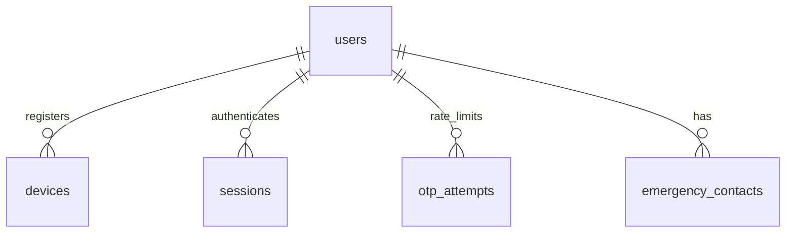
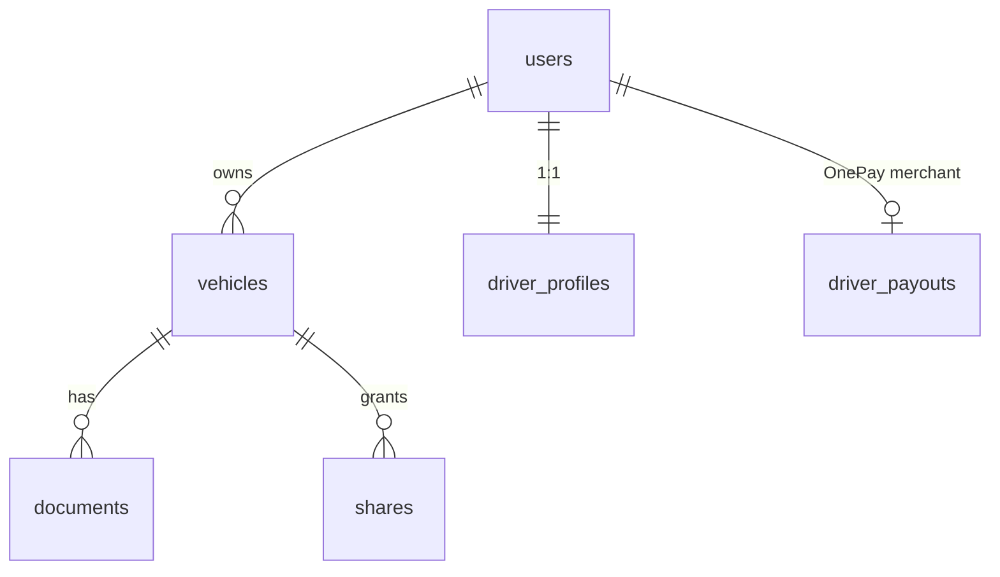
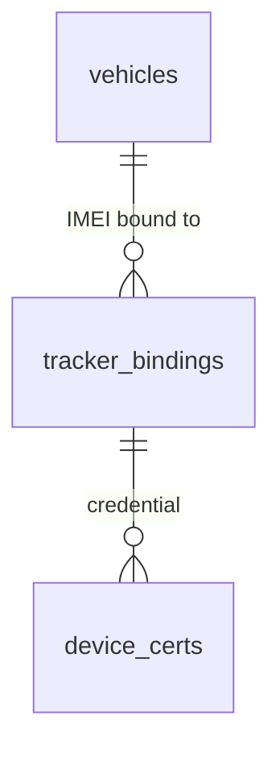
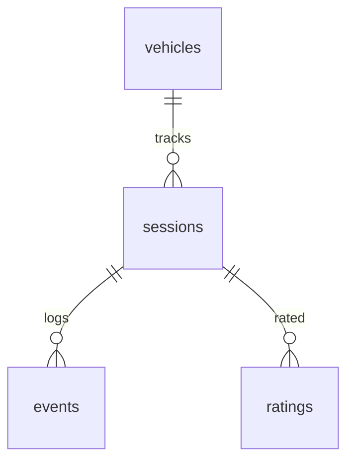
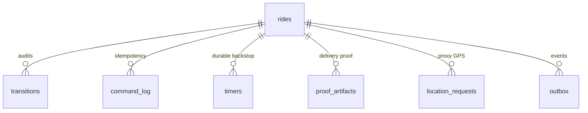
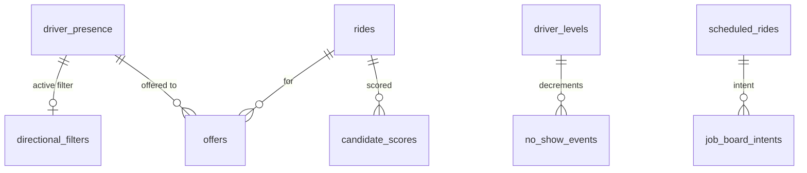

# D4′ — MageRide Data Model (PostgreSQL 16 + PostGIS + TimescaleDB)

> **🔄 Aligned to ADD v2.6 / URD v2.2 (see ADD §1.8 AL-01…AL-16).** Schema changes in this pass: **nine-role RBAC** + `iam.user_roles` + `iam.fleet_members` (AL-06), `role` enum drops `reseller` (AL-01); **single-active-device per app** — `iam.sessions.app` (AL-08); **canonical `vehicle_type`** (`car`→`sedan`, +`truck`/`mini_truck`, AL-09); **insurance + revenue-licence mandatory all modes** (AL-10, US-2.19/2.20); `registry.fleets`/`fleet_vehicles`/`fleet_assignments` + `billing.fleet_invoices` (Fleet Portal Phase 1, AL-03); `billing.resellers`→**`billing.credit_transfers`/`voucher_discount_tiers`/`voucher_purchases`** (driver-to-driver, exact value, **no commission**) + `owner_type` drops `reseller`/adds `fleet` (AL-01/03); **`billing.bank_transfer_topups` removed** (AL-05); `iam.saved_addresses` + `default_payment_method` (AL-14); `iam.users.email` for web-portal auth (AL-07).

> **Phase B deliverable (Prompt B4).** Transformed from the Namma Yatri Phase-A data model
> (`nammayatri-extraction/D4_data_model.md`) onto **MageRide PostgreSQL 16 on TimescaleDB-HA**
> (PostGIS + TimescaleDB extensions) per ADD v2.4 §8/§9, canonical 18-schema list
> (`lightweight-production-replica.md`), entities aligned to D3′ API payloads.
>
> **Stack delta:** NY = two Beckn-role Postgres DBs (`atlas_app`, `atlas_driver_offer_bpp`), 447
> tables, **no DB-level FKs**, **no PG enums** (Haskell ADTs as text), surrogate `varchar(36)` PKs,
> India PII-encryption pairs, `numeric(30,N)` + `currency` money, `merchant_operating_city_id` tenancy.
> MageRide = **18 bounded-context schemas** in one PG16 cluster + a logically separated `telemetry`
> hypertable; **real FOREIGN KEYs** (improves on NY's app-only refs — `[ADAPT]`); **`UUID` PKs**
> (ULIDs stored as UUID); **`TIMESTAMPTZ`** everywhere with business dates in **`Asia/Colombo`** (D-38);
> **`INTEGER` minor units (Rs×100) `CHECK ≥ 0`**; **CITEXT/`text` + CHECK or lookup tables** for enums.
> Every entity tagged `[KEEP]`/`[ADAPT]`/`[REPLACE]`/`[NEW]`. India-specific columns removed/adapted.

## 0. Schema Architecture & Conventions

**21 schemas (bounded contexts):** `iam, registry, prov, trips, rides, dispatch, reputation, safety,
fares, billing, comms, docs, support, content, audit, pdpa, spatial, telemetry` **+ `config` (§17b),
`subscription` (Δ 2026-06-21) and `transit` (Δ 2026-06-21)**. Two further schemas are created by later
change sets: `analytics` (Δ 2026-06-28, AL-38) and `transit_staging` (Δ 2026-07-22 #2, AL-54).

| Convention | MageRide rule | NY delta |
|---|---|---|
| PK | `id UUID PRIMARY KEY DEFAULT gen_random_uuid()` (ULID-compatible) | `[ADAPT]` from `varchar(36)` text UUID |
| FK | **Real `FOREIGN KEY` constraints** within/across schema; `ON DELETE` explicit | `[ADAPT]` NY had **zero** DB FKs |
| Enums | `text` + `CHECK (col IN (...))` for small closed sets; lookup tables for catalogs | `[KEEP]` text storage, add CHECK |
| Money | `*_minor INTEGER NOT NULL CHECK (… >= 0)` (Rs×100); `currency CHAR(3) DEFAULT 'LKR'` | `[REPLACE]` NY `numeric(30,N)`+`currency` |
| Time | `TIMESTAMPTZ`; business date `DATE` computed in `Asia/Colombo` (D-38) | `[KEEP]` timestamptz; pin tz |
| Tenancy | `operating_region` optional (single-country SL); no `merchant_operating_city_id` everywhere | `[ADAPT]` SL is one market |
| PII | hash-only (`*_phone_hash BYTEA`) for **unregistered** parties; registered users via FK; ID docs in `docs.*` SSE-KMS | `[REPLACE]` drop Aadhaar/PAN/UPI encryption pairs |
| Audit | `created_at`/`updated_at TIMESTAMPTZ NOT NULL DEFAULT now()` on all tables | `[KEEP]` |
| Extensions | `postgis`, `timescaledb`, `pgcrypto` (gen_random_uuid, HMAC), `citext` | `[NEW]` |
| Data access | **Dapper** over **Npgsql** — hand-written parameterised SQL, repository-per-schema; **no EF Core/ORM**. This DDL is the source of truth (no model-first generation) | `[NEW]` |
| Migrations | Versioned **SQL scripts** applied by **DbUp/Grate** one-shot `migrate` job; ordered/idempotent; **not** `dotnet ef migrations` | `[NEW]` |

```sql
CREATE EXTENSION IF NOT EXISTS postgis;
CREATE EXTENSION IF NOT EXISTS timescaledb;
CREATE EXTENSION IF NOT EXISTS pgcrypto;
CREATE SCHEMA iam; CREATE SCHEMA registry; CREATE SCHEMA prov; CREATE SCHEMA trips;
CREATE SCHEMA rides; CREATE SCHEMA dispatch; CREATE SCHEMA reputation; CREATE SCHEMA safety;
CREATE SCHEMA fares; CREATE SCHEMA billing; CREATE SCHEMA comms; CREATE SCHEMA docs;
CREATE SCHEMA support; CREATE SCHEMA content; CREATE SCHEMA audit; CREATE SCHEMA pdpa;
CREATE SCHEMA spatial; CREATE SCHEMA telemetry; CREATE SCHEMA config;
CREATE SCHEMA subscription; CREATE SCHEMA transit;
```

**NY→MageRide context map:** `person`(rider/driver)→`iam.users`+`registry.driver_profiles`;
`registration_token`→`iam.sessions`/`iam.otp_attempts`; `vehicle`+`*_certificate`+`idfy_verification`
→`registry.vehicles`/`registry.documents`/`docs.extractions`; `booking`+`ride`(BPP Mode C)→`rides.rides`;
`booking`/`ride`(Mode A/B tracking)→`trips.sessions`; `search_request*`/`search_request_for_driver`/
Allocator→`dispatch.*`; `driver_fee`/`plan`/`mandate`/`payout_order`/`finance_*`→`billing.*`(ledger);
`estimate`/`fare_parameters`/`fare_policy`→`fares.*`; `rating`→`trips.ratings`; `sos`/`safety_*`→
`safety.*`. **Dropped (India/Beckn):** `frfs_*`, `*_ticket*`, `pass*`, `mandate`(UPI), `aadhaar_*`,
`bbps`, `beckn_config`, `namma_tag*`, `lms_*`, `coin_*` `[DROPPED: no MageRide URD story]`.

---

## 1. `iam` — Identity & Auth   [ADAPT] (NY person/registration_token, drop Aadhaar/encryption)



### iam.users — end-user / internal-role account
> **AL-06/AL-01 (ADD v2.6):** "Reseller" is **not** a role, account, or capability — it is simply any driver who has bought bulk credit and transfers it to other drivers by Driver ID with no commission (see `billing.credit_transfers`). The platform has **nine canonical roles**; a user may hold several (see `iam.user_roles`). The single `role` column is the user's **primary** role; effective permissions = union of all assigned roles (deny-by-default RBAC).

| Column | Type | Null | Default | Constraints | Description |
|---|---|---|---|---|---|
| id | UUID | no | gen_random_uuid() | PK | User UUID |
| phone | TEXT | no | — | UQ | +94 E.164 (apps = Phone OTP; null-able for web-only internal accounts that sign in by email) |
| email | TEXT | yes | — | UQ | For Fleet Portal (Email+Password/Google/Apple) and Admin Portal (Password/Google) accounts (AL-07) |
| role | TEXT | no | 'passenger' | CK (9 roles) | **Primary** role (AL-06) |
| first_name | TEXT | yes | — | — | Given name |
| photo_url | TEXT | yes | — | — | Avatar |
| language | TEXT | no | 'en' | CK in(si,ta,en) | Locale (was Hindi/Kannada [DELTA:INDIA]) |
| operating_city_code | TEXT | yes | — | →config.operating_cities.code | Launch city chosen at onboarding (SCR-DA/DI-002); map-centroid default (Change 6/22) |
| notif_prefs | JSONB | no | '{}' | — | Per-type prefs (US-10.7) |
| default_payment_method | TEXT | no | 'cash' | CK in(cash,lankaqr,onepay) | Passenger default pay method (AL-14, US-22.4) |
| is_blocked | BOOL | no | false | — | Block gate |
| created_at/updated_at | TIMESTAMPTZ | no | now() | — | Audit |

```sql
CREATE TABLE iam.users (
  id UUID PRIMARY KEY DEFAULT gen_random_uuid(),
  phone TEXT UNIQUE,                                          -- [ADAPT] nullable: web-only internal accounts use email
  email TEXT UNIQUE,                                          -- [NEW] Fleet/Admin Portal sign-in (AL-07)
  role TEXT NOT NULL DEFAULT 'passenger' CHECK (role IN       -- [REPLACE] nine canonical roles, no 'reseller' (AL-06)
    ('passenger','driver','fleet_owner','admin','super_admin',
     'verification_officer','support_csr','finance_officer','auditor')),
  first_name TEXT, photo_url TEXT,
  language TEXT NOT NULL DEFAULT 'en' CHECK (language IN ('si','ta','en')),
  operating_city_code TEXT,                                  -- [NEW] launch city (SCR-DA/DI-002); soft ref → config.operating_cities.code (Change 6/22)
  notif_prefs JSONB NOT NULL DEFAULT '{}',
  default_payment_method TEXT NOT NULL DEFAULT 'cash' CHECK (default_payment_method IN ('cash','lankaqr','onepay')),  -- [NEW] AL-14
  is_blocked BOOLEAN NOT NULL DEFAULT false,
  created_at TIMESTAMPTZ NOT NULL DEFAULT now(), updated_at TIMESTAMPTZ NOT NULL DEFAULT now());

CREATE TABLE iam.user_roles (                                 -- [NEW] multi-role union, deny-by-default RBAC (AL-06)
  user_id UUID NOT NULL REFERENCES iam.users(id) ON DELETE CASCADE,
  role TEXT NOT NULL CHECK (role IN
    ('passenger','driver','fleet_owner','admin','super_admin',
     'verification_officer','support_csr','finance_officer','auditor')),
  granted_by UUID REFERENCES iam.users(id),                  -- internal roles (4–9) provisioned only by super_admin
  granted_at TIMESTAMPTZ NOT NULL DEFAULT now(),
  PRIMARY KEY (user_id, role));

CREATE TABLE iam.fleet_members (                              -- [NEW] org-scoped fleet sub-roles (AL-03)
  fleet_id UUID NOT NULL REFERENCES registry.fleets(id) ON DELETE CASCADE,
  user_id UUID NOT NULL REFERENCES iam.users(id) ON DELETE CASCADE,
  fleet_role TEXT NOT NULL CHECK (fleet_role IN ('owner','manager','viewer')),
  created_at TIMESTAMPTZ NOT NULL DEFAULT now(),
  PRIMARY KEY (fleet_id, user_id));

CREATE TABLE iam.saved_addresses (                            -- [NEW] Home/Work + labelled addresses (AL-14, US-22.1/22.2)
  id UUID PRIMARY KEY DEFAULT gen_random_uuid(),
  user_id UUID NOT NULL REFERENCES iam.users(id) ON DELETE CASCADE,
  label TEXT NOT NULL,                                        -- 'home' | 'work' | custom ("Save Address As")
  line1 TEXT, line2 TEXT, line3 TEXT,
  geo GEOGRAPHY(POINT,4326) NOT NULL,                         -- OSM pin (reverse-geocoded)
  created_at TIMESTAMPTZ NOT NULL DEFAULT now(), updated_at TIMESTAMPTZ NOT NULL DEFAULT now());

CREATE TABLE iam.devices (                                   -- [ADAPT] device binding (drop India enc)
  id UUID PRIMARY KEY DEFAULT gen_random_uuid(),
  user_id UUID NOT NULL REFERENCES iam.users(id) ON DELETE CASCADE,
  platform TEXT NOT NULL CHECK (platform IN ('android','ios')),
  fcm_apns_token TEXT, keystore_pubkey TEXT, attestation_verified_at TIMESTAMPTZ,
  created_at TIMESTAMPTZ NOT NULL DEFAULT now(), updated_at TIMESTAMPTZ NOT NULL DEFAULT now());

CREATE TABLE iam.sessions (                                  -- [REPLACE] opaque token → JWT refresh (D-29)
  jti UUID PRIMARY KEY DEFAULT gen_random_uuid(),
  user_id UUID NOT NULL REFERENCES iam.users(id) ON DELETE CASCADE,
  device_id UUID NOT NULL REFERENCES iam.devices(id) ON DELETE CASCADE,
  app TEXT NOT NULL DEFAULT 'passenger' CHECK (app IN ('passenger','driver')),  -- [NEW] single-active-device is PER APP (AL-08)
  issued_at TIMESTAMPTZ NOT NULL DEFAULT now(), last_used_at TIMESTAMPTZ, revoked_at TIMESTAMPTZ);
-- single active device PER APP (AL-08, US-1.12): a new-device login revokes only that app's prior session;
-- the same person may run the Driver App and Passenger App simultaneously.
CREATE UNIQUE INDEX ux_sessions_active_app ON iam.sessions(user_id, app) WHERE revoked_at IS NULL;

CREATE TABLE iam.otp_attempts (                              -- [ADAPT] token-bucket OTP rate-limit (D-32)
  id UUID PRIMARY KEY DEFAULT gen_random_uuid(),
  phone TEXT NOT NULL, auth_id UUID NOT NULL, otp_hash BYTEA NOT NULL,
  attempts SMALLINT NOT NULL DEFAULT 0, expires_at TIMESTAMPTZ NOT NULL,
  verified BOOLEAN NOT NULL DEFAULT false, created_at TIMESTAMPTZ NOT NULL DEFAULT now());
CREATE INDEX ix_otp_phone ON iam.otp_attempts(phone, created_at DESC);

CREATE TABLE iam.emergency_contacts (                        -- [KEEP] (NY person_default_emergency_number)
  id UUID PRIMARY KEY DEFAULT gen_random_uuid(),
  user_id UUID NOT NULL REFERENCES iam.users(id) ON DELETE CASCADE,
  name TEXT NOT NULL, phone TEXT NOT NULL,
  created_at TIMESTAMPTZ NOT NULL DEFAULT now(), updated_at TIMESTAMPTZ NOT NULL DEFAULT now());
```

---

## 2. `registry` — Vehicles, Sharing, Documents, Payouts   [ADAPT]/[NEW]



### registry.vehicles — registered vehicle  [ADAPT] (NY vehicle, drop RTO/India)
| Column | Type | Null | Default | Constraints | Description |
|---|---|---|---|---|---|
| id | UUID | no | gen_random_uuid() | PK | Vehicle UUID (= Vehicle ID) |
| owner_id | UUID | no | — | FK→iam.users | Owner/driver |
| registration_number | TEXT | no | — | (partial UQ) | SL plate |
| vehicle_type | TEXT | no | — | CK | **canonical (AL-09)**: motorbike, three_wheeler, flex, sedan, mini_van, van, truck, mini_truck, bus, train (**no `car` — "car"→"sedan"**) |
| mode | CHAR(1) | no | — | CK in(A,B,C) | Service mode |
| status | TEXT | no | 'PENDING' | CK in(PENDING,APPROVED,REJECTED,DEACTIVATED) | Reg status (US-2.13) |
| rejection_reason | TEXT | yes | — | — | US-2.15 |
| driver_name | TEXT | no | — | — | Shown to passengers (US-2.12) |
| driver_photo_url | TEXT | yes | — | — | US-2.12 |
| vehicle_photo_url | TEXT | yes | — | — | — |
| dispatch_state | TEXT | no | 'ACTIVE' | CK in(ACTIVE,DISPATCH_SUSPENDED) | E-03 doc-expiry suspend |
| onboarding_status | TEXT | no | 'incomplete' | CK in(incomplete,approved) | **AL-30** derived from `registry.onboarding_steps`; My Vehicles Incomplete/Approved; only `approved` Mode-C vehicles go live (US-2.26/9.6) |
| created_at/updated_at | TIMESTAMPTZ | no | now() | — | Audit |

```sql
CREATE TABLE registry.vehicles (
  id UUID PRIMARY KEY DEFAULT gen_random_uuid(),
  owner_id UUID NOT NULL REFERENCES iam.users(id),
  registration_number TEXT NOT NULL,
  vehicle_type TEXT NOT NULL CHECK (vehicle_type IN          -- [REPLACE] canonical enum, "car"→"sedan", +truck/mini_truck (AL-09)
    ('motorbike','three_wheeler','flex','sedan','mini_van','van','truck','mini_truck','bus','train')),
  mode CHAR(1) NOT NULL CHECK (mode IN ('A','B','C')),
  status TEXT NOT NULL DEFAULT 'PENDING' CHECK (status IN ('PENDING','APPROVED','REJECTED','DEACTIVATED')),
  rejection_reason TEXT, driver_name TEXT NOT NULL, driver_photo_url TEXT, vehicle_photo_url TEXT,
  dispatch_state TEXT NOT NULL DEFAULT 'ACTIVE' CHECK (dispatch_state IN ('ACTIVE','DISPATCH_SUSPENDED')),
  onboarding_status TEXT NOT NULL DEFAULT 'incomplete' CHECK (onboarding_status IN ('incomplete','approved')),  -- AL-30: derived from registry.onboarding_steps; only 'approved' Mode-C vehicles go live (US-2.26/9.6)
  created_at TIMESTAMPTZ NOT NULL DEFAULT now(), updated_at TIMESTAMPTZ NOT NULL DEFAULT now());
-- D-37: registration uniqueness across the ACTIVE set only:
CREATE UNIQUE INDEX ux_vehicles_regno_active ON registry.vehicles(registration_number)
  WHERE status IN ('PENDING','APPROVED');
CREATE INDEX ix_vehicles_owner ON registry.vehicles(owner_id);

CREATE TABLE registry.driver_profiles (                      -- [ADAPT] (NY driver_information core, drop India)
  driver_id UUID PRIMARY KEY REFERENCES iam.users(id) ON DELETE CASCADE,
  display_name TEXT NOT NULL, photo_url TEXT, verified_at TIMESTAMPTZ,
  nic_no TEXT,                                               -- AL-29: extracted from the driving-licence scan (or manual entry on unclear scan); US-2.4a
  allowed_vehicle_types TEXT[],                              -- AL-29: licence classes extracted from the licence (or manual); US-2.4a
  created_at TIMESTAMPTZ NOT NULL DEFAULT now(), updated_at TIMESTAMPTZ NOT NULL DEFAULT now());

CREATE TABLE registry.driver_payout_profiles (               -- [NEW AL-58] driver bank & payout — replaces registry.driver_payouts (D-11 retired by AL-57)
  id UUID PRIMARY KEY DEFAULT gen_random_uuid(),
  driver_id UUID NOT NULL REFERENCES iam.users(id) ON DELETE CASCADE,
  bank TEXT NOT NULL, branch TEXT NOT NULL,
  account_no TEXT NOT NULL, account_holder_name TEXT NOT NULL,
  proof_upload_id UUID REFERENCES docs.uploads(id),          -- bank_statement | passbook_first_page
  lankaqr_upload_id UUID REFERENCES docs.uploads(id),        -- the driver's OWN bank-app LankaQR (AL-59); the ride pay sheet renders this
  status TEXT NOT NULL DEFAULT 'pending_verification'
    CHECK (status IN ('pending_verification','verified','rejected','superseded')),
  rejection_reason TEXT,
  verified_by UUID REFERENCES iam.users(id), verified_at TIMESTAMPTZ,
  created_at TIMESTAMPTZ NOT NULL DEFAULT now(), updated_at TIMESTAMPTZ NOT NULL DEFAULT now());
-- Versioned exactly like registry.fleet_payout_profiles: an edit INSERTs and re-verifies, and the
-- weekly payout run pays the single verified row. Approved by a Verification Officer through the
-- AL-39 queue, whose routes are subject-agnostic and already take a driver id.
CREATE UNIQUE INDEX ux_driver_payout_verified
  ON registry.driver_payout_profiles(driver_id) WHERE status = 'verified';

CREATE TABLE registry.documents (                            -- [NEW] doc expiry tracking (E-03; NY had per-doc tables)
  id UUID PRIMARY KEY DEFAULT gen_random_uuid(),
  driver_id UUID NOT NULL REFERENCES iam.users(id) ON DELETE CASCADE,
  vehicle_id UUID REFERENCES registry.vehicles(id) ON DELETE CASCADE,
  kind TEXT NOT NULL CHECK (kind IN ('driving_license','registration','permit','insurance','revenue_license')),
  file_url TEXT NOT NULL, issued_at TIMESTAMPTZ, expires_at TIMESTAMPTZ,
  status TEXT NOT NULL DEFAULT 'VALID' CHECK (status IN ('VALID','EXPIRING','EXPIRED','REJECTED')),
  created_at TIMESTAMPTZ NOT NULL DEFAULT now(), updated_at TIMESTAMPTZ NOT NULL DEFAULT now());
CREATE INDEX ix_documents_expiry ON registry.documents(expires_at) WHERE status <> 'EXPIRED'; -- E-03 nightly job
-- AL-10 (ADD v2.6): valid kind='insurance' AND kind='revenue_license' documents are MANDATORY for ALL modes (A/B/C); registry.vehicles
--   cannot transition to status='APPROVED' without them (enforced in registry-svc). Expiry of either auto-suspends dispatch (E-03). Trains (admin) are exempt (line-level cover).
-- Driver-identity docs are VEHICLE-LESS: kind='driving_license' rows carry vehicle_id IS NULL (captured at Profile Setup, SCR-DA/DI-003a),
--   alongside registry.driver_profiles(display_name, photo_url). Insurance/revenue_license/photos are per-vehicle (Mode-C vehicle onboarding).
-- Change 6/22 — Mode-C IN-APP vehicle onboarding auto-verification (AUTO-APPROVE happy path; SCR-DA/DI-004→004c→006):
--   ocr-svc (Gemini Flash 3.0) writes one docs.extractions row per uploaded doc. A document is VERIFIED when its required field(s)
--   extract with confidence: insurance → expiry_date; revenue_license → {licence_no, expiry_date}; front/back photos → plate OCR matches
--   registry.vehicles.registration_number; vehicle details (type + reg) are driver-entered. When ALL FOUR are VERIFIED, registry-svc
--   auto-transitions registry.vehicles.status PENDING→APPROVED with NO Verification Officer step (user decision 6/22), and the vehicle
--   appears in My Vehicles (SCR-DA/DI-026). Any non-verified doc (extraction failed / low confidence) keeps the vehicle PENDING and routes
--   it to the Verification Officer queue (US-2.10). Mode A/B vehicles + permits are NOT onboarded here — Fleet Portal only (SCR-FP-004).

-- Change pass 2026-06-25 (AL-29/AL-30) — driving-licence NIC + allowed vehicle types, per-field verification, and a per-step onboarding state machine.
-- registry.document_fields — provenance + verification of every extracted/entered field (AL-29; US-2.4a/2.10a):
CREATE TABLE registry.document_fields (
  id UUID PRIMARY KEY DEFAULT gen_random_uuid(),
  document_id UUID NOT NULL REFERENCES registry.documents(id) ON DELETE CASCADE,
  field_key TEXT NOT NULL,                                   -- licence_no | licence_expiry | nic_no | allowed_vehicle_types | insurance_expiry | revenue_no | revenue_expiry | reg_no_match | ...
  field_value TEXT,
  confidence NUMERIC(4,3),                                   -- NULL when source='manual'
  source TEXT NOT NULL DEFAULT 'ai' CHECK (source IN ('ai','manual')),
  verify_status TEXT NOT NULL DEFAULT 'auto_verified' CHECK (verify_status IN ('auto_verified','pending','confirmed')),
  confirmed_by UUID REFERENCES iam.users(id), confirmed_at TIMESTAMPTZ,
  created_at TIMESTAMPTZ NOT NULL DEFAULT now());
-- A field is set verify_status='pending' when source='manual' OR confidence < threshold OR (field_key='reg_no_match' AND field_value='false').
-- Pending fields surface in the Verification-Officer queue (SCR-AP-003) for Confirm / Edit & confirm (→ 'confirmed', audited). A vehicle/driver
--   cannot reach APPROVED while any field is 'pending'.

-- registry.onboarding_steps — persisted per-step Mode-C onboarding state machine (AL-30; US-2.10a/2.26/2.27):
CREATE TABLE registry.onboarding_steps (
  vehicle_id UUID NOT NULL REFERENCES registry.vehicles(id) ON DELETE CASCADE,
  step TEXT NOT NULL CHECK (step IN ('details','insurance','revenue','photos')),
  status TEXT NOT NULL DEFAULT 'pending_input' CHECK (status IN ('pending_input','verified','pending_review')),
  fields JSONB, saved_at TIMESTAMPTZ,
  PRIMARY KEY (vehicle_id, step));
-- Each step is SAVED INDIVIDUALLY (saved_at). status='pending_review' when any of the step's registry.document_fields is 'pending'
--   (doubtful/manual) or — for step='photos' — plate OCR ≠ registration_number. Re-opening the wizard resumes at the first step with
--   status <> 'verified'. registry.vehicles.onboarding_status is DERIVED: 'approved' when all four steps are verified/confirmed (and
--   registry.vehicles.status→APPROVED), else 'incomplete'. A vehicle with ≥1 saved step shows Incomplete in My Vehicles (SCR-DA/DI-026);
--   all four verified ⇒ Approved (only these go live). When a vehicle is Approved, the wizard entry point creates a NEW vehicle at Step 1/4 (US-2.27).

-- registry.fleets — Fleet Owner organisation (AL-03; Epic 13 Phase 1). Verification-Officer-gated.
CREATE TABLE registry.fleets (                               -- [NEW] AL-03
  id UUID PRIMARY KEY DEFAULT gen_random_uuid(),
  owner_id UUID NOT NULL REFERENCES iam.users(id),           -- the fleet_owner primary account
  name TEXT NOT NULL, business_reg TEXT,
  status TEXT NOT NULL DEFAULT 'PENDING' CHECK (status IN ('PENDING','APPROVED','REJECTED')),  -- onboarding gate
  rejection_reason TEXT,
  created_at TIMESTAMPTZ NOT NULL DEFAULT now(), updated_at TIMESTAMPTZ NOT NULL DEFAULT now());

CREATE TABLE registry.fleet_vehicles (                       -- [NEW] a fleet operates Mode A and/or Mode B only (NEVER C)
  fleet_id UUID NOT NULL REFERENCES registry.fleets(id) ON DELETE CASCADE,
  vehicle_id UUID NOT NULL REFERENCES registry.vehicles(id) ON DELETE CASCADE,
  mode CHAR(1) NOT NULL CHECK (mode IN ('A','B')),           -- AL-03: Mode C is not a fleet option
  PRIMARY KEY (fleet_id, vehicle_id));

CREATE TABLE registry.fleet_assignments (                    -- [NEW] driver↔vehicle assignment (US-13.2/13.9)
  id UUID PRIMARY KEY DEFAULT gen_random_uuid(),
  fleet_id UUID NOT NULL REFERENCES registry.fleets(id) ON DELETE CASCADE,
  vehicle_id UUID NOT NULL REFERENCES registry.vehicles(id) ON DELETE CASCADE,
  driver_id UUID NOT NULL REFERENCES iam.users(id),
  assigned_at TIMESTAMPTZ NOT NULL DEFAULT now(), revoked_at TIMESTAMPTZ,
  valid_from TIMESTAMPTZ NOT NULL DEFAULT now(),             -- [Δ C059, migration 0314]
  expires_at TIMESTAMPTZ,                                    -- US-13.9's auto-expiry; NULL = open-ended
  CONSTRAINT ck_fleet_assign_window CHECK (expires_at IS NULL OR expires_at > valid_from));
-- Δ C059 (0314): ux_fleet_assign_active is REPLACED by an exclusion constraint. "One open assignment per
-- (vehicle, driver)" was right while an assignment had no end; with a window it would permanently block
-- re-hiring the same relief driver on the same bus next month. The rule that holds is "no two open
-- assignments of one driver to one vehicle whose windows overlap", which is also the only form that
-- survives two managers assigning at once.
ALTER TABLE registry.fleet_assignments ADD CONSTRAINT ex_fleet_assign_overlap
  EXCLUDE USING gist (vehicle_id WITH =, driver_id WITH =, tstzrange(valid_from, expires_at) WITH &&)
  WHERE (revoked_at IS NULL);

CREATE TABLE registry.shares (                               -- [ADAPT] Mode B sharing grant (NY no equiv)
  id UUID PRIMARY KEY DEFAULT gen_random_uuid(),
  vehicle_id UUID NOT NULL REFERENCES registry.vehicles(id) ON DELETE CASCADE,
  grantee_user_id UUID NOT NULL REFERENCES iam.users(id) ON DELETE CASCADE,
  state TEXT NOT NULL DEFAULT 'PENDING' CHECK (state IN ('PENDING','ACCEPTED','REVOKED','EXPIRED')),
  expires_at TIMESTAMPTZ, accepted_at TIMESTAMPTZ, revoked_at TIMESTAMPTZ,
  created_at TIMESTAMPTZ NOT NULL DEFAULT now(), updated_at TIMESTAMPTZ NOT NULL DEFAULT now());
CREATE UNIQUE INDEX ux_shares_active ON registry.shares(vehicle_id, grantee_user_id)
  WHERE state IN ('PENDING','ACCEPTED');
CREATE TABLE registry.operators (                            -- [NEW] fleet org stub (Phase 2 fleet-svc)
  id UUID PRIMARY KEY DEFAULT gen_random_uuid(), name TEXT NOT NULL,
  created_at TIMESTAMPTZ NOT NULL DEFAULT now());
```

---

## 3. `prov` — Tracker Provisioning   [NEW] (T-02, T-03)



### prov.tracker_bindings — IMEI ↔ vehicle source of truth (T-03)
| Column | Type | Null | Default | Constraints | Description |
|---|---|---|---|---|---|
| id | UUID | no | gen_random_uuid() | PK | Binding |
| imei | TEXT | no | — | (partial UQ) | 15-digit IMEI |
| vehicle_id | UUID | no | — | FK→registry.vehicles | Bound vehicle |
| fleet_id | UUID | yes | — | FK→registry.operators | Fleet scope (RLS) |
| credential_serial | TEXT | no | — | — | Cert/PSK serial |
| credential_type | TEXT | no | — | CK in(x509,psk) | T-02 |
| state | TEXT | no | 'ACTIVE' | CK in(ACTIVE,QUARANTINED,REVOKED) | Anti-clone (T-08) |
| rotates_at | TIMESTAMPTZ | no | — | — | 90-day rotation (T-02) |

```sql
CREATE TABLE prov.tracker_bindings (
  id UUID PRIMARY KEY DEFAULT gen_random_uuid(),
  imei TEXT NOT NULL, vehicle_id UUID NOT NULL REFERENCES registry.vehicles(id) ON DELETE CASCADE,
  fleet_id UUID REFERENCES registry.operators(id), credential_serial TEXT NOT NULL,
  credential_type TEXT NOT NULL CHECK (credential_type IN ('x509','psk')),
  state TEXT NOT NULL DEFAULT 'ACTIVE' CHECK (state IN ('ACTIVE','QUARANTINED','REVOKED')),
  rotates_at TIMESTAMPTZ NOT NULL, source TEXT, last_seen_at TIMESTAMPTZ,
  signal_strength SMALLINT, battery_mv INTEGER, sat_count SMALLINT,
  created_at TIMESTAMPTZ NOT NULL DEFAULT now(), updated_at TIMESTAMPTZ NOT NULL DEFAULT now());
CREATE UNIQUE INDEX ux_tracker_imei_active ON prov.tracker_bindings(imei) WHERE state = 'ACTIVE'; -- anti-clone (T-08)
CREATE INDEX ix_tracker_vehicle ON prov.tracker_bindings(vehicle_id);

CREATE TABLE prov.device_certs (                             -- [NEW] credential lifecycle (T-02)
  id UUID PRIMARY KEY DEFAULT gen_random_uuid(),
  binding_id UUID NOT NULL REFERENCES prov.tracker_bindings(id) ON DELETE CASCADE,
  serial TEXT NOT NULL UNIQUE, kind TEXT NOT NULL CHECK (kind IN ('x509','psk')),
  pem_or_token_hash BYTEA NOT NULL, issued_at TIMESTAMPTZ NOT NULL DEFAULT now(),
  expires_at TIMESTAMPTZ NOT NULL, revoked_at TIMESTAMPTZ);
```

---

## 4. `trips` — Mode A/B Tracking Sessions   [ADAPT] (NY booking/ride → tracking only; D-03)



### trips.sessions — Mode A/B journey session (D-03 active-session mutex)
| Column | Type | Null | Default | Constraints | Description |
|---|---|---|---|---|---|
| id | UUID | no | gen_random_uuid() | PK | Session |
| vehicle_id | UUID | no | — | FK→registry.vehicles | Vehicle |
| driver_id | UUID | no | — | FK→iam.users | Driver |
| mode | CHAR(1) | no | — | CK in(A,B) | Mode (C→rides) |
| state | TEXT | no | 'ACTIVE' | CK in(ACTIVE,COMPLETED) | Lifecycle |
| route_id | UUID | yes | — | FK→spatial.routes | Mode A route |
| auto_end_at_destination | BOOL | no | false | — | US-5.4 |
| destination_geo | geography(Point,4326) | yes | — | — | 100m geofence end |
| started_at/ended_at | TIMESTAMPTZ | no/yes | now()/— | — | Window |

```sql
CREATE TABLE trips.sessions (
  id UUID PRIMARY KEY DEFAULT gen_random_uuid(),
  vehicle_id UUID NOT NULL REFERENCES registry.vehicles(id),
  driver_id UUID NOT NULL REFERENCES iam.users(id),
  mode CHAR(1) NOT NULL CHECK (mode IN ('A','B')),
  state TEXT NOT NULL DEFAULT 'ACTIVE' CHECK (state IN ('ACTIVE','COMPLETED')),
  route_id UUID, auto_end_at_destination BOOLEAN NOT NULL DEFAULT false,
  destination_geo geography(Point,4326),
  started_at TIMESTAMPTZ NOT NULL DEFAULT now(), ended_at TIMESTAMPTZ,
  end_reason TEXT CHECK (end_reason IN ('driver_ended','idle_timeout','geofence','admin')),
  created_at TIMESTAMPTZ NOT NULL DEFAULT now(), updated_at TIMESTAMPTZ NOT NULL DEFAULT now());
-- D-03 / US-9.6: one live vehicle per driver:
CREATE UNIQUE INDEX ux_sessions_active_driver ON trips.sessions(driver_id) WHERE state = 'ACTIVE';

CREATE TABLE trips.events (                                  -- [KEEP] (NY business_event)
  id UUID PRIMARY KEY DEFAULT gen_random_uuid(),
  session_id UUID NOT NULL REFERENCES trips.sessions(id) ON DELETE CASCADE,
  kind TEXT NOT NULL, payload JSONB, ts TIMESTAMPTZ NOT NULL DEFAULT now());

CREATE TABLE trips.ratings (                                 -- [KEEP] (NY rating; US-8.6/18.1/18.2)
  id UUID PRIMARY KEY DEFAULT gen_random_uuid(),
  subject_kind TEXT NOT NULL CHECK (subject_kind IN ('session','ride')),
  subject_id UUID NOT NULL, rater_id UUID NOT NULL REFERENCES iam.users(id),
  ratee_id UUID NOT NULL REFERENCES iam.users(id),
  stars SMALLINT NOT NULL CHECK (stars BETWEEN 1 AND 5),
  comment TEXT, direction TEXT NOT NULL CHECK (direction IN ('passenger_to_driver','driver_to_passenger')),
  created_at TIMESTAMPTZ NOT NULL DEFAULT now());
```
> `trips.position_samples` (NY 1/min operational sample) — partitioned monthly PostGIS table for Mode A/B
> operational history; high-frequency hardware telemetry goes to `telemetry.positions` (§17), not here.

---

## 5. `rides` — Mode C Ride Aggregate   [NEW]/[REPLACE] (R-01; NY Beckn booking/ride)



### rides.rides — the Mode C ride aggregate (R-01, R-02, R-18, P-01, P-06)
| Column | Type | Null | Default | Constraints | Description |
|---|---|---|---|---|---|
| id | UUID | no | gen_random_uuid() | PK | Ride |
| passenger_id | UUID | no | — | FK→iam.users | Requesting passenger |
| client_request_id | UUID | no | — | (UQ w/ passenger) | Idempotency partner (R-18) |
| booker_id | UUID | no | — | FK→iam.users | Booker (= passenger unless proxy, P-01) |
| rider_id | UUID | yes | — | FK→iam.users | Rider; NULL if unregistered (P-01) |
| rider_phone_hash | BYTEA | yes | — | — | Hashed PII unregistered rider (P-03) |
| rider_name | TEXT | yes | — | — | Proxy rider name |
| is_proxy | BOOL | no | false | — | P-01 |
| kind | SMALLINT | no | 0 | CK in(0,1,2) | 0=passenger,1=proxy,2=package (P-06) |
| vehicle_type | TEXT | no | — | — | Requested tier |
| pickup_geo / dropoff_geo | geography(Point,4326) | no | — | — | Endpoints |
| state | TEXT | no | 'Requested' | CK (state machine) | Appendix B.2 |
| accepted_driver_id | UUID | yes | — | FK→iam.users | Winner |
| accepted_vehicle_id | UUID | yes | — | FK→registry.vehicles | Winner vehicle |
| current_offer_id | UUID | yes | — | — | Active offer |
| offer_expires_at | TIMESTAMPTZ | yes | — | — | 15s TTL |
| dispatch_algorithm_version | SMALLINT | yes | — | — | R-11 |
| package_size | CHAR(1) | yes | — | CK in(S,M,L) | P-06 |
| package_description | TEXT | yes | — | — | Item desc |
| pickup_otp_hash / delivery_otp_hash | BYTEA | yes | — | — | HMAC OTP (P-07) |
| pickup_otp_attempts / delivery_otp_attempts | SMALLINT | no | 0 | — | Lockout (P-07) |
| payment_method | TEXT | no | 'cash' | CK in(cash,lankaqr,onepay,cod) | P-04/P-08 |
| version | BIGINT | no | 0 | — | Optimistic concurrency (R-02) |
| created_at/updated_at/terminal_at | TIMESTAMPTZ | no/no/yes | now() | — | Audit |

```sql
CREATE TABLE rides.rides (
  id UUID PRIMARY KEY DEFAULT gen_random_uuid(),
  passenger_id UUID NOT NULL REFERENCES iam.users(id),
  client_request_id UUID NOT NULL,
  booker_id UUID NOT NULL REFERENCES iam.users(id),
  rider_id UUID REFERENCES iam.users(id),
  rider_phone_hash BYTEA, rider_name TEXT,
  is_proxy BOOLEAN NOT NULL DEFAULT false,
  kind SMALLINT NOT NULL DEFAULT 0 CHECK (kind IN (0,1,2)),
  vehicle_type TEXT NOT NULL,
  pickup_geo geography(Point,4326) NOT NULL, dropoff_geo geography(Point,4326) NOT NULL,
  state TEXT NOT NULL DEFAULT 'Requested' CHECK (state IN
    ('Requested','Matching','Offered','Accepted','DriverArrived','InProgress','Completed',
     'PaymentPending','Paid','CashSettled','CashOnDeliveryCollected','Disputed',
     'CancelledByRiderBeforeAccept','CancelledByRiderAfterAccept','CancelledByDriver',
     'ExpiredNoDriver','NoShowRider','NoShowDriver')),
  accepted_driver_id UUID REFERENCES iam.users(id),
  accepted_vehicle_id UUID REFERENCES registry.vehicles(id),
  current_offer_id UUID, offer_expires_at TIMESTAMPTZ, dispatch_algorithm_version SMALLINT,
  package_size CHAR(1) CHECK (package_size IN ('S','M','L')), package_description TEXT,
  pickup_otp_hash BYTEA, delivery_otp_hash BYTEA,
  pickup_otp_attempts SMALLINT NOT NULL DEFAULT 0, delivery_otp_attempts SMALLINT NOT NULL DEFAULT 0,
  payment_method TEXT NOT NULL DEFAULT 'cash' CHECK (payment_method IN ('cash','lankaqr','onepay','cod')),
  version BIGINT NOT NULL DEFAULT 0,
  created_at TIMESTAMPTZ NOT NULL DEFAULT now(), updated_at TIMESTAMPTZ NOT NULL DEFAULT now(),
  terminal_at TIMESTAMPTZ,
  CHECK (kind <> 2 OR (package_size IS NOT NULL AND pickup_otp_hash IS NOT NULL AND delivery_otp_hash IS NOT NULL)),
  CHECK (is_proxy = false OR (rider_name IS NOT NULL AND (rider_id IS NOT NULL OR rider_phone_hash IS NOT NULL))));
CREATE UNIQUE INDEX ux_rides_idem ON rides.rides(passenger_id, client_request_id);   -- R-18
CREATE UNIQUE INDEX ux_rides_open_passenger ON rides.rides(passenger_id)
  WHERE state NOT IN ('Completed','Paid','CashSettled','CashOnDeliveryCollected','Disputed',
    'CancelledByRiderBeforeAccept','CancelledByRiderAfterAccept','CancelledByDriver',
    'ExpiredNoDriver','NoShowRider','NoShowDriver');
CREATE UNIQUE INDEX ux_rides_driver_busy ON rides.rides(accepted_driver_id)             -- O2 + R-10
  WHERE state IN ('Accepted','DriverArrived','InProgress','PaymentPending');

CREATE TABLE rides.transitions (                             -- [NEW] immutable audit
  id UUID PRIMARY KEY DEFAULT gen_random_uuid(),
  ride_id UUID NOT NULL REFERENCES rides.rides(id) ON DELETE CASCADE,
  from_state TEXT, to_state TEXT NOT NULL, reason_code TEXT,
  actor_type TEXT NOT NULL, actor_id UUID, ts TIMESTAMPTZ NOT NULL DEFAULT now());

CREATE TABLE rides.command_log (                             -- [NEW] idempotent replay (R-14)
  idempotency_key TEXT PRIMARY KEY,
  ride_id UUID, actor_type TEXT NOT NULL, actor_id UUID, command TEXT NOT NULL,
  request_hash BYTEA NOT NULL, response_status SMALLINT, response_body JSONB,
  ts TIMESTAMPTZ NOT NULL DEFAULT now());

CREATE TABLE rides.timers (                                  -- [NEW] durable backstop (R-04)
  id UUID PRIMARY KEY DEFAULT gen_random_uuid(),
  ride_id UUID NOT NULL REFERENCES rides.rides(id) ON DELETE CASCADE,
  kind TEXT NOT NULL CHECK (kind IN ('offer_expiry','arrival_grace','no_show','payment_pending',
    'offline_grace','location_request_expiry','otp_attempt_window','cod_uncollected')),
  fire_at TIMESTAMPTZ NOT NULL, fired_at TIMESTAMPTZ, payload JSONB);
CREATE INDEX ix_timers_due ON rides.timers(fire_at) WHERE fired_at IS NULL;

CREATE TABLE rides.location_requests (                       -- [NEW] proxy GPS round-trip (P-02, P-03)
  id UUID PRIMARY KEY DEFAULT gen_random_uuid(),
  ride_id UUID REFERENCES rides.rides(id) ON DELETE CASCADE,
  request_id UUID NOT NULL UNIQUE, booker_id UUID NOT NULL REFERENCES iam.users(id),
  rider_id UUID REFERENCES iam.users(id), rider_phone_hash BYTEA,
  state TEXT NOT NULL DEFAULT 'Pending' CHECK (state IN ('Pending','Confirmed','Declined','Expired','RiderNotRegistered')),
  issued_at TIMESTAMPTZ NOT NULL DEFAULT now(), ttl_seconds INTEGER NOT NULL DEFAULT 300,
  resolved_at TIMESTAMPTZ, resolved_geo geography(Point,4326), resolved_accuracy_m NUMERIC);

CREATE TABLE rides.proof_artifacts (                         -- [NEW] delivery proof (P-10)
  id UUID PRIMARY KEY DEFAULT gen_random_uuid(),
  ride_id UUID NOT NULL REFERENCES rides.rides(id) ON DELETE CASCADE,
  kind TEXT NOT NULL CHECK (kind IN ('delivery_photo','signature','pickup_photo')),
  storage_url TEXT NOT NULL, sha256 BYTEA NOT NULL,
  captured_at TIMESTAMPTZ NOT NULL DEFAULT now(), captured_geo geography(Point,4326));

CREATE TABLE rides.outbox (                                  -- [NEW] transactional outbox (R-13, E-09)
  id BIGINT GENERATED ALWAYS AS IDENTITY PRIMARY KEY,
  aggregate_id UUID NOT NULL, event_type TEXT NOT NULL, payload JSONB NOT NULL,
  created_at TIMESTAMPTZ NOT NULL DEFAULT now(), dispatched_at TIMESTAMPTZ);
CREATE INDEX ix_outbox_undispatched ON rides.outbox(id) WHERE dispatched_at IS NULL;
```

---

## 6. `dispatch` — Candidate Scoring, Offers, Job Board, Directional   [NEW]/[REPLACE]



```sql
CREATE TABLE dispatch.driver_presence (                      -- [REPLACE] (NY driver pool/LTS)
  driver_id UUID PRIMARY KEY REFERENCES iam.users(id),
  vehicle_id UUID NOT NULL REFERENCES registry.vehicles(id),
  vehicle_type TEXT NOT NULL, state TEXT NOT NULL DEFAULT 'OFFLINE'
    CHECK (state IN ('OFFLINE','AVAILABLE','OFFERED','ON_RIDE')),
  geo geography(Point,4326), driver_home geography(Point,4326),       -- D-06 Job Board ST_DWithin
  last_seen_at TIMESTAMPTZ, updated_at TIMESTAMPTZ NOT NULL DEFAULT now());
CREATE INDEX ix_presence_geo ON dispatch.driver_presence USING gist(geo) WHERE state = 'AVAILABLE';
CREATE INDEX ix_presence_home ON dispatch.driver_presence USING gist(driver_home);

CREATE TABLE dispatch.offers (                               -- [REPLACE] (NY search_request_for_driver)
  id UUID PRIMARY KEY DEFAULT gen_random_uuid(),
  ride_id UUID NOT NULL REFERENCES rides.rides(id) ON DELETE CASCADE,
  driver_id UUID NOT NULL REFERENCES iam.users(id),
  status TEXT NOT NULL DEFAULT 'OFFERED' CHECK (status IN ('OFFERED','ACCEPTED','DECLINED','EXPIRED')),
  sent_at TIMESTAMPTZ NOT NULL DEFAULT now(), expires_at TIMESTAMPTZ NOT NULL, responded_at TIMESTAMPTZ);
-- R-10: at most one live offer per driver:
CREATE UNIQUE INDEX ux_offers_driver_live ON dispatch.offers(driver_id) WHERE status IN ('OFFERED','ACCEPTED');

CREATE TABLE dispatch.candidate_scores (                     -- [NEW] versioned scoring audit (R-11, P-11, DT-02)
  id UUID PRIMARY KEY DEFAULT gen_random_uuid(),
  ride_id UUID NOT NULL REFERENCES rides.rides(id) ON DELETE CASCADE,
  driver_id UUID NOT NULL REFERENCES iam.users(id),
  score NUMERIC NOT NULL, package_size_compatible BOOLEAN,        -- P-11
  breakdown JSONB NOT NULL,                                       -- breakdown.directional bearings/dist (DT-02)
  dispatch_algorithm_version SMALLINT NOT NULL, evaluated_at TIMESTAMPTZ NOT NULL DEFAULT now());
CREATE INDEX ix_candidate_ride ON dispatch.candidate_scores(ride_id);

CREATE TABLE dispatch.scheduled_rides (                      -- [NEW] advance bookings (US-6A.4)
  id UUID PRIMARY KEY DEFAULT gen_random_uuid(),
  ride_id UUID REFERENCES rides.rides(id), passenger_id UUID NOT NULL REFERENCES iam.users(id),
  pickup_geo geography(Point,4326) NOT NULL, dropoff_geo geography(Point,4326) NOT NULL,
  vehicle_type TEXT NOT NULL, pickup_time TIMESTAMPTZ NOT NULL,
  status TEXT NOT NULL DEFAULT 'SCHEDULED' CHECK (status IN ('SCHEDULED','DISPATCHED','CANCELLED')),
  created_at TIMESTAMPTZ NOT NULL DEFAULT now());
CREATE INDEX ix_sched_pickup ON dispatch.scheduled_rides USING gist(pickup_geo);   -- Job Board 30km (D-06)

CREATE TABLE dispatch.job_board_intents (                    -- [NEW] driver intent (US-6A.5)
  id UUID PRIMARY KEY DEFAULT gen_random_uuid(),
  scheduled_ride_id UUID NOT NULL REFERENCES dispatch.scheduled_rides(id) ON DELETE CASCADE,
  driver_id UUID NOT NULL REFERENCES iam.users(id), ts TIMESTAMPTZ NOT NULL DEFAULT now(),
  UNIQUE (scheduled_ride_id, driver_id));

CREATE TABLE dispatch.driver_levels (                        -- [NEW] Driver Level System (US-6A.6)
  driver_id UUID PRIMARY KEY REFERENCES iam.users(id),
  level SMALLINT NOT NULL DEFAULT 3 CHECK (level BETWEEN 1 AND 3),
  rating_points INTEGER NOT NULL DEFAULT 0, level_up_threshold INTEGER NOT NULL DEFAULT 500,
  updated_at TIMESTAMPTZ NOT NULL DEFAULT now());

CREATE TABLE dispatch.no_show_events (                       -- [NEW] level-decrement audit (US-6A.7)
  id UUID PRIMARY KEY DEFAULT gen_random_uuid(),
  driver_id UUID NOT NULL REFERENCES iam.users(id), ride_id UUID, ts TIMESTAMPTZ NOT NULL DEFAULT now());

CREATE TABLE dispatch.cancellation_penalties (               -- [NEW] Rs50 cross-trip (D-05)
  id UUID PRIMARY KEY DEFAULT gen_random_uuid(),
  passenger_id UUID NOT NULL REFERENCES iam.users(id), original_ride_id UUID NOT NULL,
  affected_driver_id UUID NOT NULL REFERENCES iam.users(id),
  amount_minor INTEGER NOT NULL DEFAULT 5000 CHECK (amount_minor >= 0),
  status TEXT NOT NULL DEFAULT 'OUTSTANDING' CHECK (status IN ('OUTSTANDING','SETTLED')),
  applied_ride_id UUID, created_at TIMESTAMPTZ NOT NULL DEFAULT now());
CREATE UNIQUE INDEX ux_penalty_apply ON dispatch.cancellation_penalties(id, applied_ride_id); -- idempotent (D-05)

CREATE TABLE dispatch.directional_filters (                  -- [NEW] Directional Travel (DT-01, DT-03)
  id UUID PRIMARY KEY DEFAULT gen_random_uuid(),
  driver_id UUID NOT NULL REFERENCES iam.users(id),
  destination_geo geography(Point,4326) NOT NULL, label TEXT,
  set_at TIMESTAMPTZ NOT NULL DEFAULT now(), expires_at TIMESTAMPTZ NOT NULL,
  cleared_at TIMESTAMPTZ, cleared_reason TEXT CHECK (cleared_reason IN ('expiry','manual','offline','first_matched_trip')),
  used_date DATE NOT NULL,                                   -- Asia/Colombo (D-38)
  created_at TIMESTAMPTZ NOT NULL DEFAULT now());
CREATE UNIQUE INDEX ux_directional_active ON dispatch.directional_filters(driver_id) WHERE cleared_at IS NULL;
CREATE INDEX ix_directional_uses ON dispatch.directional_filters(driver_id, used_date); -- max_uses_per_day (DT-03)

CREATE TABLE dispatch.timers (                               -- [NEW] directional expiry backstop (DT-04)
  id UUID PRIMARY KEY DEFAULT gen_random_uuid(),
  driver_id UUID NOT NULL REFERENCES iam.users(id), kind TEXT NOT NULL DEFAULT 'directional_expiry',
  fire_at TIMESTAMPTZ NOT NULL, fired_at TIMESTAMPTZ);

CREATE TABLE dispatch.directional_config (                   -- [NEW] admin params (DT-02)
  id SMALLINT PRIMARY KEY DEFAULT 1, theta_max_deg SMALLINT NOT NULL DEFAULT 45,
  detour_max_m INTEGER NOT NULL DEFAULT 2000, progress_min_m INTEGER NOT NULL DEFAULT 250,
  max_uses_per_day SMALLINT NOT NULL DEFAULT 2, max_duration_sec INTEGER NOT NULL DEFAULT 7200,
  clear_on_first_trip BOOLEAN NOT NULL DEFAULT false);
```

---

## 7. `reputation` — Counters & Block States   [NEW] (D-04, E-07)
```sql
CREATE TABLE reputation.counters (
  user_id UUID PRIMARY KEY REFERENCES iam.users(id),
  cancellations_continuous SMALLINT NOT NULL DEFAULT 0,   -- 3 continuous → BOOKING_DISABLED (US-6A.10b)
  reports_total INTEGER NOT NULL DEFAULT 0, no_shows INTEGER NOT NULL DEFAULT 0,
  window_reset_at TIMESTAMPTZ, updated_at TIMESTAMPTZ NOT NULL DEFAULT now());
CREATE TABLE reputation.block_states (                       -- consumed via gRPC by dispatch-svc (D-04)
  user_id UUID PRIMARY KEY REFERENCES iam.users(id),
  state TEXT NOT NULL DEFAULT 'OK' CHECK (state IN ('OK','WARN','BOOKING_DISABLED','DELISTED')),
  expires_at TIMESTAMPTZ, updated_at TIMESTAMPTZ NOT NULL DEFAULT now());
CREATE TABLE reputation.fraud_flags (                        -- [NEW] anti-collusion (E-07)
  id UUID PRIMARY KEY DEFAULT gen_random_uuid(), kind TEXT NOT NULL,
  subject_id UUID, related_id UUID, detail JSONB, ts TIMESTAMPTZ NOT NULL DEFAULT now());
```

---

## 8. `safety` — SOS, Trip Share, Reports, Blocks   [ADAPT]/[NEW] (NY sos)
```sql
CREATE TABLE safety.sos_events (                             -- [ADAPT] (NY sos; passenger+driver)
  id UUID PRIMARY KEY DEFAULT gen_random_uuid(),
  user_id UUID NOT NULL REFERENCES iam.users(id), role TEXT NOT NULL CHECK (role IN ('passenger','driver')),
  ride_id UUID, lat DOUBLE PRECISION NOT NULL, lng DOUBLE PRECISION NOT NULL,
  emergency_contact TEXT, sms_status TEXT, primary_gateway TEXT, secondary_gateway TEXT,
  admin_acked_at TIMESTAMPTZ, ts TIMESTAMPTZ NOT NULL DEFAULT now());   -- US-12.11 log
CREATE TABLE safety.trip_share_tokens (                      -- [NEW] (D-34; reused for package recipient P-09)
  token TEXT PRIMARY KEY, trip_id UUID NOT NULL,
  scope TEXT NOT NULL CHECK (scope IN ('trip_view','package_recipient')),
  expires_at TIMESTAMPTZ NOT NULL, revoked_at TIMESTAMPTZ, created_at TIMESTAMPTZ NOT NULL DEFAULT now());
CREATE TABLE safety.vehicle_reports (                        -- [ADAPT] (NY report; 3→delist US-12.6)
  id UUID PRIMARY KEY DEFAULT gen_random_uuid(),
  reporter_id UUID NOT NULL REFERENCES iam.users(id), vehicle_id UUID NOT NULL REFERENCES registry.vehicles(id),
  ride_id UUID, reason TEXT NOT NULL, status TEXT NOT NULL DEFAULT 'PENDING'
    CHECK (status IN ('PENDING','CONFIRMED','DISMISSED')), created_at TIMESTAMPTZ NOT NULL DEFAULT now());
CREATE TABLE safety.blocked_drivers (                        -- [NEW] passenger blocks driver (US-12.10)
  id UUID PRIMARY KEY DEFAULT gen_random_uuid(),
  passenger_id UUID NOT NULL REFERENCES iam.users(id), driver_id UUID NOT NULL REFERENCES iam.users(id),
  created_at TIMESTAMPTZ NOT NULL DEFAULT now(), UNIQUE (passenger_id, driver_id));
CREATE TABLE safety.location_request_audit (                 -- [NEW] proxy abuse audit (P-12)
  id UUID PRIMARY KEY DEFAULT gen_random_uuid(),
  booker_id UUID NOT NULL REFERENCES iam.users(id), rider_phone_hash BYTEA NOT NULL, request_id UUID NOT NULL,
  decision TEXT NOT NULL CHECK (decision IN ('Confirmed','Declined','Expired','NotRegistered')),
  ts TIMESTAMPTZ NOT NULL DEFAULT now());
```

---

## 9. `fares` — Tariffs, Payments, Refunds, Earnings   [REPLACE]/[NEW] (NY Juspay)

### fares.ride_payments — payment state machine (D-10, P-04, P-08, E-10)
| Column | Type | Null | Default | Constraints | Description |
|---|---|---|---|---|---|
| id | UUID | no | gen_random_uuid() | PK | Payment |
| ride_id | UUID | no | — | FK→rides.rides | Ride |
| state | TEXT | no | 'Initiated' | CK (machine) | D-10/P-08 |
| method | TEXT | no | — | CK in(cash,lankaqr,onepay,cod) | Method |
| amount_minor | INTEGER | no | — | CK ≥0 | Fare (Rs×100) |
| surcharge_minor | INTEGER | no | 0 | CK ≥0 | OnePay +5% (US-8.11) |
| tip_amount_minor | INTEGER | no | 0 | CK ≥0 | E-10 |
| payer_role | TEXT | no | 'rider' | CK in(rider,booker) | P-04 |
| payer_user_id | UUID | yes | — | FK→iam.users | P-04 |
| retry_of_payment_id | UUID | yes | — | self-FK | D-10 retry |
| provider_transaction_id | TEXT | yes | — | UQ | Callback idempotency (R-19) |

```sql
CREATE TABLE fares.tariffs (                                 -- [REPLACE] (NY fare_policy; Mode C only)
  id UUID PRIMARY KEY DEFAULT gen_random_uuid(),
  vehicle_type TEXT NOT NULL, first_km_minor INTEGER NOT NULL CHECK (first_km_minor >= 0),
  per_km_minor INTEGER NOT NULL CHECK (per_km_minor >= 0),
  peak_surcharge_pct SMALLINT NOT NULL DEFAULT 20, night_surcharge_pct SMALLINT NOT NULL DEFAULT 15,
  effective_from TIMESTAMPTZ NOT NULL DEFAULT now(), UNIQUE (vehicle_type, effective_from));
CREATE TABLE fares.peak_windows (                            -- [NEW] admin peak/night windows
  id UUID PRIMARY KEY DEFAULT gen_random_uuid(),
  kind TEXT NOT NULL CHECK (kind IN ('peak','night')), start_local TIME NOT NULL, end_local TIME NOT NULL,
  multiplier_pct SMALLINT NOT NULL);
CREATE TABLE fares.ride_payments (
  id UUID PRIMARY KEY DEFAULT gen_random_uuid(),
  ride_id UUID NOT NULL REFERENCES rides.rides(id),
  state TEXT NOT NULL DEFAULT 'Initiated' CHECK (state IN
    ('Initiated','Pending','Succeeded','Failed','Retried','FellBackToCash',
     'CashOnDelivery','CashOnDeliveryCollected','Overpaid','Refunded','PartiallyRefunded','Disputed')),
  method TEXT NOT NULL CHECK (method IN ('cash','lankaqr','onepay','cod')),
  amount_minor INTEGER NOT NULL CHECK (amount_minor >= 0),
  surcharge_minor INTEGER NOT NULL DEFAULT 0 CHECK (surcharge_minor >= 0),
  tip_amount_minor INTEGER NOT NULL DEFAULT 0 CHECK (tip_amount_minor >= 0),
  currency CHAR(3) NOT NULL DEFAULT 'LKR',
  payer_role TEXT NOT NULL DEFAULT 'rider' CHECK (payer_role IN ('rider','booker')),
  payer_user_id UUID REFERENCES iam.users(id),
  retry_of_payment_id UUID REFERENCES fares.ride_payments(id),
  provider_transaction_id TEXT UNIQUE, attempt_no SMALLINT NOT NULL DEFAULT 1,
  created_at TIMESTAMPTZ NOT NULL DEFAULT now(), updated_at TIMESTAMPTZ NOT NULL DEFAULT now());
CREATE TABLE fares.refunds (                                 -- [NEW] refund/dispute (E-05)
  id UUID PRIMARY KEY DEFAULT gen_random_uuid(),
  ride_payment_id UUID NOT NULL REFERENCES fares.ride_payments(id),
  kind TEXT NOT NULL CHECK (kind IN ('full','partial','overpaid_reversal')),
  amount_minor INTEGER NOT NULL CHECK (amount_minor >= 0),
  status TEXT NOT NULL DEFAULT 'Requested' CHECK (status IN ('Requested','Submitted','Succeeded','Failed')),
  provider_refund_id TEXT, reason_code TEXT, requested_by UUID, requested_at TIMESTAMPTZ NOT NULL DEFAULT now(),
  settled_at TIMESTAMPTZ);
CREATE TABLE fares.driver_earnings (                         -- [NEW] daily earnings aggregate
  driver_id UUID NOT NULL REFERENCES iam.users(id), earn_date DATE NOT NULL,  -- Asia/Colombo (D-38)
  trips INTEGER NOT NULL DEFAULT 0, gross_minor INTEGER NOT NULL DEFAULT 0 CHECK (gross_minor >= 0),
  daily_fee_minor INTEGER NOT NULL DEFAULT 0 CHECK (daily_fee_minor >= 0),
  PRIMARY KEY (driver_id, earn_date));
```

---

## 10. `billing` — Daily Fee, Double-Entry Ledger, Reseller Capability, Vouchers, Fleet   [REPLACE]/[NEW] (NY plan/driver_fee/finance)

> **AL-01/AL-05/AL-03 (ADD v2.6):** "Reseller" is **not a role, account, or capability** (`owner_type` has **no `reseller`**; a reselling driver uses their normal `driver` wallet and transfers **exact value with no commission**). The bulk-voucher commission/discount % is **configured per voucher value (denomination) in the DB** (`billing.voucher_discount_tiers`), set by Admin in the Admin Portal Config — it is the reseller's margin, applied only at purchase. **Bank-transfer top-ups removed** (`billing.bank_transfer_topups` dropped). **Fleet wallet** added (`owner_type='fleet'`) for monthly per-Mode-B-vehicle billing.

### billing.daily_fee_charges — idempotent daily fee (D-13)
PK `(driver_id, vehicle_id, fee_date)` where `fee_date` is `Asia/Colombo` — one flat charge per day,
first trip free.

```sql
CREATE TABLE billing.plans (                                 -- [NEW] 7-tier daily fee rates
  vehicle_type TEXT PRIMARY KEY, daily_fee_minor INTEGER NOT NULL CHECK (daily_fee_minor >= 0),
  mode CHAR(1) NOT NULL, updated_at TIMESTAMPTZ NOT NULL DEFAULT now());
CREATE TABLE billing.daily_fee_charges (                     -- [NEW] D-13
  driver_id UUID NOT NULL REFERENCES iam.users(id),
  vehicle_id UUID NOT NULL REFERENCES registry.vehicles(id),
  fee_date DATE NOT NULL,                                    -- Asia/Colombo (D-13/D-38)
  amount_minor INTEGER NOT NULL CHECK (amount_minor >= 0), trips_that_day INTEGER NOT NULL DEFAULT 0,
  status TEXT NOT NULL DEFAULT 'PAID' CHECK (status IN ('PAID','WAIVED_FIRST_TRIP')),
  charged_at TIMESTAMPTZ NOT NULL DEFAULT now(),
  PRIMARY KEY (driver_id, vehicle_id, fee_date));
CREATE TABLE billing.monthly_subscriptions (                -- [NEW] Mode B ~Rs300/mo, first month free
  id UUID PRIMARY KEY DEFAULT gen_random_uuid(),
  vehicle_id UUID NOT NULL REFERENCES registry.vehicles(id), period_month DATE NOT NULL,
  amount_minor INTEGER NOT NULL DEFAULT 30000 CHECK (amount_minor >= 0),
  status TEXT NOT NULL DEFAULT 'DUE' CHECK (status IN ('FREE','DUE','PAID')),
  UNIQUE (vehicle_id, period_month));
-- Double-entry ledger (D-09) — replaces NY simple wallet/transaction tables:
CREATE TABLE billing.accounts (
  id UUID PRIMARY KEY DEFAULT gen_random_uuid(),
  owner_type TEXT NOT NULL CHECK (owner_type IN ('passenger','driver','fleet','platform','suspense')),  -- [REPLACE] no 'reseller' (AL-01); +'fleet' (AL-03); +'passenger' for the AL-57 card rail
  owner_id UUID, currency CHAR(3) NOT NULL DEFAULT 'LKR',
  balance_minor BIGINT NOT NULL DEFAULT 0,                   -- may be negative (suspense); driver CHECK in app
  created_at TIMESTAMPTZ NOT NULL DEFAULT now());
CREATE TABLE billing.journal_entries (
  id UUID PRIMARY KEY DEFAULT gen_random_uuid(), ts TIMESTAMPTZ NOT NULL DEFAULT now(),
  kind TEXT NOT NULL CHECK (kind IN ('topup','daily_fee','trip_payment','penalty_settle',
    'adjustment','tip_payout','payment_refund','overpaid_reversal','voucher_purchase','driver_transfer',
    'fleet_invoice','driver_payout')),  -- no 'reseller_commission' (AL-01); 'driver_payout' [NEW AL-58] discharges the AL-57 custody liability
  idempotency_key TEXT NOT NULL UNIQUE, description TEXT);
CREATE TABLE billing.journal_postings (
  id BIGINT GENERATED ALWAYS AS IDENTITY PRIMARY KEY,
  entry_id UUID NOT NULL REFERENCES billing.journal_entries(id) ON DELETE CASCADE,
  account_id UUID NOT NULL REFERENCES billing.accounts(id), amount_minor BIGINT NOT NULL); -- Σ per entry = 0 (trigger)
CREATE INDEX ix_postings_account ON billing.journal_postings(account_id);
-- balanced-entry enforcement:
CREATE FUNCTION billing.assert_balanced() RETURNS trigger AS $$
BEGIN IF (SELECT COALESCE(SUM(amount_minor),0) FROM billing.journal_postings WHERE entry_id = NEW.entry_id) <> 0
  THEN RAISE EXCEPTION 'journal entry % not balanced', NEW.entry_id; END IF; RETURN NULL; END; $$ LANGUAGE plpgsql;
CREATE CONSTRAINT TRIGGER trg_balanced AFTER INSERT OR UPDATE ON billing.journal_postings
  DEFERRABLE INITIALLY DEFERRED FOR EACH ROW EXECUTE FUNCTION billing.assert_balanced();
CREATE TABLE billing.voucher_discount_tiers (              -- [REPLACE] bulk-voucher commission/discount % per VOUCHER VALUE (denomination), admin-set in Admin Portal (AL-01)
  denomination_minor BIGINT PRIMARY KEY,                    -- the voucher value, e.g. 100000 = Rs 1,000
  discount_bps INTEGER NOT NULL CHECK (discount_bps BETWEEN 0 AND 10000),  -- per-value commission %, admin-set (e.g. 1000 bps = 10% → pay 90,000, credit 100,000); = the reseller's margin
  active BOOLEAN NOT NULL DEFAULT true,
  updated_by UUID REFERENCES iam.users(id),                 -- admin who set the tier (Admin Portal)
  updated_at TIMESTAMPTZ NOT NULL DEFAULT now());
CREATE TABLE billing.voucher_purchases (                   -- [REPLACE] bulk credit voucher purchase (US-9.19) — credits buyer wallet at purchase, no redeem code
  id UUID PRIMARY KEY DEFAULT gen_random_uuid(), buyer_id UUID NOT NULL REFERENCES iam.users(id),
  denomination_minor BIGINT NOT NULL CHECK (denomination_minor >= 0),
  discount_bps_applied INTEGER NOT NULL CHECK (discount_bps_applied BETWEEN 0 AND 10000),
  paid_minor BIGINT NOT NULL CHECK (paid_minor >= 0),       -- amount charged to the buyer (denomination − discount)
  credited_minor BIGINT NOT NULL CHECK (credited_minor >= 0), -- amount credited to buyer wallet (= denomination)
  gateway_ref TEXT, journal_entry_id UUID REFERENCES billing.journal_entries(id),
  created_at TIMESTAMPTZ NOT NULL DEFAULT now());
CREATE TABLE billing.credit_transfers (                    -- [REPLACE] driver↔driver credit transfer, EXACT value, NO commission (US-9.13/9.21, AL-01)
  id UUID PRIMARY KEY DEFAULT gen_random_uuid(),
  sender_driver_id UUID NOT NULL REFERENCES iam.users(id),  -- credit-holding driver (approver / proactive sender)
  recipient_driver_id UUID NOT NULL REFERENCES iam.users(id), -- requester / recipient
  amount_minor BIGINT NOT NULL CHECK (amount_minor >= 0),   -- exact value debited from sender and credited to recipient (no commission)
  direction TEXT NOT NULL DEFAULT 'REQUESTED' CHECK (direction IN ('REQUESTED','DIRECT')),  -- requested-then-approved vs proactive send
  status TEXT NOT NULL DEFAULT 'PENDING' CHECK (status IN ('PENDING','APPROVED','REJECTED')),
  journal_entry_id UUID REFERENCES billing.journal_entries(id), created_at TIMESTAMPTZ NOT NULL DEFAULT now());
  -- Transfer: debit sender amount_minor, credit recipient amount_minor (Σ = 0). No commission posting.
-- billing.bank_transfer_topups REMOVED (AL-05): bank transfer is no longer a top-up method. Top-up = OnePay card / OnePay wallet / LankaQR only.
CREATE TABLE billing.fleet_invoices (                        -- [NEW] monthly per-Mode-B-vehicle fleet billing (AL-03)
  id UUID PRIMARY KEY DEFAULT gen_random_uuid(),
  fleet_id UUID NOT NULL REFERENCES registry.fleets(id), period_month DATE NOT NULL,
  total_minor INTEGER NOT NULL CHECK (total_minor >= 0),     -- Σ per-Mode-B-vehicle monthly fee (Mode A free)
  status TEXT NOT NULL DEFAULT 'DUE' CHECK (status IN ('FREE','DUE','PAID')),
  journal_entry_id UUID REFERENCES billing.journal_entries(id),
  UNIQUE (fleet_id, period_month));
```

CREATE TABLE billing.payout_batches (                        -- [NEW AL-58] one weekly sweep
  id UUID PRIMARY KEY DEFAULT gen_random_uuid(),
  run_date DATE NOT NULL UNIQUE, tz_at TIMESTAMPTZ NOT NULL,  -- D-38 Asia/Colombo business-date companion
  status TEXT NOT NULL DEFAULT 'RUNNING' CHECK (status IN ('RUNNING','COMPLETED','FAILED')),
  instruction_count INT NOT NULL DEFAULT 0,
  total_minor BIGINT NOT NULL DEFAULT 0 CHECK (total_minor >= 0),
  started_at TIMESTAMPTZ NOT NULL DEFAULT now(), completed_at TIMESTAMPTZ);
CREATE TABLE billing.payouts (                               -- [NEW AL-58] one instruction per driver per batch
  id UUID PRIMARY KEY DEFAULT gen_random_uuid(),
  batch_id UUID NOT NULL REFERENCES billing.payout_batches(id) ON DELETE CASCADE,
  driver_id UUID NOT NULL REFERENCES iam.users(id),
  payout_profile_id UUID NOT NULL REFERENCES registry.driver_payout_profiles(id),
  amount_minor BIGINT NOT NULL CHECK (amount_minor >= 0),    -- the WHOLE balance: weekly full sweep, no minimum, no holdback
  status TEXT NOT NULL DEFAULT 'PENDING' CHECK (status IN ('PENDING','SUBMITTED','PAID','FAILED')),
  failure_reason TEXT, provider_reference TEXT,              -- the bank's own id, once originated
  journal_entry_id UUID NOT NULL REFERENCES billing.journal_entries(id),   -- the wallet debit; commits WITH this row
  created_at TIMESTAMPTZ NOT NULL DEFAULT now(), updated_at TIMESTAMPTZ NOT NULL DEFAULT now());
CREATE UNIQUE INDEX ux_payouts_batch_driver ON billing.payouts(batch_id, driver_id);
CREATE UNIQUE INDEX ux_payouts_provider_ref
  ON billing.payouts(provider_reference) WHERE provider_reference IS NOT NULL;   -- R-19's shape


---

## 11–16. Supporting Schemas   [NEW]/[ADAPT]

```sql
-- 11. comms  [NEW] (D-24/25)
CREATE TABLE comms.voip_sessions (
  id UUID PRIMARY KEY DEFAULT gen_random_uuid(), ride_id UUID NOT NULL,
  livekit_room TEXT NOT NULL, started_at TIMESTAMPTZ NOT NULL DEFAULT now(), ended_at TIMESTAMPTZ,
  masked_sms_fallback BOOLEAN NOT NULL DEFAULT false);
CREATE TABLE comms.notification_tokens (                     -- [ADAPT] (NY device_token on person)
  id UUID PRIMARY KEY DEFAULT gen_random_uuid(), user_id UUID NOT NULL REFERENCES iam.users(id),
  platform TEXT NOT NULL CHECK (platform IN ('android','ios')), token TEXT NOT NULL,
  updated_at TIMESTAMPTZ NOT NULL DEFAULT now());

-- 12. docs  [ADAPT] (NY image/idfy_verification → OCR)
CREATE TABLE docs.uploads (
  id UUID PRIMARY KEY DEFAULT gen_random_uuid(), owner_id UUID NOT NULL REFERENCES iam.users(id),
  storage_url TEXT NOT NULL, sha256 BYTEA, kind TEXT, auto_delete_at TIMESTAMPTZ,  -- 90d raw delete (NFR-28)
  created_at TIMESTAMPTZ NOT NULL DEFAULT now());
CREATE TABLE docs.extractions (                              -- [ADAPT] (NY idfy_verification, drop India)
  id UUID PRIMARY KEY DEFAULT gen_random_uuid(), upload_id UUID NOT NULL REFERENCES docs.uploads(id),
  doc_type TEXT NOT NULL, extracted JSONB, confidence NUMERIC,
  status TEXT NOT NULL DEFAULT 'PENDING' CHECK (status IN ('PENDING','EXTRACTED','MANUAL_REVIEW','FAILED')),
  redaction_applied BOOLEAN NOT NULL DEFAULT true, created_at TIMESTAMPTZ NOT NULL DEFAULT now());  -- D-36

-- 13. support  [NEW] (Epic 16)
CREATE TABLE support.tickets (
  id UUID PRIMARY KEY DEFAULT gen_random_uuid(), user_id UUID NOT NULL REFERENCES iam.users(id),
  category TEXT NOT NULL, description TEXT NOT NULL, ride_id UUID, screenshot_url TEXT,
  status TEXT NOT NULL DEFAULT 'OPEN' CHECK (status IN ('OPEN','IN_PROGRESS','RESOLVED')),
  admin_response TEXT, created_at TIMESTAMPTZ NOT NULL DEFAULT now(), updated_at TIMESTAMPTZ NOT NULL DEFAULT now());

-- 14. content  [NEW] (D-26 Si/Ta/En)
CREATE TABLE content.notification_templates (
  template_key TEXT NOT NULL, language TEXT NOT NULL CHECK (language IN ('si','ta','en')),
  subject TEXT, body TEXT NOT NULL, version INTEGER NOT NULL DEFAULT 1, approved_by UUID,
  PRIMARY KEY (template_key, language, version));
CREATE TABLE content.faq_articles (
  id UUID PRIMARY KEY DEFAULT gen_random_uuid(), category TEXT NOT NULL, title TEXT NOT NULL,
  body TEXT NOT NULL, language TEXT NOT NULL CHECK (language IN ('si','ta','en')), sort_order INTEGER NOT NULL DEFAULT 0);
CREATE TABLE content.broadcasts (
  id UUID PRIMARY KEY DEFAULT gen_random_uuid(), audience JSONB, message_by_lang JSONB NOT NULL,
  scheduled_at TIMESTAMPTZ, created_at TIMESTAMPTZ NOT NULL DEFAULT now());

-- 15. audit  [NEW] (D-35 immutable admin log)
CREATE TABLE audit.events (
  id BIGINT GENERATED ALWAYS AS IDENTITY PRIMARY KEY, actor_id UUID, action TEXT NOT NULL,
  entity_type TEXT, entity_id UUID, before JSONB, after JSONB, ts TIMESTAMPTZ NOT NULL DEFAULT now());
REVOKE UPDATE, DELETE ON audit.events FROM PUBLIC;           -- append-only, 7y retention

-- 16. pdpa  [NEW] (E-06)
CREATE TABLE pdpa.requests (
  id UUID PRIMARY KEY DEFAULT gen_random_uuid(), user_id UUID NOT NULL REFERENCES iam.users(id),
  kind TEXT NOT NULL CHECK (kind IN ('export','erasure')),
  status TEXT NOT NULL DEFAULT 'Received' CHECK (status IN ('Received','InProgress','FulfilledHold','Fulfilled','Rejected')),
  requested_at TIMESTAMPTZ NOT NULL DEFAULT now(), due_by TIMESTAMPTZ NOT NULL DEFAULT now() + INTERVAL '30 days',
  fulfilled_at TIMESTAMPTZ, hold_reason TEXT);
CREATE TABLE pdpa.fulfillment_artifacts (
  id UUID PRIMARY KEY DEFAULT gen_random_uuid(), request_id UUID NOT NULL REFERENCES pdpa.requests(id),
  kind TEXT NOT NULL CHECK (kind IN ('export_zip','erasure_log')), storage_url TEXT NOT NULL,
  sha256 BYTEA, signed_at TIMESTAMPTZ);

-- 17a. spatial  [ADAPT] (NY route/station/geofence; PostGIS system of record §8)
CREATE TABLE spatial.routes (
  id UUID PRIMARY KEY DEFAULT gen_random_uuid(), name TEXT NOT NULL, route_number TEXT,
  geom geometry(LineString,4326) NOT NULL, mode CHAR(1));
CREATE TABLE spatial.stops (
  id UUID PRIMARY KEY DEFAULT gen_random_uuid(), name TEXT NOT NULL, geom geometry(Point,4326) NOT NULL);
CREATE TABLE spatial.geofences (
  id UUID PRIMARY KEY DEFAULT gen_random_uuid(), name TEXT, kind TEXT, geom geometry(Polygon,4326) NOT NULL);
CREATE INDEX ix_routes_geom ON spatial.routes USING gist(geom);
CREATE INDEX ix_stops_geom ON spatial.stops USING gist(geom);
CREATE INDEX ix_geofences_geom ON spatial.geofences USING gist(geom);
```

---

## 17b. `config` — Launch / Operating Cities   [NEW] (Change 6/22; backs SCR-DA/DI-002 city picker)

`config.operating_cities` is the **source of truth for the launch-city radio list** on the first-run
language/city screen (SCR-DA-002 / SCR-DI-002). Previously the city list was **hard-coded in the apps**;
it is now **admin-managed in the Admin Portal** and served read-only to the apps via `GET /config/cities`
(active rows only, ordered by `sort_order`). It replaces the dropped India `merchant_operating_city_id`
tenancy; the `centroid_*` columns formalise the Mode-B "city centroid" default already noted in §19.
The chosen `code` persists on `iam.users.operating_city_code` and seeds the map centroid.

```sql
CREATE TABLE config.operating_cities (                       -- [NEW] launch cities, admin-managed (Change 6/22)
  id UUID PRIMARY KEY DEFAULT gen_random_uuid(),
  code TEXT NOT NULL UNIQUE,                                  -- short slug e.g. 'colombo' (iam.users.operating_city_code ref)
  name_en TEXT NOT NULL, name_si TEXT NOT NULL, name_ta TEXT NOT NULL,  -- Si/Ta/En labels (D-26)
  centroid_lat DOUBLE PRECISION NOT NULL, centroid_lng DOUBLE PRECISION NOT NULL,
  is_active BOOLEAN NOT NULL DEFAULT true,                    -- only active cities are shown / bookable
  sort_order INTEGER NOT NULL DEFAULT 0,
  created_at TIMESTAMPTZ NOT NULL DEFAULT now(), updated_at TIMESTAMPTZ NOT NULL DEFAULT now());
CREATE INDEX ix_operating_cities_active ON config.operating_cities(sort_order) WHERE is_active;
-- Seed (Change 6/22) — Colombo first & default (matches §19 centroid default):
INSERT INTO config.operating_cities(code,name_en,name_si,name_ta,centroid_lat,centroid_lng,sort_order) VALUES
  ('colombo','Colombo','කොළඹ','கொழும்பு',6.9271,79.8612,0),
  ('kandy','Kandy','මහනුවර','கண்டி',7.2906,80.6337,1),
  ('galle','Galle','ගාල්ල','காலி',6.0535,80.2210,2);
```
```sql
-- The chosen city persists on the user (AL-27, US-1.3a):
ALTER TABLE iam.users ADD COLUMN IF NOT EXISTS operating_city_code TEXT
  REFERENCES config.operating_cities(code);
```
Admins toggle `is_active` / add rows to launch a new city — **no app release required**; the apps fetch
the list on first run (cacheable, see D6 §7). Mirrored as runnable DDL in `server_db_schema.md` §17b.

---

## 17. `telemetry` — Hardware-Tracker Hypertable   [NEW] (T-06; TimescaleDB)

`telemetry.positions` is a **TimescaleDB hypertable** on a logically separated tablespace — high-
frequency tracker + mobile GPS (replaces NY's Kafka/external-LTS pipeline). Operational Mode A/B
samples stay in `trips.position_samples`; this is the historical telematics system of record.

```sql
CREATE TABLE telemetry.positions (
  vehicle_id   UUID NOT NULL,
  sample_ts    TIMESTAMPTZ NOT NULL,                         -- GNSS UTC
  received_ts  TIMESTAMPTZ NOT NULL DEFAULT now(),
  seq          BIGINT NOT NULL,                              -- monotonic per vehicle (replay dedup, T-05)
  lat DOUBLE PRECISION NOT NULL, lng DOUBLE PRECISION NOT NULL,
  speed_mps REAL, heading_deg SMALLINT, accuracy_m REAL, hdop REAL, sat_count SMALLINT,
  source SMALLINT NOT NULL,                                  -- 0=mobile,1=gt06,2=jt808,3=h02,4=nmea-mqtt
  fleet_id UUID, trip_id UUID);
SELECT create_hypertable('telemetry.positions','sample_ts',
  partitioning_column => 'vehicle_id', number_partitions => 16, chunk_time_interval => INTERVAL '1 day');
CREATE INDEX ON telemetry.positions (vehicle_id, sample_ts DESC);
CREATE INDEX ON telemetry.positions (fleet_id, sample_ts DESC) WHERE fleet_id IS NOT NULL;
CREATE UNIQUE INDEX ON telemetry.positions (vehicle_id, seq);   -- replay idempotency (T-05/R-17)

-- Continuous aggregates (1m / 5m / 1h rollups):
CREATE MATERIALIZED VIEW telemetry.positions_1m WITH (timescaledb.continuous) AS
  SELECT vehicle_id, time_bucket('1 minute', sample_ts) AS bucket,
         avg(speed_mps) AS avg_speed, max(speed_mps) AS max_speed, count(*) AS samples,
         last(lat, sample_ts) AS last_lat, last(lng, sample_ts) AS last_lng
  FROM telemetry.positions GROUP BY vehicle_id, bucket;
SELECT add_continuous_aggregate_policy('telemetry.positions_1m',
  start_offset => INTERVAL '3 hours', end_offset => INTERVAL '1 minute', schedule_interval => INTERVAL '1 minute');

-- Per-fleet health rollup (continuous aggregate, fleet-health-svc):
CREATE MATERIALIZED VIEW telemetry.fleet_health_5m WITH (timescaledb.continuous) AS
  SELECT fleet_id, time_bucket('5 minutes', sample_ts) AS bucket,
         count(DISTINCT vehicle_id) AS active_vehicles, count(*) AS samples
  FROM telemetry.positions WHERE fleet_id IS NOT NULL GROUP BY fleet_id, bucket;

-- Compression (after 7 days, ~10×) + retention (raw 30 days):
ALTER TABLE telemetry.positions SET (timescaledb.compress,
  timescaledb.compress_segmentby = 'vehicle_id', timescaledb.compress_orderby = 'sample_ts DESC');
SELECT add_compression_policy('telemetry.positions', INTERVAL '7 days');
SELECT add_retention_policy('telemetry.positions', INTERVAL '30 days');
-- Fleet RLS (Epic 13):
ALTER TABLE telemetry.positions ENABLE ROW LEVEL SECURITY;
CREATE POLICY fleet_scope ON telemetry.positions USING (fleet_id = current_setting('app.fleet_id')::uuid);
```

---

## 18. Enumerations (text + CHECK, no PG enum types — `[KEEP]` NY pattern)

| Enum | Values | Used By |
|---|---|---|
| role | passenger, driver, fleet_owner, admin, super_admin, verification_officer, support_csr, finance_officer, auditor | iam.users.role / iam.user_roles (nine canonical, AL-06; **no `reseller`**) |
| fleet_role | owner, manager, viewer | iam.fleet_members (org-scoped, AL-03) |
| language | si, ta, en | iam.users.language (was Hindi/Kannada/Tamil/Telugu [DELTA:INDIA]) |
| vehicle_type | motorbike, three_wheeler, flex, sedan, mini_van, van, truck, mini_truck, bus, train | registry.vehicles (canonical, AL-09; **"car"→"sedan"**, +truck/mini_truck) |
| mode | A, B, C | vehicles, sessions |
| vehicle.status | PENDING, APPROVED, REJECTED, DEACTIVATED | registry.vehicles.status |
| ride.state | Requested, Matching, Offered, Accepted, DriverArrived, InProgress, Completed, PaymentPending, Paid, CashSettled, CashOnDeliveryCollected, Disputed, CancelledByRider*, CancelledByDriver, ExpiredNoDriver, NoShowRider, NoShowDriver | rides.rides.state (R-01) |
| payment.method | cash, lankaqr, onepay, cod | ride_payments.method (was UPI/Juspay [DELTA:JUSPAY]) |
| payment.state | Initiated, Pending, Succeeded, Failed, Retried, FellBackToCash, CashOnDelivery, CashOnDeliveryCollected, Overpaid, Refunded, PartiallyRefunded, Disputed | ride_payments.state (D-10) |
| block_state | OK, WARN, BOOKING_DISABLED, DELISTED | reputation.block_states |
| document.status | VALID, EXPIRING, EXPIRED, REJECTED | registry.documents (E-03) |
| credential_type | x509, psk | prov.tracker_bindings (T-02) |
| journal.kind | topup, daily_fee, trip_payment, penalty_settle, adjustment, tip_payout, payment_refund, overpaid_reversal, voucher_purchase, driver_transfer | billing.journal_entries (D-09); no `reseller_commission` (AL-01) |

---

## 19. Seed / Reference Data

```sql
-- 7-tier daily fee (billing.plans) — Mode A free, Mode C tiered. EVERY Mode-C-registerable
-- vehicle_type (registry.vehicles enum minus bus/train) MUST have a plan row (B0 fix B1):
-- Canonical Mode-C taxonomy (AL-09; URD §1.B/§9) — no 'car' (→'sedan'). Every Mode-C ride type has a plan row.
INSERT INTO billing.plans(vehicle_type, daily_fee_minor, mode) VALUES
  ('bus',0,'A'),('train',0,'A'),
  ('motorbike',5000,'C'),('three_wheeler',10000,'C'),('flex',15000,'C'),
  ('sedan',20000,'C'),('mini_van',25000,'C'),('van',30000,'C');
  -- Truck/Mini Truck: package-delivery types — admin-configured daily-fee rows (no default seeded).
-- Mode C fare tariffs (Rs minor units, AL-09; URD §8 v2.2 table). EVERY Mode-C-bookable type has a tariff row:
INSERT INTO fares.tariffs(vehicle_type, first_km_minor, per_km_minor, peak_surcharge_pct, night_surcharge_pct) VALUES
  ('motorbike',8000,6000,20,15),('three_wheeler',10000,8000,20,15),('flex',13000,9000,20,15),
  ('sedan',15000,10000,20,15),('mini_van',15000,11000,20,15),('van',15000,12000,20,15);
  -- Truck/Mini Truck (package delivery, Epic 20): admin-configured delivery rates of the same structure.
-- Peak / night windows:
INSERT INTO fares.peak_windows(kind,start_local,end_local,multiplier_pct) VALUES
  ('peak','07:00','09:00',20),('peak','17:00','19:00',20),('night','22:00','05:00',15);
-- Platform ledger account:
INSERT INTO billing.accounts(owner_type, currency, balance_minor) VALUES ('platform','LKR',0),('suspense','LKR',0);
-- Directional config defaults:
INSERT INTO dispatch.directional_config(id) VALUES (1);
-- Content templates (Si/Ta/En) sample:
INSERT INTO content.notification_templates(template_key,language,body) VALUES
  ('ride_offer','en','New ride request: {{pickup}} → {{dropoff}}'),
  ('ride_offer','si','නව ගමන් ඉල්ලීමක්: {{pickup}} → {{dropoff}}'),
  ('ride_offer','ta','புதிய பயண கோரிக்கை: {{pickup}} → {{dropoff}}');
```
Mode B monthly subscription seeded per vehicle at registration (`FREE` first month). City centroid
default = Colombo (6.9271, 79.8612) — replaces NY Bangalore default [DELTA:INDIA]; centroids are now
managed in `config.operating_cities` (§17b), keyed by the driver's `operating_city_code` (Change 6/22).

---

## 20. Query Patterns & Data Characteristics

| Query | Tables | Key columns | QPS |
|---|---|---|---|
| Verify session / refresh | iam.sessions | jti, user_id, device_id | Very high |
| Nearby vehicles (live map) | Redis GEO (hot) → telemetry.positions_1m | vehicle_id, geo | Very high (SignalR) |
| Dispatch candidate build | dispatch.driver_presence (gist), reputation gRPC | geo, state, level | Very high (per request) |
| Atomic accept | rides.rides | id, state, version, offer_expires_at | High |
| Daily-fee idempotent charge | billing.daily_fee_charges | (driver_id,vehicle_id,fee_date) | Medium |
| Ledger posting | billing.journal_postings | entry_id, account_id | Medium |
| Tracker IMEI resolve | prov.tracker_bindings (+Redis) | imei | Very high (per connect) |
| Telemetry write | telemetry.positions (COPY batch) | vehicle_id, sample_ts, seq | Very high (40k rows/s) |
| Trip history | rides.rides, trips.sessions | passenger_id, created_at | Medium |

| Table | Write | Read | Append-only | Growth |
|---|---|---|---|---|
| telemetry.positions | ✅✅✅ | ✅✅ | yes (hypertable) | Very high (compressed 7d, retain 30d) |
| dispatch.offers | ✅✅ | ✅ | insert+update | Very high churn, short-lived |
| rides.rides | ✅✅ | ✅✅ | mutable+audit | High (1/ride) |
| rides.transitions / command_log / outbox | ✅✅ | low | append | Very high (audit) |
| billing.journal_* | ✅✅ | ✅ | append-only | Very high (double-entry) |
| billing.daily_fee_charges | ✅ | ✅ | mostly append | Medium (1/driver/day) |
| iam.users / registry.vehicles | ✅ | ✅✅ | mutable | Bounded |
| audit.events | ✅✅ | low | append-only | Very high (7y) |

**Partitioning:** `telemetry.positions` = TimescaleDB 1-day chunks × 16 vehicle-hash space partitions
(§17). `trips.position_samples` = monthly range partitions (NY had none — `[ADAPT]` resolved NY
`[UNVERIFIED: partitioning]`). `audit.events`, `rides.outbox` = monthly range partition candidates.

---

## Traceability Addendum

| URD US-ID | URD Epic | D4′ table | Tag | ADD §/Item | Notes |
|---|---|---|---|---|---|
| US-1.1/1.9/1.11 | 1 | iam.users/sessions/otp_attempts | [ADAPT] | D-29/32 | JWT refresh, device revoke |
| US-1.8 | 1 | pdpa.requests | [NEW] | E-06 | erasure/export |
| US-2.1–2.12 | 2 | registry.vehicles/documents, docs.* | [ADAPT] | D-37, E-03 | reg uniqueness, doc expiry |
| US-2.13/2.15 | 2 | registry.vehicles.status | [ADAPT] | §6 registry | status + reason |
| US-3.1/3.2/3.5/3.8 | 3 | prov.tracker_bindings/device_certs | [NEW] | T-02/03/08 | IMEI bind, anti-clone |
| US-3.9/3.10/3.11 | 3 | telemetry.positions | [NEW] | T-05/06, R-17 | replay seq dedup |
| US-3.13 | 3 | telemetry.fleet_health_5m | [NEW] | §9.5 | fleet health |
| US-4.1–4.8/NEW.1 | 4/10 | registry.shares | [ADAPT]/[NEW] | D-22 | Mode B share/unsub |
| US-5.1–5.4/5.10 | 5 | trips.sessions | [ADAPT] | D-03 | active-session mutex |
| US-6A.1 | 6A | dispatch.driver_presence | [REPLACE] | R-08 | standby |
| US-6A.2/6A.3 | 6A | rides.rides (version), dispatch.offers | [NEW] | R-02/10 | atomic accept |
| US-6A.4/6A.5 | 6A | dispatch.scheduled_rides/job_board_intents | [NEW] | D-06 | Job Board |
| US-6A.6/6A.7/6A.8 | 6A | dispatch.driver_levels/no_show_events | [NEW] | D-04 | Driver Level |
| US-6A.9/6A.10/6A.10b | 6A | dispatch.cancellation_penalties, reputation.counters | [NEW] | D-05 | Rs50, 3-cancel |
| US-6A.16 | 6A | comms.voip_sessions | [NEW] | D-24 | VoIP |
| US-6A.17–6A.23 | 6A | dispatch.directional_filters/timers/config | [NEW] | DT-01/03 | Directional |
| US-7.1–7.4/7.16/7.17 | 7 | telemetry.positions, dispatch.driver_presence | [REPLACE] | §8 | live map |
| US-8.2/8.4/8.9 | 8 | fares.tariffs/peak_windows | [REPLACE] | §6 fare | fare estimate |
| US-8.7 | 8 | rides.rides, trips.sessions | [KEEP] | — | history |
| US-8.10/8.11/8.15 | 8 | fares.ride_payments | [REPLACE] | D-10 | Cash/LankaQR/OnePay |
| US-8.16–8.21 | 8 | rides.rides(booker/rider), rides.location_requests | [NEW] | P-01/02/04 | proxy + loc-request |
| US-9.1/9.4/9.6/9.7 | 9 | billing.plans/daily_fee_charges, trips.sessions | [NEW]/[ADAPT] | D-13/03 | daily fee, first-free |
| US-9.10–9.21 | 9 | billing.credit_transfers/voucher_discount_tiers/voucher_purchases, journal_* | [NEW] | D-09/AL-01 | exact-value transfer, DB-config voucher discount, ledger |
| US-9A.4 | 9A | billing.journal_* (top-up via OnePay/LankaQR only) | [ADAPT] | AL-05 | **bank transfer removed** |
| US-13.* | 13 | registry.fleets/fleet_vehicles/fleet_assignments, billing.fleet_invoices, iam.fleet_members | [NEW] | AL-03 | Fleet Portal (Phase 1) |
| US-22.* | 22 | iam.saved_addresses, iam.users.default_payment_method | [NEW] | AL-14 | passenger settings |
| US-10.x | 10 | content.notification_templates, comms.notification_tokens | [NEW] | D-26 | Si/Ta/En push |
| US-12.1/12.8/12.10/12.11 | 12 | safety.sos_events/blocked_drivers/vehicle_reports/trip_share_tokens | [ADAPT]/[NEW] | D-33/34 | SOS, block, share |
| US-14.x/19.3 | 14/19 | audit.events | [NEW] | D-35 | admin audit |
| US-15.1 | 15 | telemetry.positions (seq) | [NEW] | R-17 | offline replay |
| US-16.1/16.2 | 16 | support.tickets, content.faq_articles | [NEW] | §6 support | FAQ + tickets |
| US-18.1/18.2 | 18 | trips.ratings | [KEEP] | — | ratings + comment |
| US-20.1–20.11 | 20 | rides.rides(kind/package/otp), rides.proof_artifacts | [NEW] | P-06/07/08/10 | package + OTP/COD |

**Coverage:** all 18 ADD §9 schemas have ≥1 table specced above (iam, registry, prov, trips, rides,
dispatch, reputation, safety, fares, billing, comms, docs, support, content, audit, pdpa, spatial,
telemetry).

## Mandatory ADD Critique-Item Coverage (D4′ scope)

| Item | Where | ✅/❌ |
|---|---|---|
| **D-03** driver-vehicle exclusivity partial index | `ux_sessions_active_driver` (trips.sessions) | ✅ |
| **D-04** reputation counters | reputation.counters / block_states | ✅ |
| **D-09** double-entry ledger | billing.accounts/journal_entries/journal_postings + balanced trigger | ✅ |
| ~~**D-11** registry.driver_payouts~~ **RETIRED (AL-57)** | OnePay has one merchant account per merchant — no per-driver sub-account exists. Replaced by `registry.driver_payout_profiles` (AL-58) + `billing.payout_batches`/`billing.payouts` | ✅ |
| **D-13** daily-fee PK | billing.daily_fee_charges PK (driver_id,vehicle_id,fee_date) Asia/Colombo | ✅ |
| **D-26** content tables | content.notification_templates/faq_articles/broadcasts | ✅ |
| **D-37** vehicle reg uniqueness | `ux_vehicles_regno_active` partial | ✅ |
| **D-38** TIMESTAMPTZ + Asia/Colombo | §0 conventions; fee_date/used_date DATE | ✅ |
| **R-01** rides.rides | §5 rides.rides | ✅ |
| **R-02** version column | rides.rides.version | ✅ |
| **R-10** reservation UNIQUE(driver_id) | `ux_offers_driver_live` WHERE status IN (OFFERED,ACCEPTED) | ✅ |
| **R-11** candidate_scores | dispatch.candidate_scores (+algorithm_version) | ✅ |
| **R-14** command_log | rides.command_log (idempotency_key UNIQUE) | ✅ |
| **R-18** UNIQUE(passenger_id, client_request_id) | `ux_rides_idem` | ✅ |
| **E-03** document expiry columns | registry.documents(expires_at,status) | ✅ |
| **E-05** fares.refunds | fares.refunds | ✅ |
| **E-06** pdpa.requests | pdpa.requests/fulfillment_artifacts | ✅ |
| **E-10** tip_amount_minor | fares.ride_payments.tip_amount_minor | ✅ |
| **P-01** booker/rider/is_proxy | rides.rides columns | ✅ |
| **P-04** payer_role | fares.ride_payments.payer_role/payer_user_id | ✅ |
| **P-06** kind/package_size/otp_hashes | rides.rides columns + CHECK | ✅ |
| **P-08** COD states | ride.state + ride_payments.state CashOnDelivery* | ✅ |
| **P-10** proof_artifacts | rides.proof_artifacts | ✅ |
| **T-02** credential lifecycle | prov.device_certs/tracker_bindings.rotates_at | ✅ |
| **T-03** tracker_bindings | prov.tracker_bindings | ✅ |
| **T-06** TimescaleDB hypertable | telemetry.positions + cont. aggs + compression | ✅ |
| **DT-01** directional_filters | dispatch.directional_filters | ✅ |
| **DT-03** use_date / max_uses | directional_filters.used_date + ix + config | ✅ |

All in-scope items ✅ — **document NOT `[INCOMPLETE]`.**

---

## Verification & Caveats Summary

- 18 bounded-context schemas modelled in PG16 + PostGIS + TimescaleDB; complete DDL (CREATE TABLE +
  indexes + partial uniques + FKs + triggers) for every table; hypertable + continuous aggregates +
  compression/retention for `telemetry.positions`.
- **`[ADAPT]` deltas:** real FOREIGN KEYs (NY had zero); UUID PKs; text+CHECK enums (NY ADT-as-text,
  kept pattern + added CHECK); INTEGER minor-unit money with `CHECK ≥ 0` (NY `numeric(30,N)`).
- **India columns removed/adapted:** dropped Aadhaar/PAN/UPI/GST/mandate/exophone/encryption-pairs,
  FRFS/ticketing/pass/metro/coins/LMS/Beckn tables; Hindi/Kannada→Si/Ta/En; ₹→Rs; Bangalore→Colombo.
- **Phase-A `[UNVERIFIED]` resolved:** physical indexes now explicit; partitioning strategy defined
  (Timescale chunks + monthly range); enum value sets enumerated (§18); no-FK → real FKs.
- All in-scope ADD critique items ✅; traceability covers every §9 schema and P0 story needing storage.

---

## Δ Addendum — Discussion 2026-06-21 (ADD v2.7 §1.9 AL-17…AL-26 · URD v2.3 Epic 23)

Schema changes for the 17-change discussion pass. New objects + altered columns:

### iam (saved addresses + prefs) — AL-26 / US-22.2, US-1.3/1.5

```sql
-- Address Line 1/2/3 + free-text Label captured in the Add-address ModalBottomSheet (SCR-PA-026a)
CREATE TABLE iam.saved_addresses (
  id          UUID PRIMARY KEY DEFAULT gen_random_uuid(),   -- §0 PK convention
  user_id     UUID NOT NULL REFERENCES iam.users(id) ON DELETE CASCADE,
  label       TEXT   NOT NULL,                 -- free text e.g. 'Gym','Mum''s House','Office'
  line1       TEXT   NOT NULL,                 -- main street / building
  line2       TEXT,                            -- area / suburb
  line3       TEXT,                            -- city / district
  geo         geography(Point,4326) NOT NULL,  -- reverse-geocoded pin
  is_home     BOOLEAN NOT NULL DEFAULT FALSE,
  is_work     BOOLEAN NOT NULL DEFAULT FALSE,
  created_at  TIMESTAMPTZ NOT NULL DEFAULT now()
);
CREATE UNIQUE INDEX uq_saved_home ON iam.saved_addresses(user_id) WHERE is_home;
CREATE UNIQUE INDEX uq_saved_work ON iam.saved_addresses(user_id) WHERE is_work;
-- language lives in iam.user_prefs (set in onboarding + Settings only; NOT Edit-profile) — UI order: si, ta, en (Sinhala first)
ALTER TABLE iam.user_prefs ADD COLUMN IF NOT EXISTS language CHAR(2) NOT NULL DEFAULT 'si' CHECK (language IN ('si','ta','en'));
```

### registry (Mode B Paid/Free classification) — AL-24 / US-13.1b

```sql
ALTER TABLE registry.vehicles
  ADD COLUMN mode_b_billing TEXT CHECK (mode_b_billing IN ('paid','free')),  -- NULL for Mode A/C
  ADD COLUMN default_monthly_fare_minor INT;                                  -- default fare for Paid (overridable per subscriber)
```

### subscription (Mode B passenger subscriptions, requests, payments) — AL-23/24/25 / Epic 23

```sql
CREATE SCHEMA IF NOT EXISTS subscription;

CREATE TABLE subscription.access_requests (   -- PER VEHICLE request queue (items 8,15)
  id          UUID PRIMARY KEY DEFAULT gen_random_uuid(),
  vehicle_id  UUID NOT NULL REFERENCES registry.vehicles(id) ON DELETE CASCADE,
  passenger_id UUID NOT NULL REFERENCES iam.users(id) ON DELETE CASCADE,
  status      TEXT NOT NULL DEFAULT 'pending' CHECK (status IN ('pending','accepted','rejected')),
  requested_at TIMESTAMPTZ NOT NULL DEFAULT now(),
  decided_at  TIMESTAMPTZ, decided_by UUID REFERENCES iam.users(id)
);
CREATE UNIQUE INDEX ux_access_request_open ON subscription.access_requests(vehicle_id, passenger_id)
  WHERE status = 'pending';                   -- one OPEN request per (vehicle,passenger)

CREATE TABLE subscription.grants (            -- tracking-access grant (item 17 lifecycle)
  id          UUID PRIMARY KEY DEFAULT gen_random_uuid(),
  vehicle_id  UUID NOT NULL REFERENCES registry.vehicles(id) ON DELETE CASCADE,
  passenger_id UUID NOT NULL REFERENCES iam.users(id) ON DELETE CASCADE,
  status      TEXT NOT NULL DEFAULT 'active' CHECK (status IN ('active','unsubscribed')),
  granted_at  TIMESTAMPTZ NOT NULL DEFAULT now(),
  expires_at  TIMESTAMPTZ,
  unsubscribed_at TIMESTAMPTZ,                 -- set on passenger unsubscribe (loses visibility)
  deleted_at  TIMESTAMPTZ                      -- set ONLY by fleet owner; row stays MUTED until then
);
CREATE UNIQUE INDEX uq_grant_active ON subscription.grants(vehicle_id, passenger_id) WHERE deleted_at IS NULL;

CREATE TABLE subscription.subscriptions (     -- per-subscriber Paid/Free + fare + cycle (items 16f,16g)
  id          UUID PRIMARY KEY DEFAULT gen_random_uuid(),
  grant_id    UUID NOT NULL REFERENCES subscription.grants(id) ON DELETE CASCADE,
  vehicle_id  UUID NOT NULL REFERENCES registry.vehicles(id) ON DELETE CASCADE,
  passenger_id UUID NOT NULL REFERENCES iam.users(id) ON DELETE CASCADE,
  billing     TEXT NOT NULL CHECK (billing IN ('paid','free')),   -- defaults from registry.vehicles.mode_b_billing
  monthly_fare_minor INT CHECK (monthly_fare_minor >= 0),         -- overridable per subscriber (NULL when free)
  cycle       TEXT NOT NULL DEFAULT 'join_anniversary' CHECK (cycle IN ('month_first','join_anniversary')),
  join_day    SMALLINT CHECK (join_day BETWEEN 1 AND 31),         -- join_anniversary (5 Jun → next due 6 Jul)
  next_due    DATE,                            -- Asia/Colombo business date (D-38)
  status      TEXT NOT NULL DEFAULT 'active' CHECK (status IN ('active','paused','cancelled')),
  created_at  TIMESTAMPTZ NOT NULL DEFAULT now(),
  updated_at  TIMESTAMPTZ NOT NULL DEFAULT now(),
  CHECK (billing = 'free' OR monthly_fare_minor IS NOT NULL)
);

CREATE TABLE subscription.payments (          -- routed to FLEET OWNER (pass-through) (items 16d–16i)
  id          UUID PRIMARY KEY DEFAULT gen_random_uuid(),
  subscription_id UUID NOT NULL REFERENCES subscription.subscriptions(id),
  vehicle_id  UUID NOT NULL REFERENCES registry.vehicles(id),
  passenger_id UUID NOT NULL REFERENCES iam.users(id),
  period_month DATE NOT NULL,                  -- Asia/Colombo month (D-38)
  amount_minor INT NOT NULL CHECK (amount_minor >= 0),
  currency    CHAR(3) NOT NULL DEFAULT 'LKR',
  method      TEXT NOT NULL CHECK (method IN ('lankaqr_deeplink','lankaqr_scan','onepay','online_transfer','cash')),
  status      TEXT NOT NULL DEFAULT 'initiated' CHECK (status IN ('initiated','pending_verification','paid','failed')),
  slip_url    TEXT,                            -- online-transfer screenshot (item 16e)
  gateway_ref TEXT,
  confirmed_by UUID REFERENCES iam.users(id),  -- owner who confirmed transfer / marked cash (item 16f)
  paid_at     TIMESTAMPTZ,
  created_at  TIMESTAMPTZ NOT NULL DEFAULT now()
);
CREATE UNIQUE INDEX ux_subpay_period ON subscription.payments(subscription_id, period_month)
  WHERE status IN ('initiated','pending_verification','paid');
CREATE INDEX ix_subpay_vehicle ON subscription.payments(vehicle_id, period_month);
CREATE INDEX ix_subpay_passenger ON subscription.payments(passenger_id, period_month);
```

> PKs/FKs follow the **§0 UUID convention** (this addendum originally listed `BIGSERIAL`/`BIGINT`, which
> cannot reference the `UUID` PKs of `iam.users` / `registry.vehicles` — corrected 2026-07-26).
> The existing `billing.monthly_subscriptions` remains the **platform** Mode-B fee (~Rs 300 to the fleet/owner); the `subscription.*` tables above are the **subscriber-facing fare** the fleet collects (separate money flow, pass-through to owner). Mirrored as runnable DDL in `server_db_schema.md` §18b.

### transit (GTFS public-transport routing) — AL-18 / US-8.2a/8.2b (items 3,4)

```sql
CREATE SCHEMA IF NOT EXISTS transit;
CREATE TABLE transit.gtfs_routes (route_id TEXT PRIMARY KEY, agency TEXT, route_short_name TEXT, route_long_name TEXT, route_type INT);
CREATE TABLE transit.gtfs_trips  (trip_id TEXT PRIMARY KEY, route_id TEXT REFERENCES transit.gtfs_routes, service_id TEXT, shape_id TEXT, direction SMALLINT);
CREATE TABLE transit.gtfs_stops  (stop_id TEXT PRIMARY KEY, name TEXT, geo geography(Point,4326));
CREATE TABLE transit.gtfs_stop_times (trip_id TEXT, stop_id TEXT, stop_sequence INT, arr INTERVAL, dep INTERVAL, PRIMARY KEY (trip_id, stop_sequence));
CREATE TABLE transit.gtfs_shapes (shape_id TEXT, seq INT, geo geography(Point,4326), PRIMARY KEY (shape_id, seq));
CREATE INDEX ix_gtfs_stops_geo ON transit.gtfs_stops USING GIST (geo);
```
> Mirrored as runnable DDL (with the §0 explicit-FK convention applied to `gtfs_stop_times`) in
> `server_db_schema.md` §18c; the versioned import lifecycle is `transit.gtfs_feed_versions` +
> `transit_staging.*` (Δ 2026-07-22 #2, AL-54).

### Enum / value additions
- `fares.ride_payments` payment-init `method` adds **`scan_driver_qr`** (item 18, AL-22) — passenger scans the driver's QR to pay; no MageRide QR rendered.
- `subscription.payments.method` value set = `lankaqr_deeplink | lankaqr_scan | onepay | online_transfer | cash` (item 16).

## Δ Addendum — Discussion 2026-06-28 (ADD v2.9 §1.11 AL-36…AL-43 · URD v2.5 Epic 24)

> Server-schema deltas for the 2026-06-28 change set. The admin **passenger/driver/vehicle directories** (items 9–11) and the **verification split** (item 8) are **read-models / joins over existing tables** — no new entity tables are required for them; the additions below are the analytics rollup, two audit-action values, document-capture provenance, the call-type log, and the MFA-removal note.

```sql
-- Item 7 (AL-38): dashboard statistics rollup feeding GET /admin/dashboard/stats.
CREATE SCHEMA IF NOT EXISTS analytics;
CREATE TABLE analytics.daily_metrics (                       -- [NEW] one row per metric-day (Asia/Colombo)
  metric_date DATE NOT NULL,
  completed_trips        INT    NOT NULL DEFAULT 0,
  gross_fare_minor       BIGINT NOT NULL DEFAULT 0,          -- integer minor units (Rs×100)
  new_riders             INT    NOT NULL DEFAULT 0,
  new_drivers            INT    NOT NULL DEFAULT 0,
  daily_fee_revenue_minor BIGINT NOT NULL DEFAULT 0,
  refreshed_at TIMESTAMPTZ NOT NULL DEFAULT now(),
  PRIMARY KEY (metric_date));
-- period & custom-range queries aggregate over metric_date; live cards (online drivers, pending
-- verifications, open tickets) are read real-time from their own services, not from this table.

-- Item 6 (AL-43): record how each onboarding image was captured (drag-crop scanner vs gallery).
ALTER TABLE docs.uploads
  ADD COLUMN captured_via TEXT CHECK (captured_via IN ('camera_dragcrop','gallery','other'));

-- Item 4 (AL-36/US-24.3): call-type chooser — log which channel a passenger picked.
CREATE TABLE comms.call_log (                                -- [NEW]
  id UUID PRIMARY KEY DEFAULT gen_random_uuid(),
  ride_id UUID REFERENCES rides.rides(id), caller_id UUID NOT NULL REFERENCES iam.users(id),
  callee_role TEXT NOT NULL CHECK (callee_role IN ('driver','passenger','sender','recipient')),
  call_type TEXT NOT NULL CHECK (call_type IN ('free_voip','normal_masked')),  -- free in-app VoIP vs masked PSTN
  --   ⚠ migration history only: the Δ 2026-07-05 #2 addendum (AL-48) narrows this to
  --   ('free_voip','direct_dial') and drops share_token — that is the current schema.
  started_at TIMESTAMPTZ NOT NULL DEFAULT now(), ended_at TIMESTAMPTZ, outcome TEXT);
```

### Enum / value additions (2026-06-28)
- `audit.events.action` adds **`DOC_VIEW`** (full-size document viewed in Admin Portal, SCR-AP-003b) and **`PII_READ`** (passenger/driver directory detail opened) — supports the read-access auditing for items 8–11 (AL-39/40/41/42). Append-only, 7-y retention as before.
- **Item 2 (AL-36):** no DDL change — `dispatch.scheduled_rides.dropoff_geo` is **already `NOT NULL`**; the "select the location to go" requirement is now **enforced at the API/UI** (`POST /v1/rides/schedule` rejects a missing destination).
- **Item 5 (AL-37):** the admin **MFA/TOTP enrolment is removed from the login flow** — any `iam.user_mfa` rows are unused/deprecated (no second factor for internal roles); no replacement table.
- `docs.uploads.captured_via` defaults to `NULL` for historical rows; new onboarding captures set `camera_dragcrop`.

## Δ Addendum — Discussion 2026-07-05 (ADD v3.0 §1.12 AL-44…AL-46 · URD v2.6 Epic 25)

> Server-schema deltas for the Passenger Web subview contracts. The six `SCR-WT` pages are **read-models over existing ride/package state** — the deltas below extend the share-token model to the two new scopes, add access metering for the public surface, and let web-originated SOS and masked calls be logged without an `iam.users` row.

```sql
-- Items 1–3, 7 (AL-44/45): extend safety.trip_share_tokens to the two new web scopes.
ALTER TABLE safety.trip_share_tokens
  DROP CONSTRAINT IF EXISTS trip_share_tokens_scope_check,
  ADD CONSTRAINT trip_share_tokens_scope_check
    CHECK (scope IN ('trip_view','package_recipient','proxy_rider','pickup_confirm')),
  ALTER COLUMN trip_id DROP NOT NULL,                        -- pickup_confirm exists pre-ride
  ADD COLUMN location_request_id UUID REFERENCES rides.location_requests(id),
  ADD COLUMN last_access_at TIMESTAMPTZ,                     -- public-surface metering (rate-limit forensics)
  ADD COLUMN access_count INT NOT NULL DEFAULT 0,
  ADD CONSTRAINT trip_share_tokens_subject_check
    CHECK ( (scope = 'pickup_confirm' AND location_request_id IS NOT NULL)
         OR (scope <> 'pickup_confirm' AND trip_id IS NOT NULL) );

-- Item 5 (AL-44/US-25.5): web SOS carries no app identity — record the channel.
ALTER TABLE safety.sos_events
  ADD COLUMN source TEXT NOT NULL DEFAULT 'app' CHECK (source IN ('app','web')),
  ALTER COLUMN user_id DROP NOT NULL,                        -- web guest: token, not user
  ADD COLUMN share_token TEXT REFERENCES safety.trip_share_tokens(token),
  ADD CONSTRAINT sos_events_actor_check CHECK (user_id IS NOT NULL OR share_token IS NOT NULL);

-- Item 4 (AL-44/US-25.4): web-originated masked calls log against the token, not a user.
ALTER TABLE comms.call_log
  ALTER COLUMN caller_id DROP NOT NULL,
  ADD COLUMN share_token TEXT REFERENCES safety.trip_share_tokens(token),
  ADD CONSTRAINT call_log_actor_check CHECK (caller_id IS NOT NULL OR share_token IS NOT NULL);
ALTER TABLE comms.call_log DROP CONSTRAINT IF EXISTS call_log_call_type_check;
ALTER TABLE comms.call_log ADD CONSTRAINT call_log_call_type_check
  CHECK (call_type IN ('free_voip','normal_masked','web_masked'));
```

### Enum / value / no-DDL notes (2026-07-05)
- **Item 2 (AL-44):** the `/public/track/*` snapshot, live feed and receipt are **reads over `rides.rides`, `telemetry.positions`, `rides.proof_artifacts`, `fares.ride_payments`** — no new entity tables.
- **Item 6 (AL-44):** the delivered-page outcome (`otp_verified` / `photo_proof` / `cod_collected` / `disputed`) is **derived**: `proof_artifacts` presence, `cod-collected` transition (P-08) and the >24 h uncollected rule (P-14) — no new column.
- **Item 8 (AL-46):** hygiene only — no schema impact.
- `pickup_confirm` tokens are **burned on confirm/decline/expiry** (`revoked_at` set); `package_recipient` TTL = delivery + 1 h; `proxy_rider` TTL = trip completion (D6 I-29.2 minting rules).

## Δ Addendum — Discussion 2026-07-05 #2 (ADD v3.1 §1.13 AL-47…AL-48 · URD v2.7 Epic 26)

> Server-schema deltas for the driver-QR attestation settlement and the removal of the number-masking requirement.

```sql
-- Item 1 (AL-47): attestation terminal states for driver-QR payments (no gateway callback exists).
ALTER TABLE fares.ride_payments DROP CONSTRAINT IF EXISTS ride_payments_state_check;
ALTER TABLE fares.ride_payments ADD CONSTRAINT ride_payments_state_check
  CHECK (state IN ('Initiated','Pending','Succeeded','Failed','Retried','FellBackToCash',
                   'CashOnDelivery','CashOnDeliveryCollected','Overpaid','Refunded','Disputed',
                   'QrClaimedByPassenger','DriverConfirmedQR'));
ALTER TABLE fares.ride_payments
  ADD COLUMN qr_claimed_at   TIMESTAMPTZ,                       -- passenger "I've paid" tap
  ADD COLUMN qr_confirmed_at TIMESTAMPTZ,                       -- driver "QR payment received" tap
  ADD COLUMN qr_claim_artifact_id UUID REFERENCES rides.proof_artifacts(id);  -- optional receipt screenshot
-- Driver earning posts on DriverConfirmedQR exactly as on CashSettled (R-05); Disputed path unchanged.

-- Items 2–4 (AL-48): masking removed — call log becomes a best-effort client tap log.
ALTER TABLE comms.call_log DROP CONSTRAINT IF EXISTS call_log_actor_check;
ALTER TABLE comms.call_log DROP COLUMN IF EXISTS share_token;    -- web /call endpoint removed
ALTER TABLE comms.call_log DROP CONSTRAINT IF EXISTS call_log_call_type_check;
ALTER TABLE comms.call_log ADD CONSTRAINT call_log_call_type_check
  CHECK (call_type IN ('free_voip','direct_dial'));              -- normal_masked / web_masked removed
```

### Notes (2026-07-05 #2)
- **Phone visibility is an API concern, not DDL:** `iam.users.phone` was always stored in clear; post-accept ride payloads now expose the counterparty MSISDN (P-05 routing retained). The admin-portal **RBAC PII masking (`mobileMasked`, `PII_READ` audits) is unrelated and unchanged**.
- `rides.proof_artifacts.kind` gains value **`qr_receipt`** (passenger-attached payment screenshot, AL-47) alongside `delivery_photo`/`signature`.
- `safety.sos_events.share_token` (web SOS) is **kept** — only the call-side token column is dropped.
- `comms.voip_sessions` masked-SMS-relay flag is dropped (D-25 removed).

## Δ Addendum — Discussion 2026-07-18 (ADD v3.2 §1.14 AL-49…AL-51 · URD v2.8 Epic 27)

> Server-schema deltas for the Fleet Portal bank & payout profile (SCR-FP-002a) and the SCR-FP-004 named vehicle-document slots. Mobile SQLite is unaffected (Fleet Portal is web-only; the passenger pay sheet reads `payTo` live).

```sql
-- Item 1 (AL-49): org bank & payout profile — receives Mode B pass-through payments (BR-23.10).
CREATE TABLE registry.fleet_payout_profiles (
  id UUID PRIMARY KEY DEFAULT gen_random_uuid(),
  fleet_id UUID NOT NULL REFERENCES registry.fleets(id) ON DELETE CASCADE,
  bank TEXT NOT NULL, branch TEXT NOT NULL,
  account_no TEXT NOT NULL, account_holder_name TEXT NOT NULL,
  proof_upload_id   UUID REFERENCES docs.uploads(id),   -- bank_statement | passbook_first_page
  lankaqr_upload_id UUID REFERENCES docs.uploads(id),   -- bank-app-generated LankaQR image
  status TEXT NOT NULL DEFAULT 'pending_verification'
    CHECK (status IN ('pending_verification','verified','rejected')),
  rejection_reason TEXT,
  verified_by UUID REFERENCES iam.users(id), verified_at TIMESTAMPTZ,
  created_at TIMESTAMPTZ NOT NULL DEFAULT now(), updated_at TIMESTAMPTZ NOT NULL DEFAULT now());
CREATE UNIQUE INDEX ux_payout_profile_verified ON registry.fleet_payout_profiles(fleet_id)
  WHERE status = 'verified';                             -- at most one live verified profile per org
-- Edits are INSERT-new-row + re-verify (versioned); pay-sheet payTo always reads the latest 'verified' row (BR-31.1).
-- docs.uploads.kind gains values: bank_statement, passbook_first_page, lankaqr_code.

-- Item 2 (AL-50): fleet-uploaded vehicle documents — registry.documents was driver-owned (driver_id NOT NULL).
ALTER TABLE registry.documents ALTER COLUMN driver_id DROP NOT NULL;
ALTER TABLE registry.documents ADD COLUMN fleet_id UUID REFERENCES registry.fleets(id) ON DELETE CASCADE;
ALTER TABLE registry.documents ADD CONSTRAINT ck_documents_owner
  CHECK (driver_id IS NOT NULL OR fleet_id IS NOT NULL);  -- exactly the uploading principal
-- kind values already cover the four slots: 'registration' (CR copy), 'insurance', 'revenue_license', 'permit' (route permit).
-- Approval gate (extends AL-10): registry-svc requires verified registration+insurance+revenue_license for ALL modes
--   and verified 'permit' for Mode A before registry.vehicles.status→'APPROVED'; expiry of any auto-suspends dispatch (E-03).

-- Item 3 (AL-51): "Service payment" is a UI/docs rename ONLY — registry.vehicles.mode_b_billing ∈ {paid,free}
--   and fleet-svc /classification are unchanged (no migration for a label).
```

### Notes (2026-07-18)
- `subscription-svc` pay-init composes `payTo` from the org's **verified** `fleet_payout_profiles` row + signed `lankaqr_upload_id` URL; nothing is denormalised into `subscription.payments`.
- Verification Officer actions on payout profiles are audited like org-KYC approvals (same SCR-AP-003 queue).

## Δ Addendum — Discussion 2026-07-22 #2 (ADD v3.4 §1.16 AL-54…AL-55 · URD v2.9 Epic 28)

> GTFS Dataset Manager (SCR-AP-016). The existing `transit.gtfs_*` tables (AL-18) are unchanged in shape; they gain a **versioned import lifecycle**: the importer loads a parallel **`transit_staging.gtfs_*`** set (identical DDL), and activation swaps staging→live via table renames in **one transaction**, then `NOTIFY transit_feed_activated`. Exactly one feed version is `active`.

```sql
-- AL-54: versioned full-feed imports for SCR-AP-016
CREATE TABLE transit.gtfs_feed_versions (
  feed_version_id   UUID PRIMARY KEY DEFAULT gen_random_uuid(),
  file_name         TEXT        NOT NULL,
  file_size_bytes   BIGINT      NOT NULL,
  sha256            TEXT        NOT NULL UNIQUE,      -- duplicate-upload guard (US-28.1)
  feed_info_version TEXT,                             -- feed_info.txt feed_version as supplied in the uploaded feed
  service_start     DATE,
  service_end       DATE,
  counts            JSONB       NOT NULL DEFAULT '{}'::jsonb,  -- {agencies,routes,trips,stops,stop_times,shapes,frequencies}
  status            TEXT        NOT NULL DEFAULT 'uploaded'
                    CHECK (status IN ('uploaded','validating','validated','failed','active','archived')),
  validation_report JSONB,                            -- {errors:[{file,row,code,message}], warnings:[...]}
  storage_key       TEXT        NOT NULL,             -- original zip in object storage (SSE), retained for download/rollback
  uploaded_by       UUID        NOT NULL REFERENCES iam.users(user_id),
  uploaded_at       TIMESTAMPTZ NOT NULL DEFAULT now(),
  activated_at      TIMESTAMPTZ,
  archived_at       TIMESTAMPTZ
);
CREATE UNIQUE INDEX ux_gtfs_feed_one_active ON transit.gtfs_feed_versions ((TRUE)) WHERE status = 'active';  -- BR-32.2
CREATE SCHEMA IF NOT EXISTS transit_staging;          -- importer target; swapped into transit.* on activate
```

### Notes (2026-07-22 #2)
- Rollback re-runs the import from the archived version's `storage_key` into staging, then swaps — the live tables never hold a partial feed (BR-32.2/32.3).
- Mobile SQLite unaffected (admin-web-only surface); `server_db_schema.md` §27 mirrors this delta.

*End of D4′. 0 `[INCOMPLETE]` markers; all in-scope ADD critique items ✅.*
