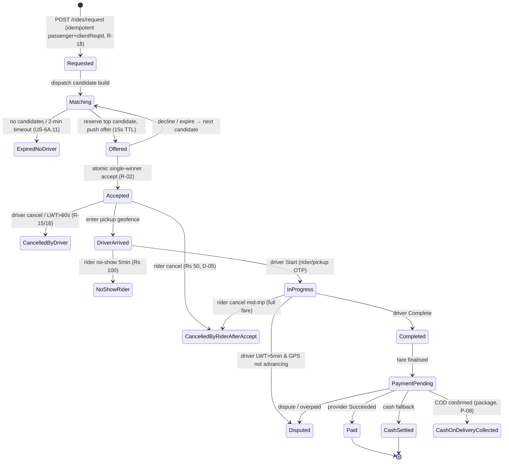
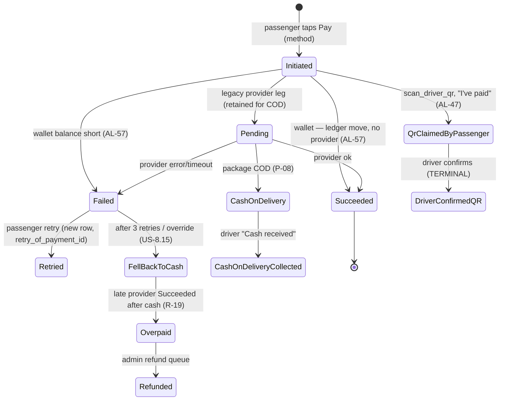

# D5′ — MageRide Business Logic & Rules

> **🔄 Aligned to ADD v2.6 / URD v2.2 (ADD §1.8 AL-01…AL-16).** This pass: **canonical vehicle taxonomy resolved** (car→sedan; Flex/Mini Van get own fare rows — supersedes B0 D-DRIFT-1, AL-09); **"reseller" is not a role/account/capability** — driver-to-driver credit transfer moves exact value with **no per-transfer commission**; bulk-voucher purchase discount is DB-configurable (AL-01); **bank-transfer top-ups removed** (AL-05); **single active device per app** + nine-role RBAC + portal auth scoping (AL-06/07/08); cancellation Rs 50 next-driver pass-through + **3 consecutive post-acceptance** booking-disable with reset/re-enable (AL-16).

> **Phase B deliverable (Prompt B5).** Transformed from the Namma Yatri Phase-A business-logic
> extraction (`nammayatri-extraction/D5_business_logic.md`) onto MageRide rules per ADD v2.4 (§3 Goals,
> §7.4–§7.7 real-time/cadence/tracker, Appendix B/B.2 state machines, §11 flows, §1.3–§1.7 deficit log),
> URD v1.3 Epics 5/6A/8/9/12/18, canonical services `lightweight-production-replica.md`.
>
> **Stack delta:** NY = Haskell `FareCalculator.hs` + Beckn dispatch + Juspay/UPI + IST + ₹ +
> `HighPrecMoney` (no rounding) + geohash-9 + external LTS + opaque token. MageRide = **.NET 10**
> domain services + **MapLibre/OSRM** + **OnePay/LankaQR/Cash** + **Asia/Colombo** + **Rs integer minor
> units** + **H3** + **MQTT/SignalR** + **RS256 JWT**. Every rule tagged `[KEEP]`/`[ADAPT]`/`[REPLACE]`/
> `[NEW]`; pseudocode only (no source). All Phase-A `[UNVERIFIED]` resolved; `[DELTA:INDIA]`→SL,
> `[DELTA:JUSPAY]`→native.

---

## 1. Fare Calculation — Mode C   [REPLACE] (NY 30-charge `pureFareSum` → simple SL tariff)

### 1.1 Master formula (§3 Goals; URD §8)
NY's 30-component `pureFareSum` (toll/GST/airport/congestion/pet/luggage/state-permit…) is **replaced**
by a lean Mode-C tariff. **Mode A = no fare. Mode B = no per-trip fare (monthly only).**

```
# all amounts in Rs minor units (Rs×100); inputs: vehicleType, distanceKm, rideTime, isPackage
firstKmMinor   = tariff[vehicleType].first_km_minor
perKmMinor     = tariff[vehicleType].per_km_minor
extraKm        = max(0, distanceKm - 1.0)
baseMinor      = firstKmMinor + round(extraKm * perKmMinor)        # first km included in first_km charge
peakPct        = isPeak(rideTime)  ? tariff.peak_surcharge_pct  : 0     # default +20%, admin windows
nightPct       = isNight(rideTime) ? tariff.night_surcharge_pct : 0     # default +15%, admin windows
surchargeMinor = round(baseMinor * (peakPct + nightPct) / 100)
fareMinor      = baseMinor + surchargeMinor                         # TOTAL ONLY shown to user (US-8.4)
```

**Tariff (admin-configurable, `fares.tariffs`; URD §8 / prompt):**

| Vehicle | 1st-km (Rs) | per-km (Rs) | Peak | Night |
|---|---|---|---|---|
| Motorbike | 80 | 60 | +20% | +15% |
| Three-wheeler | 100 | 80 | +20% | +15% |
| Flex | 130 | 90 | +20% | +15% |
| Sedan | 150 | 100 | +20% | +15% |
| Mini Van | 150 | 110 | +20% | +15% |
| Van | 150 | 120 | +20% | +15% |

> **Vehicle-type taxonomy — RESOLVED (AL-09; URD §1.B v2.2; supersedes B0 D-DRIFT-1).** One **canonical**
> enumeration: `motorbike, three_wheeler, flex, sedan, mini_van, van` (passenger ride) + `truck, mini_truck`
> (package delivery) + `bus, train` (Mode A). **"Car" is removed → "Sedan".** `fares.tariffs` and `billing.plans`
> (D4′ §19) use this exact set with their **own** per-type rows (Flex/Mini Van now have their own fare). Daily fee
> (D4′ §10): Motorbike 50 · Three-wheeler 100 · Flex 150 · Sedan 200 · Mini-Van 250 · Van 300. `bus`/`train` = Mode A,
> no fare. Truck/Mini Truck = admin-configured delivery rates (Epic 20).

`isPeak/isNight` evaluated in **Asia/Colombo** (was IST `minutesToTimeZone 330` `[DELTA:INDIA]`; D-38)
against `fares.peak_windows` (default peak 07:00–09:00 & 17:00–19:00; night 22:00–05:00). Peak+night
stack additively on `baseMinor`. **No GST/CGST/SGST/toll/airport/state-permit** (all `[DROPPED:INDIA]`).

### 1.2 Distance   [ADAPT]/[REPLACE] (E-04; resolves NY snap-to-road)
- **Upfront estimate (US-8.9):** OSRM/Valhalla route distance (`fareEstimateToken` returned to client).
- **Actual (final):** Phase 1 = **Kalman filter + accuracy-weighted resample** over the GPS trace
  before summation (E-04) — corrects the 5–15% GPS inflation NY tolerated; Phase 3 = OSRM `match`
  snap-to-road. Straight-line proximity = haversine (geo helpers). `distance_calculation_failed` →
  fall back to estimate. (NY's conditional Google/OSRM snap `[ADAPT]`.)

### 1.3 Rounding & currency   [REPLACE] (NY HighPrecMoney/no-rounding/INR)
- **Integer minor units throughout** (Rs×100); `round()` = banker's rounding to nearest minor unit at
  each additive step is avoided — compute in minor units, single `round` only where a `*pct/100`
  product is taken. Display = `fareMinor / 100` formatted `Rs N`. Currency `LKR` (was INR
  `[DELTA:INDIA]`). **No "nearest 5/10"** (resolves NY `[UNVERIFIED]`: MageRide bills exact minor units).

### 1.4 Estimate vs final & disputes
Same engine; estimate uses route distance, final uses Kalman-resampled distance. Discrepancy >
admin-threshold → ride `Disputed` → admin refund queue (E-05, §10). Tip captured post-trip (E-10, §10).

---

## 2. Daily Platform Fee   [REPLACE] (NY Juspay subscription/mandate/GST → wallet daily fee)

### 2.1 Rule (URD Epic 9; D-13)
First trip of the **calendar day (Asia/Colombo)** is **FREE** — no wallet check. Before the **2nd**
trip the flat daily fee is auto-deducted; insufficient balance → request missed + low-balance push.
Single flat charge regardless of trip count (US-9.4). Only **one vehicle live per driver** (US-9.6,
D-03 mutex). Mode A = Free; Mode B = monthly ~Rs 300 (first month free).

**7-tier rates (`billing.plans`, admin-configurable):** Bus/Train = Free · Motorbike = Rs 50 ·
Three-wheeler = Rs 100 · Flex = Rs 150 · Sedan = Rs 200 · Mini Van = Rs 250 · Van = Rs 300.

### 2.2 Charge logic   [NEW] (idempotent; D-13)
```
on driver accepts trip N for (driverId, vehicleId):
  feeDate = today(Asia/Colombo)
  tripsToday = count(completed+accepted today for driver)
  if tripsToday == 0:                       # first trip
      upsert billing.daily_fee_charges(driverId,vehicleId,feeDate, status=WAIVED_FIRST_TRIP, amount=0)
      ALLOW                                  # no wallet check (US-9.1)
  else:
      if already_charged(driverId,vehicleId,feeDate):  ALLOW           # idempotent: charge once/day
      else:
          fee = billing.plans[vehicleType].daily_fee_minor
          if walletBalance(driverId) >= fee:
              ledgerPost(kind=daily_fee, debit driver, credit platform, key=driverId|vehicleId|feeDate)
              upsert billing.daily_fee_charges(... status=PAID, amount=fee)
              ALLOW
          else: REFUSE → notify "request missed: insufficient balance" (US-9.1)
```
**Idempotency key** = `(driver_id, vehicle_id, fee_date)` PK (D-13) — accepting trips 2..N never
double-charges. On accepting trip 1, if balance < fee for trip 2 → warning push (US-9.1). If a driver
does not go online → no charge.

---

## 3. Dispatch Algorithm — Mode C   [ADAPT] (NY Allocator/DriverPool → dispatch-svc)

### 3.1 Candidate generation   [REPLACE] (NY stepped-radius haversine → H3 + Redis GEO; R-06, R-08)
```
# coarse pre-filter (R-06): driver index geo:drivers:available:{type}:{h3res5cell}
candidateCells = h3(pickup, res=5) + ring(1..2)
raw = union(Redis GEO geo:drivers:available:{vehicleType}:{cell}  for cell in candidateCells)
# exact post-filter MANDATORY (never trust H3 cell as distance bound):
near = [d in raw where ST_DWithin(d.geo, pickup, searchRadius)]   # PostGIS / GEOSEARCH BYRADIUS
```
Passenger live-map view = H3 **res-7 + ring(2)** = 19 cells ≈ 3 km (R-06). `driver:availability:
{driverId}` HASH (state, vehicleType, level, walletOk, currentRideId) TTL 60 s (R-08).

### 3.2 Hard eligibility gates (run BEFORE scoring)
Exclude driver if any: `reputation.block_state ∈ {BOOKING_DISABLED,DELISTED}` (D-04); not online /
not AVAILABLE; wrong vehicle category; **2nd-trip wallet < daily fee** (first trip exempt, §2; D-08
cache); `safety.blocked_drivers` contains (passenger,driver) (US-12.10, D-23 entitlement-style cache);
package-size incompatible (P-11); doc-expired `DISPATCH_SUSPENDED` (E-03); GPS sample older than
`2×expectedInterval` (§5 freshness). (NY filter set `[ADAPT]`: drop India-specific soft-blocks.)

### 3.3 Scoring   [ADAPT] (NY IntelligentScores → versioned weighted score; R-11)
```
score = w_dist * normalize(1/distanceToPickup)
      + w_level * (driverLevel / 3)               # US-6A.2 Driver Level
      + w_cat  * vehicleCategoryMatch
score persisted → dispatch.candidate_scores(ride_id, driver_id, score, breakdown JSONB,
                  dispatch_algorithm_version)      # R-11 auditable; breakdown.directional = DT-02 metrics
```
Weights versioned per `dispatch_algorithm_version` (admin-config). Phase 1 = **sequential** matching
(top-1 reserved, R-12); batch matching deferred to Phase 2.

### 3.4 Directional Travel predicate (applied AFTER hard gates, before offer) — see §12 (DT-02/DT-05).

### 3.5 Offer TTL & cascade   [ADAPT] (NY batch popupDelay → 15 s Redis + Quartz backstop)
- **Offer = 15 s** (US-6A.3): Redis `offer:{rideId}` HASH `PEXPIRE 15000` (fast hint, D-07) +
  keyspace-notification reassignment.
- **Durable backstop (R-04):** Quartz.NET clustered job `rides.timers.kind=offer_expiry` fires ≤1 s
  after expiry independent of Redis → re-offer next candidate. (Resolves NY `[UNVERIFIED]` countdown.)
- **Cascade:** decline/expire → next eligible candidate (sequential).
- **Global timeout 2 min** (US-6A.11): no driver after N rounds/120 s → `ExpiredNoDriver`, passenger
  notified, request auto-cancelled.

### 3.6 Reservation atomicity   [NEW] (R-10) — Redis Lua `SET lock:driver-offer:{driverId} NX PX 15000`
+ Postgres `UNIQUE(driver_id) WHERE status IN ('OFFERED','ACCEPTED')` on `dispatch.offers`. Single
live offer per driver guaranteed.

### 3.7 Job Board (scheduled rides)   [NEW] (US-6A.5; D-06)
Scheduled ride goes live **30 min prior** → dispatched to closest intent-submitting driver by Level
(ties → higher level rung first). Candidate search = **PostGIS `ST_DWithin(pickup, driver_home, 30 km)`**
on `dispatch.driver_presence` (D-06, replaces NY infeasible "30 km H3 ring"). L1 drivers excluded (§4).

---

## 4. Driver Level System   [REPLACE] (NY rating cumulative-average → MageRide level engine)

### 4.1 Rating collection   [KEEP] (NY 1–5 stars; + text US-18.1)
After ride `Completed`: integer 1–5 stars + optional text comment; one rating per ride; `stars ∈
[1..5]` else reject. Passenger↔driver both directions (US-18.1/18.2). Stored `trips.ratings`.

### 4.2 Level rules   [REPLACE] (URD US-6A.6)
- **Start Level 3.** Levels 1–3 (`dispatch.driver_levels`, default 3).
- **Level-up:** `points = Σ over ratings(star_value × star)` counting **only 4★ and 5★** (≤2★ ignored;
  3★ counts 0 toward level per prompt "100 five-star = 500 points = +1 level", i.e. 5★=5pts, 4★=4pts).
  **500 points = +1 level** (e.g. 100×5★ = 500, or 50×5★+65×4★ = 250+260 = 510 ⇒ +1). On crossing
  threshold: `level = min(level+1, 3)`, points -= 500.
- **Level-down:** **3 passenger reports** → `level -= 1` + **temporary delisting** (`reputation.
  block_state = DELISTED`, time-boxed). **No-show on accepted scheduled ride** → `level -= 1`
  (`dispatch.no_show_events`, US-6A.7).
- **L1 effect:** loses Job Board / scheduled-ride access (US-6A.8) — **NOT a permanent ban**; still
  operates immediate Mode C. Restore via admin appeal.

### 4.3 Effect on dispatch
`driverLevel` is a scoring input (§3.3) and a Job-Board ranking key (ties → higher level first).
(NY's cancellation-driven auto-block `[REPLACE]` by Level + reputation counters.)

---

## 5. Adaptive GPS Rate & Position Pipeline   [REPLACE] (NY LTS/Kafka snap → MQTT phase-aware; R-07, R-17)

### 5.1 Base adaptive cadence (US-5.5 / NFR-30)
Moving = 1 call / 4 s · Stationary (GPS idle) = 1 / 10 s · Idle standby (Mode C) = 1 / 60 s.

### 5.2 Phase-aware cadence table (R-07) — server pushes hint on `veh/{vehicleId}/cmd`
| Phase | Trigger | Cadence | Coalesce |
|---|---|---|---|
| Standby idle | online, no session | 30–60 s | skip if Δpos < 25 m |
| Standby moving | A/B session, >5 km/h | 5–10 s | skip if Δpos < 25 m |
| Candidate in pool | availability=AVAILABLE | 2–5 s | none (scoring freshness) |
| Accepted→PickupBound | ride.state=Accepted | 2–4 s | none |
| Near-pickup geofence <300 m | server-computed | 1–2 s | none |
| InProgress | ride.state=InProgress | 2–4 s | none |
| Near-drop geofence <300 m | server-computed | 1–2 s | none |
| PaymentPending | ride.state=PaymentPending | 30 s | skip if Δpos < 25 m |

Hint = `{"cmd":"setPosRate","intervalMs":2000}`. **Freshness rule:** candidate whose last `pos/live`
> `2×expectedInterval` old is excluded from scoring round.

### 5.3 Server ceilings (D-17) & replay (R-17, T-05)
- EMQX rule-engine: **>5 msg/s per vehicleId** → suppressed + `mqtt.rate_violation` to `audit.events`.
  `position-processor-svc` second-line >10 msg/s/10 s → drop + flag. Replay topic ≤ **20 samples/s**.
- **Mobile offline buffer (R-17, US-15.1):** Room (Android) / SQLite (iOS) ring buffer of GPS samples
  with monotonic `seq`; on reconnect publish to `veh/{vehicleId}/pos/replay`; `position-processor`
  keeps `veh:seq:{vehicleId}` and **discards `seq ≤ last_seen_seq`** (idempotent). Live preempts replay
  (4:1 fair-share). UI shows buffered-then-replayed indicator.

### 5.4 Geo system   [REPLACE] (NY geohash-9 → H3)
H3 (res-7 passenger view, res-5 dispatch pre-filter); Redis GEO hot index; PostGIS system of record
(§8). Stale vehicle (LWT `status=offline` or sample older than freshness window) removed from public
map (US-7.17). (Resolves NY `[UNVERIFIED]` LTS staleness — now EMQX LWT + freshness window.)

---

## 6. Mode C Ride Aggregate State Machine   [NEW] (R-01; ride-svc SOLE writer; Appendix B.2)

`ride-svc` owns the Mode C aggregate; `trip-state-svc` = Mode A/B tracking sessions only (R-01).



### 6.1 Atomic single-winner accept (R-02)   [NEW]
```
# fast path: Redis Lua reserves lock:driver-offer:{driverId} (R-10)
# authoritative path (single SQL, optimistic concurrency on version):
UPDATE rides.rides SET state='Accepted', accepted_driver_id=:d, accepted_vehicle_id=:v,
    version=version+1, updated_at=now()
  WHERE id=:rideId AND state IN ('Matching','Offered')
    AND current_offer_id=:offerId AND offer_expires_at > now() AND version=:expectedVersion;
# rowcount=1 → winner; rowcount=0 → 409 Conflict (someone won) / 410 Expired → driver shown next
```
**Two drivers can never both win** (conditional UPDATE + `UNIQUE(accepted_driver_id) WHERE state IN
(Accepted,DriverArrived,InProgress,PaymentPending)`). Resolves NY's status-guard race
(`[ADAPT]`→atomic). Driver earning posts **only on payment terminal** (R-05).

### 6.2 Idempotency (R-14, R-18)   [NEW]
Every mutating ride command carries `Idempotency-Key` → `rides.command_log(idempotency_key UNIQUE)`;
duplicates replay stored response. `POST /rides/request` idempotent on `(passenger_id,
client_request_id)` (R-18) — retry returns existing ride, never duplicates.

### 6.3 LWT & grace (R-15, R-16)   [NEW]
EMQX LWT `veh/{vehicleId}/status=offline` → `dispatch-svc` releases active offer / starts grace
(R-15). **Per-state grace (R-16):** offline-after-accept 60 s, after-arrive 120 s, in-progress 5 min,
at-payment 10 min → beyond grace → `CancelledByDriver`/`Disputed`.

### 6.4 Stuck-state SLOs / runbooks (R-20)   [NEW]
Alerts: `Matching>60s`, `Offered>20s`, `Accepted no-pos>60s`, `DriverArrived>10min`, `InProgress
no-GPS>5min`, `Completed+PaymentPending>10min` → ops runbook + driver-availability reconciliation.

---

## 7. Cancellation & No-Show Matrix   [NEW] (R-03; server-owned; D-05)

`ride-svc` is **sole writer** of `rides.state`; every cancellation = one of these transitions.

| From | Actor & trigger | To | Penalty | Driver avail | Events |
|---|---|---|---|---|---|
| Requested/Matching | Rider cancel | CancelledByRiderBeforeAccept | **None** (US-6A.9) | n/a | ride.cancelled |
| Matching | no driver 2-min/N rounds | ExpiredNoDriver | None | n/a | ride.expired_no_driver |
| Offered | Driver decline | →Matching | None | released | offer.declined |
| Offered | Offer expires 15 s | →Matching | None | released | offer.expired |
| Accepted | Rider cancel | CancelledByRiderAfterAccept | **Rs 50** (D-05) | released | ride.cancelled, penalty.accrued |
| Accepted | Driver cancel | CancelledByDriver | reputation hit, brief delist | released | reputation.driver_cancelled |
| Accepted | Driver LWT>60s | CancelledByDriver(system) | same | released | same |
| DriverArrived | Rider no-show 5min+2 SMS | NoShowRider | **Rs 100** + driver comp base/2 | released | ride.no_show_rider |
| DriverArrived | Driver LWT>120s | CancelledByDriver | reputation hit | released | same |
| Accepted/DriverArrived | Driver accepted but never reaches pickup; rider waits, grace exceeded | NoShowDriver | reputation hit + rider compensation | released | ride.no_show_driver |
| InProgress | Rider cancel | CancelledByRiderAfterAccept | **full fare** | released | ride.cancelled |
| InProgress | Driver LWT>5min, GPS stalled | Disputed | manual review | released | ride.disputed |

### 7.1 Cross-trip Rs 50 settlement (D-05, AL-16)   [NEW] (idempotent)
```
on cancel-AFTER-ACCEPT by passenger:
  passenger app outstanding_balance += 5000 (Rs 50)
  insert dispatch.cancellation_penalties(passenger, original_ride, affected_driver, amount=5000,
    status=OUTSTANDING, applied_ride_id=NULL)   # accrued, NOT collected now (no card-on-file)
on next completed trip for that passenger (fare-svc.complete):
  Rs 50 is ADDED to this next trip's fare (passenger pays it to the next-trip driver).
  for each OUTSTANDING penalty FOR UPDATE SKIP LOCKED:
    ledger entry kind=penalty_settle, key=concat(penalty_id,':',tripId)   # idempotent
      debit next-trip driver wallet 5000, credit affected_driver wallet 5000   # next driver is a pass-through (AL-16, US-6A.9)
    set status=SETTLED, applied_ride_id=tripId; passenger outstanding_balance -= 5000
  UNIQUE(penalty_id, applied_ride_id) prevents double-apply.
```
### 7.2 Booking-disable rule (US-6A.10b, AL-16)   [NEW]
`reputation.counters.cancellations_continuous` ++ on each **post-acceptance** cancel only (pre-acceptance
cancels never count); **3 consecutive** → `block_state = BOOKING_DISABLED` (booking entry blocked).
**Counter resets to 0 on any completed ride.** **Re-enable:** clear outstanding Rs 50 balance → access
restored after a configurable cooldown or admin/CSR reinstatement.

---

## 8. Payment / Refund / COD   [NEW]/[REPLACE] (NY Juspay/UPI → OnePay/LankaQR/Cash; D-10)

### 8.1 Payment state machine (D-10, R-19, P-08)   [REPLACE]

- **Methods (Δ AL-57/AL-59):** Cash (default, driver collects) · **`wallet`** (prepaid balance,
  topped up by card — **no surcharge, no gateway leg, terminal on the spot**) · **`scan_driver_qr`**
  (the driver's own bank LankaQR, settles by AL-47 attestation) · COD (package only).
  **`onepay` and platform-merchant `lankaqr` are removed**, and with them the +5% surcharge:
  no ride fare is charged to a platform merchant account, so there is no acquirer fee on the ride to
  recover. OnePay's ~3% is now borne on the **top-up**, where MageRide is the payee.
- **`wallet` has no `Pending`.** Every other rail waits on an acquirer; this one is a single balanced
  `trip_payment` journal entry — passenger wallet debit, driver wallet credit — inside one
  transaction. It reaches `Succeeded` or it does not happen, and a short balance is
  `402 insufficient-wallet` with cash and driver-QR still offered rather than a silent
  fallback to cash.
- **The driver's wallet is the fare accumulation account (AL-57/AL-58).** Fares credit it, the D-08
  daily fee debits it, and the weekly payout run sweeps it in full. ⚠ **Interaction with §2:** the
  sweep leaves a zero balance, and the daily fee is charged from the **2nd trip** of each Colombo
  day — so a driver whose passengers pay in cash (which never touches the wallet) is short on their
  second trip after a sweep until they top up. Policy is a full sweep with no holdback
  (`Payout:RetainMinor = 0`); the knob exists so the remedy is a setting.
- **Proxy payer routing (P-04):** Cash ⇒ rider pays driver; **`wallet` ⇒ the booker's wallet is
  debited** (`payer_role`, regardless of who is at pickup).
- **Mid-trip failure (US-8.15):** notify, retry, or fall back to cash **without losing trip history**.
- Driver earning posts only on terminal `Paid`/`CashSettled`/`CashOnDeliveryCollected` (R-05).

### 8.2 Refund / dispute (E-05) & tip (E-10)   [NEW]
Admin-initiated full/partial reversal via OnePay/LankaQR reverse API → `fares.refunds` + balanced
ledger `payment_refund`. **Late-callback-after-cash** → `Overpaid` → admin refund (R-19; idempotent on
`provider_transaction_id` UNIQUE). **Tip (E-10):** optional post-trip, credited directly to driver
wallet (`tip_amount_minor`).

### 8.3 COD lifecycle (P-08)   [NEW]
Package COD: `CashOnDelivery` set at delivery; driver "Cash received" → `CashOnDeliveryCollected` →
earning posts. Quartz `cod_uncollected` timer 24 h: uncollected → `Disputed` (P-14) → admin.

---

## 9. Wallet & Credit Transfer   [ADAPT + NEW] (NY finance-kernel double-entry kept; UPI/coins dropped)

> **AL-01/AL-05:** "Reseller" is **not a role, account, or enabled capability** — it is simply any driver who bought bulk credit and transfers it to others **in the Driver App** by **Driver ID** (no per-transfer commission). **Bank-transfer top-ups removed** — top-up = OnePay card / OnePay wallet / LankaQR only (+ bulk credit vouchers).

### 9.1 Double-entry ledger (D-09)   [KEEP] (NY finance_ledger_entry → billing.journal_*)
Every wallet mutation = a **balanced** `billing.journal_entries` (Σ postings = 0, DB trigger);
idempotent on `idempotency_key`. Materialised balance in `billing.accounts`.

### 9.2 Dispatch wallet cache (D-08)   [NEW]
`wallet:bal:{driverId}` Redis cache TTL **5 s**, **debit-invalidated** (`wallet.debited` event clears).
**Degraded-mode rule:** if cache miss AND Postgres unreachable → allow **first trip** (free anyway),
refuse 2nd-trip charge until balance confirmable (fail-safe, never double-charge).

### 9.3 Driver-to-driver credit transfer (US-9.10–9.17)   [NEW, AL-01]
A driver requests credit from another driver **by Driver ID (or QR)** → that driver approves **in the Driver App**
(or proactively sends by Driver ID) → **debit sender the exact amount, credit recipient the same exact amount**
— **no commission** (`billing.credit_transfers`, balanced ledger; US-9.13/9.21). **Bulk credit vouchers** Rs 1k–10k carry a
**commission % set per voucher value (denomination)** by Admin in the Admin Portal Config (`billing.voucher_discount_tiers`, variable), applied **only at purchase**
and credited directly to the buyer's wallet (e.g., a 10% voucher → pay Rs 900, wallet credited Rs 1,000; US-9.19). A "reseller's" margin = that per-voucher-value commission, **not** a per-driver or per-transfer commission.
**No bank-transfer top-up / no portal reconciliation queue (AL-05)** — only OnePay/LankaQR **gateway settlement** reconciliation remains.

### 9.4 Low-balance (US-9.9)   [NEW]
`walletBalance < Rs 200` (admin-configurable) → low-balance push; `< Rs 0` → "Top Up Required" banner.

---

## 10. Proxy Booking   [NEW] (P-01..P-05, P-12, P-13)

- **booker ≠ rider** (`is_proxy`, `booker_id`, `rider_id`); rider may be **unregistered** → phone
  **hashed at rest** (`rider_phone_hash`, P-03); `iam.users` lookup-by-phone returns
  `{registered:false}` → no FCM, booker falls back to map-pin/search (US-8.19).
- **FCM location-request round-trip (P-02, P-13):** booker `POST /location-requests` → FCM data-message
  to rider → rider confirms pickup on map → posted back to booker via **SignalR** group
  `booker:{bookerId}:loc-req:{requestId}`; **5-min TTL** (Quartz durable expiry). States Pending→
  Confirmed/Declined/Expired/RiderNotRegistered. Decline never leaks GPS.
- **Abuse limit (P-12):** 5 requests/h, 30/day per booker (Redis token bucket); declines logged
  `safety.location_request_audit` → repeated declines raise booker reputation flag.
- **Payment (P-04):** Cash ⇒ rider pays driver (notified via FCM, US-8.21); LankaQR/OnePay ⇒ booker.
- **Driver UX (P-05):** offer carries `is_proxy`, `rider_name`, masked phone → "Third-party booking"
  badge; **VoIP token binds driver↔rider** (not booker).

---

## 11. Package Delivery   [NEW] (P-06..P-11)

- `kind=package`, `package_size ∈ {S,M,L}`; **same dispatch, fare tariff, daily-fee semantics**
  (deliveries + passenger rides counted together for daily fee, P-06/§2).
- **OTP gating (P-07):** two **4-digit** OTPs generated at ride creation, **HMAC-SHA256 hashed at
  rest** (pepper); plaintext leaves server exactly once (pickup OTP → sender via booking response,
  delivery OTP → recipient via FCM/SMS). Driver POSTs OTP at pickup (`Accepted→InProgress`) and
  delivery (`→Completed`); **max 5 attempts** each → admin queue (`423 locked`).
- **Proof photo (P-10):** recipient absent → driver uploads `proof_photo` (sha256, captured_geo) to
  complete instead of delivery OTP.
- **COD terminal (P-08):** see §8.3. **Package-size × vehicle-type compatibility (P-11):** candidate
  filtered if incompatible (e.g. `Motorbike × L = false`) — driver still sees size+desc and may reject
  (autonomy); pattern rejections downweighted, not penalised.

---

## 12. Directional Travel   [NEW] (DT-01..DT-08; PickMe-style)

### 12.1 Predicate (DT-02, DT-05)   [NEW]
Applied to a candidate **only if** that driver has an active filter (`driver:directional:{driverId}`),
**after all hard gates** (§3.2). Driver kept in round **only if all** hold:
```
angularDiff(bearing(driver→destination), bearing(pickup→dropoff)) ≤ θ_max     # default 45°
AND  dist(pickup, driver)          ≤ detour_max                                # default 2 km
AND  dist(dropoff, destination)    <  dist(pickup, destination) − progress_min # default 250 m
```
Decision + computed bearings/distances persisted to `dispatch.candidate_scores.breakdown.directional`
(audit, extends R-11). Predicate **only removes** otherwise-eligible candidates — never adds
ineligible, never relaxes a gate (DT-05). Kind-agnostic; composes with P-11 (DT-07).

### 12.2 Daily-use limit & duration (DT-03)   [NEW]
`max_uses_per_day` default **2**, `max_duration` default **2 h** (admin-config). Each activation
`INCR driver:directional:uses:{driverId}:{yyyy-mm-dd}` + upsert `dispatch.directional_filters`
(`used_date` Asia/Colombo, D-38). **Manual turn-off (DELETE) STILL consumes a use** (US-6A.19,
prevents gaming). Going Offline clears any active filter.

### 12.3 Expiry & clearing (DT-04)   [NEW]
Durable expiry via **Quartz.NET** `dispatch.timers.kind=directional_expiry` (Redis key TTL = fast hint
only). Clears on: expiry / `DELETE /standby/directional` / offline / EMQX LWT → emit
`directional.cleared`; driver returns to full eligible pool. **Pre-expiry reminder 10 min** push
(US-10.14, DT-08). **Empty-pool safe (DT-06):** filter is per-driver → ride simply skips filtered-out
drivers and matches another; never blocks the passenger's ride. **No penalty** if no directional hires
arrive (US-6A.23).

---

## 13. Hardware Tracker Validation & Eligibility   [NEW] (T-04..T-08, T-11; D-18)

### 13.1 Plausibility (D-18, T-07)   [NEW]
Same checks for mobile + hardware: **per-vehicle-type max-speed** table (reject teleport/jump);
**accuracy > 200 m discarded** (D-18, replaces NY's arbitrary 200 km/h + no-accuracy-filter
`[UNVERIFIED]`). Hardware **additionally**: monotonic GNSS UTC timestamp + minimum satellite count
(T-07). Failed samples dropped, counted toward per-device fraud score.

### 13.2 Anti-cloning (T-08)   [NEW]
Two devices presenting the **same IMEI within 24 h** → **both quarantined**, manual admin resolution
(`prov.tracker_bindings.state=QUARANTINED`).

### 13.3 Replay throttle (T-05)   [NEW]
`pos/replay` ≤ **20 samples/s/device**; monotonic `seq` dedup (`veh:seq:{vehicleId}`, discard `seq ≤
last_seen_seq`); live preempts replay 4:1 (see §5.3).

### 13.4 Mode eligibility (T-11)   [NEW]
- **Mode A** (public bus/fleet): position broadcasts **irrespective of driver-app** — tracker is sole
  authority (US-3.22).
- **Mode C** (individual): dispatch-eligible only if tracker online **≤ 30 s** **AND** driver-app
  online (T-11, US-3.21); tracker is position truth when bound; tracker offline >30 s → fall back to
  phone GPS if reporting, else mark unavailable.
- **Fleet bulk** (T-09): CSV ≤ 5,000 IMEIs validated in SAGA, error report (US-3.2; portal path).

---

## 14. Validation / Auth / Notifications   [ADAPT] (resolve NY India/[UNVERIFIED])

### 14.1 Validation
| Field | Rule | Tag |
|---|---|---|
| Mobile | **+94** E.164, `^\+947\d{8}$` (was +91/10-digit `[DELTA:INDIA]`) | [ADAPT] |
| OTP | **6 digits** (was 4); SMS gateway Notify.lk (was 4-digit + fake "7891") | [ADAPT] |
| OTP rate-limit (D-32) | **60 s resend cooldown, 5/h**; Redis token bucket | [NEW] |
| Rating | integer 1–5 | [KEEP] |
| Ride/pickup OTP | must equal stored OTP (HMAC) else `IncorrectOTP` | [KEEP] |
| Package OTP | 4-digit HMAC, max 5 attempts → admin queue | [NEW] (P-07) |
| Vehicle docs | Gemini **Flash 3.0** OCR; **PII redaction pre-pass** (OpenCV face-blur + Tesseract masking) **before** Gemini (D-36); Mode-C in-app onboarding **auto-verifies → auto-approves** (§14.1a), human review only on Pending | [ADAPT] |
| GPS plausibility | max-speed + accuracy>200m discard (D-18) — resolves NY `[UNVERIFIED]` | [NEW] |
| File upload | type/size limits + SSE-KMS at rest, raw delete 90 d (NFR-28) | [ADAPT] |

### 14.1a Mode-C vehicle onboarding — auto-verification & go-online gating   [NEW] (Change 6/22)
Onboarding is **two phases**: (1) **driver identity** (name + **required** photo + driving-license
front/back at Profile Setup, SCR-DA/DI-003a) which **precedes Home and needs no vehicle**; and (2)
**optional, in-app, Mode-C-only** vehicle onboarding (Steps 1–4, SCR-DA/DI-004→004c). **Mode A/B vehicles
and their permits are onboarded in the Fleet Portal (SCR-FP-004), never in the driver app.**

**Per-document verdict** (Gemini Flash 3.0, after PII redaction D-36):

| Document | VERIFIED when… | else |
|---|---|---|
| Vehicle details (Step 1) | type + registration number entered (reg-no unique in active set, D-37) | — (entered) |
| Insurance (Step 2) | **expiry date** extracted with confidence | Pending |
| Revenue licence (Step 3) | **licence no** AND **expiry date** extracted | Pending |
| Front & back photos (Step 4) | **plate OCR matches** `registry.vehicles.registration_number` | Pending |

**Auto-approve (user decision 6/22):** when **all four = VERIFIED**, `registry-svc` transitions
`registry.vehicles.status PENDING→APPROVED` **with no Verification Officer step**, and the vehicle
appears in My Vehicles (FCM/APNs US-2.14). Any **Pending** doc (extraction failed / low confidence /
plate mismatch) keeps the vehicle PENDING and routes it to the **Verification Officer queue** (US-2.10);
rejection returns a reason for re-upload (US-2.15).

**Go-online gating (US-9.6):** a driver may reach Home with no vehicle but **cannot switch Online until at
least one vehicle is available** — an **owned Mode C** vehicle that is APPROVED in My Vehicles, **or** a
**shared / temporarily-assigned Mode A/B** vehicle (US-4.x / US-13.9). With no available vehicle the Go
Online toggle is disabled with a prompt to onboard (SCR-DA/DI-026a) or await assignment.

### 14.2 Auth / sessions (D-29)   [REPLACE] (NY opaque token → JWT)
RS256 **30-min access** + **opaque rotating refresh** (`iam.sessions`, single-use, rotate jti).
**Single active device PER APP** (AL-08, US-1.12; US-1.11 merged) — a new-device login revokes only that
app's prior `(user_id, app)` session; the same person may run Driver + Passenger apps simultaneously.
**Sign-in by surface:** apps = Phone OTP only; Admin Portal = Password/Google, **no MFA/TOTP second
factor** (~~+ MFA~~ removed by **AL-37** — see BR-28.5; compensating controls = failed-attempt lock-out,
session binding, optional IP allow-list); Fleet Portal = Email/Google/Apple (AL-07). **Nine-role deny-by-default RBAC** (AL-06). **MQTT session JWT separate**
(TTL = max(ride+2h, 4h), E-02). Logout/forced-logout revokes refresh.

### 14.3 SOS SLO (D-33)   [NEW]
SOS (passenger + driver, US-12.1/12.8) → SMS to emergency contact via **primary + secondary gateway in
parallel**, **p99 ≤ 5 s**; fan-out to admin live-feed; logged `safety.sos_events` (US-12.11).
**Trip-share token (D-34):** scoped to trip + 1 h grace, 60 req/min, revocable, no historical replay;
reused for package recipient (P-09).

### 14.4 Notification table (per-type)   [ADAPT] (templates Si/Ta/En via content-svc, D-26)
| Trigger | Channel | Type | Throttle |
|---|---|---|---|
| Ride offer to driver | FCM-hi / APNs silent (E-01) | RIDE_OFFER | 15 s window; 3 s no-ack → SMS |
| Driver assigned | FCM/APNs | DRIVER_ASSIGNED | per-ride |
| Driver arrived | FCM | DRIVER_ARRIVED | per-ride |
| Ride cancelled | FCM | RIDE_CANCELLED | per-event (US-10.8) |
| Scheduled reminder | FCM | SCHEDULED_REMINDER | 30 min driver (US-6A.15); 1 h+15 min passenger (US-10.9) |
| Directional pre-expiry | FCM | DIRECTIONAL_EXPIRING | 10 min before (US-10.14, DT-08) |
| Low balance | FCM | LOW_BALANCE | once < Rs 200 (US-9.9) |
| Payment confirmed | FCM | PAYMENT_CONFIRMED | per-event (US-8.12) |
| Proxy location-request | FCM data | location_request | 5/h, 30/day per booker (P-12) |
| Package picked/delivered | FCM/SMS | package_* | per-event (US-10.12/13) |
| SOS | SMS×2 parallel | SOS_* | p99 ≤ 5 s (D-33) |
| Registration result | FCM | REGISTRATION_RESULT | per-event (US-2.14) |
Templates rendered by **content-svc** in user language (Si/Ta/En, D-26); was Hindi/Kannada `[DELTA:INDIA]`.

---

## 15. Edge Cases & Failure Modes   [ADAPT]/[NEW]

| Scenario | MageRide handling | Tag |
|---|---|---|
| Double-submit request | idempotent `(passenger_id, client_request_id)` → existing ride (R-18) | [NEW] |
| Two drivers accept | atomic conditional UPDATE; one wins, other 409/410 (R-02) | [NEW] |
| Driver app crash post-accept | aggregate server-side; resume via `GET /rides/active`; grace timers (R-16) | [ADAPT] |
| GPS lost mid-ride | Kalman fallback; LWT>5min stalled → Disputed; buffer+replay (R-17) | [ADAPT] |
| Network fail mid-payment | provider non-terminal; reconcile; retry/cash fallback, no double-charge (D-10) | [ADAPT] |
| Wallet negative | first trip still free; 2nd refused until top-up; low-balance push | [NEW] |
| Clock skew | server time authoritative; all fare/night/expiry in Asia/Colombo (D-38) | [ADAPT] |
| Late payment callback after cash | Overpaid → admin refund (R-19) | [NEW] |
| Stuck workflow | R-20 SLOs + availability reconciliation | [NEW] |
| Anti-collusion (E-07) | pair-frequency, device-binding, IP/ASN clustering → fraud.suspected | [NEW] |
| PDPA erasure (E-06) | export/erasure 30 d, statutory hold (active rides/disputes/audit) | [NEW] |

---

## Traceability Addendum

| URD US-ID | Epic | D5′ section | Tag | ADD §/Item | Notes |
|---|---|---|---|---|---|
| US-5.1–5.5 | 5 | §5.1/§5.2 cadence; §2 Mode A free | [REPLACE] | R-07, US-5.5 | adaptive GPS, no fee |
| US-5.3/5.4/5.10 | 5 | §6.3 grace; trip-state auto-end | [ADAPT] | Appendix B | idle/geofence/restart |
| US-6A.1 | 6A | §3.1 candidate; §5.2 standby | [REPLACE] | R-08 | standby presence |
| US-6A.2/6A.3 | 6A | §3.3 scoring; §3.5 15s; §6.1 accept | [ADAPT]/[NEW] | R-02/11 | rank + 15s atomic |
| US-6A.4/6A.5 | 6A | §3.7 Job Board | [NEW] | D-06 | scheduled 30km |
| US-6A.6/6A.7/6A.8 | 6A | §4.2 Level | [REPLACE] | D-04 | level up/down, L1 |
| US-6A.9/6A.10/6A.10b | 6A | §7 matrix; §7.1/§7.2 | [NEW] | D-05, AL-16 | Rs50; **3 _consecutive post-acceptance_ cancels disable booking, reset on completed ride** |
| US-6A.11 | 6A | §3.5 2-min timeout | [ADAPT] | — | auto-cancel |
| US-6A.16 | 6A | §10 VoIP rider | [NEW] | P-05, D-24 | call rider |
| US-6A.17–6A.23 | 6A | §12 Directional | [NEW] | DT-01..08 | predicate, uses |
| US-8.2/8.4/8.9 | 8 | §1.1 fare; §1.2 estimate | [REPLACE] | E-04 | upfront estimate |
| US-8.8 | 8 | §1.1 (driver fare) | [ADAPT] | — | driver sees fare |
| US-8.10/8.11/8.15 | 8 | §8.1 payment SM | [REPLACE] | D-10 | Cash/LankaQR/OnePay+5% |
| US-8.16–8.21 | 8 | §10 proxy | [NEW] | P-01..05 | proxy + loc-request |
| US-9.1/9.4/9.6 | 9 | §2 daily fee; §3.2 mutex | [REPLACE]/[NEW] | D-13/03 | first-free, one-vehicle |
| US-9.7/9.9 | 9 | §9.4 low-balance | [NEW] | — | wallet status |
| US-9.10–9.21 | 9 | §9.3 credit transfer/voucher | [NEW] | D-09 | exact value, vouchers |
| US-10.8/10.9/10.14 | 10 | §14.4 notif table | [ADAPT] | DT-08 | reminders |
| US-12.1/12.8/12.11 | 12 | §14.3 SOS | [NEW] | D-33 | p99 5s |
| US-12.5/12.6/12.10 | 12 | §3.2 gates; §7.2 | [ADAPT] | D-23/34 | report/block, delist |
| US-15.1 | 15 | §5.3 replay | [NEW] | R-17 | offline buffer |
| US-18.1/18.2 | 18 | §4.1 rating | [KEEP] | — | stars + text |
| US-20.1–20.11 | 20 | §11 package | [NEW] | P-06..11 | OTP/COD/size |
| US-2.x (OCR/redact) | 2 | §14.1 | [ADAPT] | D-36 | redaction pre-pass |
| US-1.10/1.11 | 1 | §14.1/§14.2 | [ADAPT]/[REPLACE] | D-29/32 | OTP limit, JWT, device |

**Coverage:** every P0 story in Epics 5/6A/8/9/12 (and 18) maps to ≥1 section.

## Mandatory ADD Critique-Item Coverage (D5′ scope)

| Item | §where | ✅ | Item | §where | ✅ |
|---|---|---|---|---|---|
| D-03 | §2.1/§3.2 mutex | ✅ | R-11 | §3.3 candidate_scores | ✅ |
| D-04 | §3.2/§4.3 reputation | ✅ | R-12 | §3.3 sequential | ✅ |
| D-05 | §7.1 cross-trip | ✅ | R-13 | §6 outbox (ride.requested) | ✅ |
| D-06 | §3.7 Job Board ST_DWithin | ✅ | R-15 | §6.3 LWT release | ✅ |
| D-07 | §3.5 Redis PEXPIRE | ✅ | R-16 | §6.3 grace windows | ✅ |
| D-08 | §9.2 wallet cache | ✅ | R-17 | §5.3 replay | ✅ |
| D-10 | §8.1 payment SM | ✅ | R-19 | §8.2 Overpaid | ✅ |
| D-18 | §13.1 plausibility | ✅ | R-20 | §6.4 stuck SLOs | ✅ |
| D-19 | §5.2/§1 (SLO p95<5s cadence) | ✅ | E-03 | §3.2 doc-suspend | ✅ |
| D-23 | §3.2 block/entitlement cache | ✅ | E-04 | §1.2 Kalman distance | ✅ |
| D-25 | §10 — **withdrawn by AL-48**; VoIP fallback is a direct dial, no masked-SMS relay (BR-30.3) | ✅ | E-05 | §8.2 refund | ✅ |
| D-29 | §14.2 JWT/sessions | ✅ | E-06 | §15 PDPA | ✅ |
| D-32 | §14.1 OTP rate-limit | ✅ | E-07 | §15 anti-collusion | ✅ |
| D-33 | §14.3 SOS p99 5s | ✅ | E-10 | §8.2 tip | ✅ |
| D-34 | §14.3 trip-share token | ✅ | P-01..P-05 | §10 proxy | ✅ |
| D-35 | §5.3/§14 audit.events | ✅ | P-06/P-07/P-08 | §11 package OTP/COD | ✅ |
| D-36 | §14.1 redaction pre-pass | ✅ | P-11 | §11 size compat | ✅ |
| R-01 | §6 ride-svc sole writer | ✅ | P-12 | §10 abuse limit | ✅ |
| R-02 | §6.1 atomic accept | ✅ | T-04/T-05 | §13.3 LWT/replay | ✅ |
| R-03 | §7 matrix | ✅ | T-07 | §13.1 GNSS/sat | ✅ |
| R-04 | §3.5 Quartz backstop | ✅ | T-08 | §13.2 anti-clone | ✅ |
| R-05 | §8.1 earning on terminal | ✅ | T-09 | §13.4 bulk CSV | ✅ |
| R-06 | §3.1/§5.4 H3 res-7 | ✅ | T-11 | §13.4 Mode eligibility | ✅ |
| R-08 | §3.1 Redis GEO | ✅ | DT-01..DT-07 | §12 Directional | ✅ |
| R-10 | §3.6 reservation | ✅ | | | |

All in-scope items ✅ — **document NOT `[INCOMPLETE]`.**

---

## Verification & Caveats Summary

- All rules expressed as formulas / decision tables / mermaid state diagrams / pseudocode (no source);
  every rule tagged; currency in Rs integer minor units.
- **`[REPLACE]` cores:** Mode C fare (lean SL tariff, no GST/toll/India charges), daily fee (first-free
  + 7-tier wallet), driver level, adaptive phase-aware cadence, ride aggregate + atomic accept, payment
  state machine.
- **Resolved Phase-A `[UNVERIFIED]`:** offer countdown = 15 s; fare rounding = exact minor units;
  staleness = EMQX LWT + freshness window; GPS plausibility = max-speed + >200 m accuracy discard;
  session model = single-active-device JWT; pool weights = versioned `candidate_scores`.
- **India/Juspay resolved:** IST→Asia/Colombo, ₹→Rs, +91→+94, geohash→H3, UPI/mandate/GST/coins/Beckn
  dropped; Juspay→OnePay/LankaQR/Cash/COD.
- All in-scope ADD critique items ✅; traceability covers every P0 story in Epics 5/6A/8/9/12/18.

---

## Δ Addendum — Discussion 2026-06-21 (business rules, items 1–18)

> New/changed rules for ADD v2.7 §1.9 (AL-17…AL-26) / URD v2.3 Epic 23.

### BR-23.1 Geo-only destination search (item 4, AL-17)
Location search accepts a **place/address only**; route-number input is rejected (no route rows in predictions). Predictions = geocoded places (Nominatim/Photon) + saved/recent addresses. On selection, the booking screen computes the reachable options (BR-23.2).

### BR-23.2 GTFS direct-route discovery (item 3, AL-18)
For a chosen geo-destination, `transit-svc` returns **all DIRECT public-transport routes** from the GTFS dataset — a route is *direct* when a single route's stop sequence covers a stop near the origin **before** a stop near the destination (within an admin halt-radius, default 400 m). Each option carries route number, headsign/description, Direct tag, PUBLIC label, and shape polyline. **Transit** options (≥1 transfer) are computed and listed **below** direct options. Ordering: direct by fewest stops/soonest departure, then transit.

### BR-23.3 Mode C tiers price-only pre-match (item 3, AL-19)
Before dispatch, Mode C private tiers expose the **upfront price only** — "minutes away" and "distance to driver" are **suppressed** (no driver matched yet). ETA/distance appear only after Accept (BR carries over from ride state machine).

### BR-23.4 Google-Maps Paste-link parsing (items 5, 6, AL-20)
Accept Google Maps URLs and extract `{lat,lng}`: parse `?q=lat,lng`, `@lat,lng,zoom`, `/place/.../@lat,lng`, `!3dlat!4dlng`, and `ll=` params **client-side**; for short `maps.app.goo.gl` / `goo.gl/maps` links, resolve via `transit-svc /geo/parse-maps-link` (follows the redirect server-side, extracts coords, **no Google API**). On success drop the pin; on failure show "couldn't read that link — pick on map". Applies to proxy pickup and package pickup **and drop-off**. Surfaced in the **paste sheet `SCR-PA/PI-012a`** with the interaction states **Empty → Parsing ("Reading link…") → Resolved (pin preview + reverse-geocoded address + lat/lng → Use this location) → Error** (3 s timeout, 1 retry → pick-on-map).

### BR-23.5 Package drop-off + recipient notification on pickup-confirm (items 6, 11, AL-21)
Package booking captures **both** pickup and drop-off (each via Search/Map/Paste-link; drop-off may also be **Request** = recipient shares). **When the driver confirms pickup**, `notification-svc` branches on recipient registration: **registered** → high-priority FCM *"📦 Package on the way — [Driver] · ETA NN min"* deep-linking SCR-PA-021; **unregistered** → SMS with a `safety.trip_share_tokens` link `passenger.mageride.lk/track?token=…` opening the no-login web page (map + status + delivery OTP).

### BR-23.6 QR-scan fare payment (item 18, AL-22)
On Pay-fare, the passenger **scans the driver's QR** (printed/on-screen/sticker) to complete payment; the app does **not** render a centred MageRide QR. The LankaQR "Pay" deep-link remains an alternative.

### BR-23.7 Mode B marker → access request; per-vehicle requests (items 8, 12, 15, AL-23)
Tapping a **Mode B marker** opens the access-request screen with `vehicle_id` pre-filled (no A-style popup). **Access requests and grants are keyed by `vehicle_id`**; the Driver App (SCR-DA-028) and Fleet Portal (SCR-FP-011) present requests/subscribers **scoped to one vehicle**. A driver with multiple vehicles, or **temporarily assigned** (fleet-hired) Mode A/B vehicles, sees each vehicle's requests under that vehicle. Accept grants tracking + starts the subscription; Reject dismisses.

### BR-23.8 Mode B Paid/Free classification (items 16a, 16b, AL-24) *(⚠ UI label renamed **"Service payment"** by BR-31.3 / US-27.4 — semantics unchanged)*
Each Mode B vehicle is **Paid** or **Free** at onboarding. **Free** (office/staff transport) → no fare, no payment UI. **Paid** → default monthly fare set at onboarding, collected per subscriber. *(Since BR-31.1: Paid additionally requires a **Verified org payout profile**.)*

### BR-23.9 Per-subscriber fare & billing cycle (items 16f, 16g)
Fleet owner may **override the monthly fare per subscriber** (subscribers may pay different amounts). Billing **cycle** is either **1st-of-month** or **join-anniversary**: for join-anniversary, `next_due = join_date + 1 month` computed in Asia/Colombo (joined **5 Jun → next due 6 Jul**); subsequent due dates roll monthly. Both subscriber and owner see the next-due date.

### BR-23.10 Subscription payment & verification (items 16c–16f, 16h, 16i)
Passenger pays via **LankaQR deep-link / LankaQR scan / OnePay / online transfer**; payments route **to the fleet owner** (pass-through, not platform revenue) and appear per-vehicle/per-subscriber. **Online transfer** requires a **slip screenshot** → status `pending_verification` until the **owner confirms** → `paid`. **Cash** is handed to a collector and only the **owner marks it received** in the portal → `paid`, which flips the passenger card to Paid and logs it. Subscriber views full history (SCR-PA-025b); owner monitors per-subscriber ledger (SCR-FP-012).

### BR-23.11 Unsubscribe & muted-until-deleted (item 17, AL-25)
Passenger **unsubscribe** → `grants.status='unsubscribed'`, revocation push <200 ms (D-22); passenger **loses visibility** of the vehicle. The fleet portal keeps the subscriber **muted** until the owner **deletes** it (`deleted_at`). To rejoin, the passenger must **request again** and the driver/owner must **accept** (BR-23.7).

### BR-23.12 Saved-address structure & language placement (items 7, 1, 10, AL-26)
Saved address = **Address Line 1 (street/building) + Line 2 (area/suburb) + Line 3 (city/district) + free-text Label**, captured in a ModalBottomSheet after a pin drop. **Language** is chosen only in onboarding (vertical boxes, **Sinhala first**) and Profile & settings — **removed from Edit-profile**.

## Δ Addendum — Discussion 2026-06-25 (driver change pass, items 1–13)

> New/changed business rules for ADD v2.8 §1.10 (AL-28…AL-35) / URD v2.4.

### BR-25.1 Driver onboarding feature carousel (item 1, AL-28)
The driver language/city screen (SCR-DA/DI-002) shows a **3-slide feature-infographic carousel** (content-svc strings, Si/Ta/En) above the language & city selectors. Presentation only; no gating.

### BR-25.2 Licence NIC + allowed-vehicle-types extraction & manual-entry flag (item 2, AL-29)
The driving-licence scan extracts `{licence_no, licence_expiry, nic_no, allowed_vehicle_types}` and writes each to `registry.document_fields` (confidence, `source='ai'`). If a value is unreadable the driver **types it** (`source='manual'`). Any field with `source='manual'` **OR** `confidence < threshold` → `verify_status='pending'` → Verification-Officer queue (SCR-AP-003). The driver may proceed; the field is trusted only after officer **Confirm / Edit**.

### BR-25.3 Doubtful / manual / mismatch ⇒ step Pending (items 2,3,4,5, AL-29/AL-30)
For each onboarding step (`details, insurance, revenue, photos`), `registry.onboarding_steps.status` is:
- **`verified`** — every field auto-verified (in-confidence AI, no manual entry); for `photos`, plate OCR `==` `registration_number`.
- **`pending_review`** — any field is pending (doubtful/manual) **OR** (`photos`) plate OCR `!=` `registration_number`.

A vehicle reaches `APPROVED` **only when all four steps are verified/confirmed**; the SCR-AP-003 per-step breakdown shows Verified/Pending and **Approve unlocks only when all Pending fields are confirmed** (audited).

### BR-25.4 Step persistence, resume & vehicle status (items 5,6, AL-30)
Each step is **saved on completion**; re-opening Vehicle Onboarding **resumes at the first step with `status <> 'verified'`** (not Step 1). `registry.vehicles.onboarding_status` is derived: **`incomplete`** (≥1 saved step but not all verified) or **`approved`** (all four). My Vehicles (SCR-DA/DI-026) renders **Incomplete** (with Resume) or **Approved**; **only Approved Mode-C vehicles are go-live eligible** (US-9.6). When the current vehicle is Approved, the wizard entry point (nav-drawer / My-Vehicles ＋) **creates a NEW vehicle at Step 1/4**.

### BR-25.5 Driver home map scoped to own vehicle; hamburger removed (item 7, AL-31)
The driver home map (SCR-DA/DI-010) renders **only the driver's own active vehicle** — no nearby/other active vehicles. The top-left **hamburger is removed**; navigation is via the bottom **Menu** tab.

### BR-25.6 Mode A/B home dashboard + GPS-ignition journey control (items 8,11, AL-32)
When the active vehicle is Mode A or Mode B, **Home is the Start/End-Journey dashboard** (SCR-DA/DI-011) — only Start/End actions, vehicle type + reg below the route card. For tracker-equipped Mode A/B vehicles, `trip-state-svc` **auto-starts/ends the session on ignition** (ACC on/off) with the device as **single active publisher**; opening the app shows **"Journey started"** if the device is ingesting. The **dashboard Start/End buttons override** the device by writing the session transition directly.

### BR-25.7 Three-stage package-delivery flow + "Delivery completed" (item 9, AL-33)
The driver delivery flow is **three sequential bottom sheets**:
1. **Review** (SCR-DA/DI-016a) — pickup & drop distances, payment method, **sender & recipient phone numbers each with a Call button** (direct **PSTN dial** — the same mechanism as the passenger "Normal call" since AL-48; the in-app VoIP "Free call" option is passenger-ride-only). **Start** proceeds; **Cancel** releases the offer back to dispatch → **next eligible driver** (R-02/O2).
2. **Pickup** (016b) — Call sender, SOS, **Pickup OTP**; correct OTP → `package.picked_up` and the third sheet appears.
3. **Complete** (016c) — **Delivery OTP** / proof photo, sender+recipient call buttons, and **"Delivery completed"** → `Completed`. The **"Cash received (COD)" button is removed**; COD/cash is reconciled separately (uncollected 24 h → Disputed, P-14).

### BR-25.8 Driver credit request — Driver ID only (item 10, AL-34)
The credit-request flow (SCR-DA/DI-023) accepts a **Driver ID only**; the **QR-scan path is removed**. (The driver's own pay-QR shown to passengers — AL-22 — is unrelated and retained.)

### BR-25.9 Mode B sharing UI & rate-passenger sheet (items 12,13, AL-35)
SCR-DA/DI-028 **drops the "Showing sharing for … temporarily assigned by …" caption** and renders the per-vehicle selector **full device width**. SCR-DA/DI-030 **rate-passenger opens in a modal bottom sheet** (rating endpoint unchanged).

---

## Δ Addendum — Discussion 2026-06-28 (business rules, items 1–11)

> New/changed business rules for ADD v2.9 §1.11 (AL-36…AL-43) / URD v2.5 Epic 24.

### BR-28.1 Schedule-ride destination mandatory (item 2, AL-36)
A scheduled ride **cannot be confirmed without a destination** ("the location to go"). The picker reuses the on-demand place-search/map-pick; pickup defaults to the rider's current GPS but is editable. `POST /v1/rides/schedule` **rejects (400) a request with no `destLat/destLng`**. Reminders (1 h & 15 min) and Job-Board dispatch at T-30 min are unchanged (US-24.2).

### BR-28.2 Call-type chooser — free VoIP vs masked cellular (item 4, AL-36)
Tapping 📞 **Call** (active ride SCR-PA/PI-015, history SCR-PA/PI-022, trip details) opens the **call-type chooser (SCR-PA/PI-015a)**: **Free call** → in-app WebRTC/CallKit VoIP (numbers incidentally hidden); **Normal call** → a **direct `tel:` dial of the counterparty's real MSISDN**, returned post-accept in the ride detail (P-05: the driver sees the rider, never the booker). The chosen channel is written best-effort to `comms.call_log.call_type` (`free_voip` | `direct_dial`). VoIP failure prompts **"Call normally instead?"** → the same direct dial. The last choice is remembered. **Same dial mechanism as the driver delivery flow (BR-25.7).** (US-24.3, as amended by **AL-48** / US-26.2 — the ~~masked-number PSTN bridge~~ and the ~~masked-SMS fallback (D-25)~~ are withdrawn; see BR-30.2/30.3)

### BR-28.3 Driver mobile in passenger trip history (item 3, AL-36)
Each **completed** trip in passenger history shows the driver's **name + mobile number** with a **Call** action (→ 015a), so the rider can reach the driver after the trip (e.g. lost item). The number is **withheld for rides cancelled before driver assignment**. (US-24.4)

### BR-28.4 Onboarding camera capture + drag-crop (item 6, AL-43)
Every onboarding image is captured via the **camera document-scanner (SCR-DA/DI-005)** with a **draggable four-corner crop**; auto edge-detect proposes the quad, manual drag overrides, and the image is **perspective-corrected/de-skewed on confirm** before upload (`docs.uploads.captured_via='camera_dragcrop'`). Higher capture quality raises OCR confidence, so **fewer fields land in `pending_review`** (complements BR-25.3). Same upload/extraction contract as before. (US-24.6)

### BR-28.5 Admin login — no second factor (item 5, AL-37)
Admin Portal sign-in completes on **password or Google only**; **the MFA/TOTP challenge is removed**. Compensating controls: failed-attempt lock-out, session binding, optional IP allow-list. (US-24.5)

### BR-28.6 Admin dashboard statistics period (item 7, AL-38)
KPIs are scoped by **Today / This week / This month / custom range** (Asia/Colombo) with **vs-previous-period** deltas, served from `analytics.daily_metrics`; **live cards (online drivers, pending verifications, open tickets) ignore the filter** and stay real-time. Filtered figures export to CSV. (US-24.7)

### BR-28.7 Verification split + document viewer (item 8, AL-39)
Verification is **three queues** (driving-licence pending · vehicle-registration pending · fleet-org approval) → **detail** (document-thumbnail grid + flagged fields + decision rail) → **full-size viewer** opened by tapping a thumbnail. **Approve still unlocks only when every Pending field is confirmed** (BR-25.3 unchanged). Each full-size document open writes a **`DOC_VIEW`** audit event; thumbnails/full images use short-lived signed URLs. (US-24.8)

### BR-28.8 Admin directories — passenger / driver / vehicle (items 9–11, AL-40/41/42)
Support/Admin/Finance can **search and open** a passenger (name/mobile/ID/email), a **verified** driver (name/mobile/ID/NIC/reg-no/Level/status), or a registered vehicle (reg-no/ID/type/mode/owner-mobile/fleet-org/status) and review tabbed **transactions** (trips, payments/wallet ledger, daily fee, credit transfers, earnings, disputes/reports). All are **read-only**: refunds route to Finance (US-14.13) and wallet reversals stay Finance-only (US-9A.15). **Opening a detail writes a `PII_READ` audit event**; PII fields render only for roles whose RBAC grant permits them. (US-24.9/24.10/24.11)

---

## Δ Addendum — Discussion 2026-07-05 (Passenger Web subview rules, items 1–8)

> New/changed business rules for ADD v3.0 §1.12 (AL-44…AL-46) / URD v2.6 Epic 25.

### BR-29.1 Web subview access — the token is the credential (items 1–2, 7, AL-44)
Every `SCR-WT` page is gated by a `safety.trip_share_tokens` token: **single ride/package, scope-shaped payload, TTL-bounded, no login, no cookie session**. Scopes: `package_recipient` (TTL = delivery + 1 h) · `proxy_rider` (TTL = trip completion) · `pickup_confirm` (TTL 300 s, burned on confirm/decline/expiry). Requests are rate-limited **per token and per IP**; each hit increments `access_count`. A revoked/expired/unknown token renders **SCR-WT-006 with zero ride data**. The payload never exceeds the scope's need (P-02/P-09): recipient scope excludes the sender's clear number; proxy scope excludes booker payment instruments. (US-25.1/25.2/25.7)

### BR-29.2 Unregistered proxy rider — web pickup-confirm (item 3, AL-45)
When a location request resolves `RiderNotRegistered` (P-03), the platform **now sends the rider an SMS link** with a `pickup_confirm` token → the rider shares an adjustable pin on **SCR-WT-003** within the same 5-min TTL, feeding the **same `rides.location_requests` state machine** as the in-app confirm. **Decline transmits no coordinates** (P-02). **Supersedes the "map-pin/search only" reading of US-8.19** — the booker fallback remains for decline/expiry/no-SMS-delivery, but is no longer the only path. (US-25.3)

### BR-29.3 Web masked call (item 4, AL-44)
**Call driver** on SCR-WT-002/004 is a plain **browser `tel:` link** on the `driver.phone` carried in the token-scoped snapshot — **no VoIP stack on the web subview**, and no server round-trip. The number appears only in `package_recipient`/`proxy_rider` scopes and only while the token lives (BR-29.1). Supersedes the "masked-VoIP" wording of US-11.9. (US-25.4, as amended by **AL-48** / US-26.3 — the ~~ride-scoped masked proxy DID~~, the ~~`POST /public/track/{token}/call`~~ endpoint and ~~`call_log.share_token`~~ are withdrawn; see BR-30.3)

### BR-29.4 Web SOS (item 5, AL-44)
**SOS** on SCR-WT-004 sends the browser's geolocation via **dual-gateway SMS, p99 ≤ 5 s (D-33)** to the **booker** (the proxy rider has no registered emergency contact) and raises the admin live feed, logged `safety.sos_events(source='web', share_token=…)`. Geolocation permission denied → SOS still fires with the **last known driver-reported position**, marked `accuracy=unknown`. (US-25.5)

### BR-29.5 Delivered page, receipt & token closure (item 6, AL-44)
SCR-WT-005 renders exactly one outcome: **OTP-verified ✓** · **photo-proof** (recipient absent, P-10 — the proof photo is shown to the recipient) · **COD collected** · **Disputed** (COD uncollected > 24 h, P-14). **Receipt download** is available only in a terminal state and only while the token lives; after closure the receipt is reachable solely through the booker/sender app history. (US-25.6)

---

## Δ Addendum — Discussion 2026-07-05 #2 (driver-QR settlement & masking removal, items 1–6)

> New/changed business rules for ADD v3.1 §1.13 (AL-47…AL-48) / URD v2.7 Epic 26.

### BR-30.1 Driver-QR payments settle by attestation (item 1, AL-47)
A payment made by **scanning the driver's own bank QR** is bank-to-bank and produces **no platform webhook** — it is settled like cash, by attestation: passenger **claim** (`QrClaimedByPassenger`, optional `qr_receipt` screenshot) and/or driver **confirm** → terminal **`DriverConfirmedQR`**; **driver earning posts only on `DriverConfirmedQR`** (extends R-05). A driver confirm is valid without a prior claim. **Claim without confirm:** nudge push at +5 min; unresolved at ride-history view → "Get help" → Support ticket → **Finance dispute queue** (no wallet movement; evidence = claim screenshot + timestamps). Gateway-verified `Succeeded` is **OnePay-only** (D-10 unchanged for OnePay); `FellBackToCash` remains reachable when both parties settle in cash instead. **Supersedes the webhook-implied reading of BR-23.6 for driver-QR.** (US-26.1)

### BR-30.2 Calls use real numbers post-accept — masking removed (items 2, 5, AL-48)
The **number-masking requirement is withdrawn**. "Normal call" = **direct cellular dial of the counterparty's real MSISDN**, which the API exposes **only after driver acceptance**; withheld for rides cancelled before assignment (BR-28.3 rule unchanged). **P-05 retained:** on proxy rides the driver sees the **rider's** number, never the booker's. The call-type chooser (BR-28.2) is retained as **Free (VoIP) / Normal (direct dial)**; `comms.call_log` records best-effort `free_voip` / `direct_dial` taps. **ToS + first-call tooltip disclose number visibility** (PDPA transparency); passenger block-driver (US-12.10) still prevents re-matching. **Supersedes BR-28.2's masked-PSTN leg.** (US-26.2/26.5)

### BR-30.3 Web subview call = `tel:` link; VoIP fallback = direct dial (items 3–4, AL-48)
SCR-WT-002/004 render the driver's number as a **`tel:` link** inside the token-scoped snapshot (scope-shaped payload rule BR-29.1 still applies — the number appears only in `package_recipient`/`proxy_rider` scopes and only while the token lives). `POST /public/track/{token}/call`, the proxy-DID lease and `call_log.share_token` are **removed — supersedes BR-29.3 entirely**. In-app **VoIP failure → "Call normally instead?" direct-dial prompt**; the **D-25 masked-SMS relay is removed**. (US-26.3/26.4)

---

## Δ Addendum — Discussion 2026-07-18 (Fleet Portal payout & vehicle-document detail, items 1–3)

> New/changed business rules for ADD v3.2 §1.14 (AL-49…AL-51) / URD v2.8 Epic 27.

### BR-31.1 Org bank & payout profile — verified before money moves (item 1, AL-49)
Each fleet org records **one payout profile** (bank, branch, account number, account holder name) with two evidentiary uploads — **latest bank statement *or* passbook first page**, and the **bank-app-generated LankaQR code image**. A **Verification Officer** approves it in the existing fleet-org queue (SCR-AP-003); the **account-holder name must match the org / owner-KYC name** (mismatch → Reject + reason). Gates: a vehicle cannot be set **Service payment = Paid**, and Paid subscriptions cannot start billing, while the org has no `verified` profile (fleet-svc returns 409 `payout-profile-not-verified`). **Any edit re-enters `pending_verification`** as a **new versioned row** — the passenger pay sheet (`payTo`: transfer details / LankaQR image) always renders the **latest verified** row, never unverified edits. Mode B payments remain **pass-through to the owner** (BR-23.10 unchanged); MageRide still holds no subscriber money.

### BR-31.2 Vehicle document completeness (item 2, AL-50)
SCR-FP-004 onboards each vehicle with **named document slots**: **registration copy (CR book)**, **insurance certificate**, **revenue license** — required for **all modes** — and **route permit**, required for **Mode A only**. Each upload runs AI extraction (reg-no ↔ plate match, insurance/revenue expiry, permit no/route) with the per-field verification of AL-29; a low-confidence or manual field routes to the Verification Officer. **registry-svc blocks `APPROVED` while any required document is Missing or Pending** (extends AL-10, which mandated insurance + revenue license); expiry of any required doc auto-suspends dispatch (E-03). Bulk-CSV rows are created **Docs pending** — documents are always uploaded per vehicle.

### BR-31.3 "Service payment" naming (item 3, AL-51)
The Mode B **Paid/Free** setting is presented as **"Service payment"** across the Fleet Portal (formerly "Mode B classification"). **Rename is UI/documentation only**: values stay `Free | Paid`, `registry.vehicles.mode_b_billing` and `PUT …/classification` are unchanged. Supersedes the *label* of BR-23.8; its semantics stand.

---

## Δ Addendum — Discussion 2026-07-22 #2 (GTFS Dataset Manager, US-28.1…28.3)

### BR-32.1 GTFS upload & validation (US-28.1, AL-54)
Accepted input: a single **`.zip` ≤ 200 MB** containing GTFS text files. **Required:** `agency`, `routes`, `trips`, `stops`, `stop_times`, and `calendar` and/or `calendar_dates`. **Optional:** `shapes`, `frequencies`, `translations`, `feed_info`. Validation (async, off the request path): referential integrity across all ID references; duplicate primary IDs; every stop within the Sri Lanka bounding box (5.7–10.0 °N, 79.4–82.1 °E); service window sane (`service_end ≥ today`; warn if < 30 days ahead); warn on unstable IDs (`route_id`/`stop_id` values that disappeared or changed versus the currently active feed version — Δ 2026-07-23). Any **error** ⇒ `failed` (feed never touches live tables) with a complete row-level report; **warnings alone** do not block. Re-upload of an identical file (sha256) is refused with a pointer to the existing version.

### BR-32.2 Activation atomicity & single active feed (US-28.2, AL-54)
Only a `validated` (or `archived`, for rollback — BR-32.3) version can be activated. Activation = import into `transit_staging.gtfs_*` → **one transaction** swaps staging↔live and flips version rows (`active` → `archived`, target → `active`) → `NOTIFY transit_feed_activated` → `transit-svc` cache reload **≤ 60 s**. At most **one** `active` version exists (partial-unique index). On any import/swap failure the transaction rolls back and the prior feed stays live — passengers never see a partial dataset. Idempotent on `Idempotency-Key`; audited (D-35).

### BR-32.3 Version history, rollback & retention (US-28.3, AL-54)
Every upload is a permanent version row; original zips are retained in object storage **≥ 12 months** (download via signed URL). Rollback = activating an archived version (BR-32.2 guarantees apply). `failed` versions are kept for their report but can never be activated.

### BR-32.4 Full-feed-at-launch premise (AL-55)
The complete national feed is loaded via SCR-AP-016 **before go-live**; Mode A route-matching is not gated on acquisition phases. SCR-PA-009's no-coverage degradation (BR-23.2 context) applies only as a **safety net**: genuine feed gaps, an expired service window, or the pre-first-import state.

---

## Δ Addendum — 2026-07-23 (micro-change-set: GTFS acquisition plan retired, AL-56)

The standalone GTFS acquisition plan is retired — the feed (launch + every refresh) is an **externally provided file** entering solely via SCR-AP-016. BR-32.1's stable-ID warning is now defined self-containedly (IDs compared against the currently active feed version, no external convention document). BR-32.2…32.4 unchanged.

---

*End of D5′. 0 `[INCOMPLETE]` markers; all in-scope ADD critique items ✅.*
