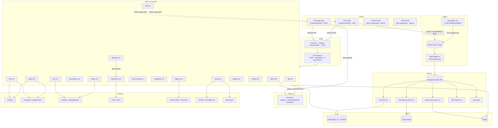

# D6′ — MageRide Integration & Protocol Specification

> **🔄 Aligned to ADD v2.6 / URD v2.2 (ADD §1.8 AL-01…AL-16).** This pass: web clients = **Admin Portal** (`admin.mageride.lk`) + **Fleet Portal** (`fleet.mageride.lk`) — `wallet-portal` removed (AL-02/03); **bank-transfer top-up removed**, ComBank IPG webhook retained only for OnePay/LankaQR gateway settlement reconciliation (AL-05); LankaQR = Pay deep link (AL-15); "reseller" = any driver who bought bulk credit and transfers it to others (exact value, **no per-transfer commission**; AL-01).

> **Phase B deliverable (Prompt B6).** Transformed from the Namma Yatri Phase-A integration extraction
> (`nammayatri-extraction/D6_integration_protocols.md`) onto MageRide's **.NET 10 LTS + Redpanda
> (Kafka-API) + EMQX (MQTT) + SignalR** architecture, per ADD v2.4 §5 (logical), §7 (real-time, incl.
> §7.2/§7.3/§7.5/§7.7), §18.1 (core stack), §1.3–§1.7 deficit log; canonical services
> `lightweight-production-replica.md`; event schemas aligned to D3′/D4′.
>
> **Stack delta:** NY = Kafka (no MQTT) + external LTS + HTTP-poll (no WebSocket) + Beckn/ed25519 +
> Juspay/Stripe + Idfy/HyperVerge/DigiLocker/Aadhaar + Google Maps + Exotel. MageRide = **EMQX MQTT
> ingest** (real) + **Redpanda** event backbone + **SignalR** fan-out (real) + **OnePay/LankaQR** +
> **Gemini OCR** + **PMTiles/MapLibre** + **LiveKit VoIP** + **FCM/APNs** + **Notify.lk SMS**. **No
> Beckn/ONDC** (`[DELTA:BECKN]` removed — direct ride-svc). Every item tagged; all `[DELTA:*]` and
> Phase-A `[UNVERIFIED]` resolved.

---

## 1. Service Dependency Graph



### 1.1 Per-connection classification & failure impact

| From → To | Sync/Async | Protocol | Criticality | Failure impact |
|---|---|---|---|---|
| App → API Gateway | Sync | HTTPS REST (YARP) | Critical | App unusable; no auth/book/ride |
| Driver App → EMQX | Async pub | MQTT 5/TLS, QoS1 | Critical (tracking) | No live position; dispatch/ETA degrade |
| tcp-adapter → EMQX | Async pub | mTLS bridge | Critical (HW fleets) | Tracker positions stop publishing |
| EMQX → bridge → Redpanda | Async | shared-sub → Kafka | Critical | Position pipeline stalls (buffered, no loss) |
| Redpanda → consumers | Async | Kafka consume | Best-effort→Critical | Lag; offsets prevent loss |
| ride-svc → SignalR (outbox) | Async | LISTEN/NOTIFY | Critical | Ride state not pushed; client polls fallback |
| dispatch-svc → notification-svc → FCM | Async | REST/FCM | Critical (offers) | Drivers miss offers; 3s no-ack → SMS (E-01) |
| Passenger App ↔ SignalR | Async | WSS | Critical (live map) | Map freezes; reconnect + snapshot resync |
| fare/wallet → OnePay/LankaQR | Sync+webhook | REST | Critical (payments) | Top-up/pay blocked; cash fallback |
| iam/safety → SMS | Sync | REST | Best-effort/Critical | OTP login blocked if down; SOS uses 2 gateways |
| registry → Gemini | Sync+fallback | REST | Best-effort | Onboarding OCR stalls; Tesseract fallback |
| query → PMTiles/Nominatim | Sync | HTTP/CDN | Critical (map) | No tiles/geocode; offline tile cache mitigates |

**Removed vs NY:** Beckn Gateway/ONDC (`[DELTA:BECKN]` — direct ride-svc, no signed callbacks);
external LTS (replaced by in-cluster MQTT pipeline); Juspay/Stripe/Idfy/HyperVerge/DigiLocker/Aadhaar/
Exotel (`[DELTA:INDIA]` dropped).

---

## 2. Event Backbone — Redpanda (Kafka-API)   [ADAPT] (NY Kafka/LTS → Redpanda)

Redpanda at every stage (same `Confluent.Kafka` client): **1 broker RF=1** dev → **3-node RF=3**
MVP/prod → **5-node RF=3 + tiered storage** scale (§7.3). **Default partition key = `vehicleId`**
(in-order per vehicle); the `ride.events`/`dispatch.events` topics are keyed by `rideId` (see the §2.1
registry). Consumer group per service; auto-managed offsets.

### 2.1 Topic registry (ADD §5; replaces NY `location-updates`/`*-events-updates`/`beckn-transaction-log`)

| Topic | Partition key | Producer | Consumers | Tag |
|---|---|---|---|---|
| `telemetry.raw` | vehicleId | mqtt-bridge-svc | position-processor, anti-spoof | [ADAPT] |
| `telemetry.normalized` | vehicleId | position-processor | persistence-writer, trip-state, fleet-health | [NEW] |
| `trip.events` | vehicleId | trip-state-svc | query, persistence, audit | [ADAPT] |
| `ride.events` | rideId | ride-svc (outbox) | dispatch, fare, reputation, fanout, audit | [NEW] |
| `dispatch.events` | rideId | dispatch-svc | ride-svc, notification, fanout | [NEW] |
| `audit.events` | entityId | all (admin-bff interceptor) | audit sink, cold storage (D-35) | [NEW] |

### 2.2 Event schemas (full JSON; MageRide field names, aligned to D4′)

**`telemetry.normalized`** (canonical `PositionSample`; CBOR on wire, JSON shown):
```jsonc
{ "vehicleId":"uuid", "sampleTs":"2026-06-13T10:15:30Z", "receivedTs":"2026-06-13T10:15:31Z",
  "seq": 84213,                       // monotonic per vehicle (replay dedup, R-17/T-05)
  "lat":6.9271, "lng":79.8612, "speedMps":11.8, "headingDeg":270,
  "accuracyM":7.5, "hdop":0.9, "satCount":11,
  "source":1,                          // 0=mobile,1=gt06,2=jt808,3=h02,4=nmea-mqtt
  "mode":"C", "vehicleType":"three_wheeler", "fleetId":null, "tripId":"uuid?" }
```
**`ride.events`** (outbox envelope):
```jsonc
{ "eventId":"uuid", "eventType":"ride.accepted",       // ride.requested|offer.created|ride.accepted|
                                                        //   ride.driver_arrived|ride.started|ride.completed|
                                                        //   ride.cancelled|location.request.confirmed|
                                                        //   package.picked_up|package.delivered
  "rideId":"uuid", "version": 2, "ts":"2026-06-13T10:16:00Z",
  "payload": { "passengerId":"uuid", "driverId":"uuid?", "vehicleId":"uuid?",
    "kind":"passenger", "isProxy":false, "state":"Accepted",
    "pickup":{"lat":6.9,"lng":79.8}, "dropoff":{"lat":6.95,"lng":79.9} } }
```
**`dispatch.events`** (offer):
```jsonc
{ "eventType":"offer.created", "rideId":"uuid", "offerId":"uuid", "driverId":"uuid",
  "expiresAt":"2026-06-13T10:15:45Z",          // +15s TTL
  "isProxy":false, "riderName":null, "riderPhoneMasked":null,   // P-05
  "isPackage":false, "packageSize":null,                          // P-06
  "directionalMatched":false,                                     // DT-08 badge
  "fareEstimateMinor":48000, "currency":"LKR", "paymentMethod":"cash" }
```
**`audit.events`** (D-35): `{ "eventId","actorId","action","entityType","entityId","before","after","ts" }`.

### 2.3 Ordering, retry, DLQ (resolves NY `[UNVERIFIED]` DLQ)   [ADAPT]/[NEW]
- **Ordering:** per-partition (Kafka guarantee); `vehicleId`/`rideId` key → in-order per aggregate.
- **Retry:** consumer-side exponential backoff (3 attempts, 100 ms→2 s, ±25% jitter).
- **DLQ (NEW):** poison/exhausted messages → `<topic>.dlq` with `{originalOffset, error, attempts}`
  (NY dropped undecodable records — `[REPLACE]` with durable DLQ + alert). Idempotent consumers key
  on `eventId`/`seq`.
- **Dedup:** position-processor discards `seq ≤ veh:seq:{vehicleId}` (R-17/T-05).

### 2.4 Transactional outbox (R-13, E-09)   [NEW]
`ride-svc`/`dispatch-svc` write domain change + outbox row in one DB transaction; **`offer.created`
pushed only after COMMIT** (no phantom offers, R-13). **Postgres `LISTEN/NOTIFY 'ride_outbox'`** wakes
the dispatcher in **< 50 ms** (vs 250 ms poll, E-09); dispatcher publishes to Redpanda + notification-svc.

---

## 3. MQTT Plane — EMQX   [KEEP structure, ADAPT auth] (NY had no MQTT — resolves `[UNVERIFIED]`)

NY had **no MQTT broker** (HTTP→LTS→Kafka). MageRide is MQTT-native. Driver App client = **HiveMQ
(Android) / CocoaMQTT (iOS)** in a native foreground service; MQTT config shared via KMP.

### 3.1 Topic tree & ACL (ADD §7.2/§7.7)

| Topic | Direction | QoS | Retain | Payload | ACL |
|---|---|---|---|---|---|
| `veh/{vehicleId}/pos/live` | device→broker | 1 | last | CBOR PositionSample | device PUB own only |
| `veh/{vehicleId}/pos/replay` | device→broker | 1 | no | CBOR backlog (seq) | device PUB own; rate-limited |
| `veh/{vehicleId}/cmd` | broker→device | 1 | no | `{cmd,args,expiresAt}` | device SUB own only |
| `veh/{vehicleId}/status` | broker (LWT) | 1 | yes | `online`/`offline` | system |
| `fleet/{operatorId}/+/pos/live` | broker→consumer | 1 | — | wildcard | operator-scoped SUB (RLS) |
| `sys/diag/{vehicleId}` | device→broker | 0 | no | diagnostics | device PUB own |

**ACL:** device may `PUB` only to its own `veh/{vehicleId}/*` (EMQX binds the `vehicleId` JWT/X.509
claim). `cmd` commands carry `expiresAt`; expired commands not delivered on reconnect. Supported `cmd`:
`setPosRate`, `pingNow`, `reboot`, `setGeofence`, `revokeCredential`.

### 3.2 Auth — MQTT session JWT decoupled (E-02, D-21)   [NEW]
- **MQTT session JWT ≠ API JWT (E-02):** minted by `provisioning-svc`; **TTL = max(active-ride+2h,
  4h)**, bound to `(vehicleId, deviceId, rideId?)` — survives mid-trip API-token refresh failures in
  low coverage. API access JWT stays 30 min.
- **EMQX local JWKS cache 15-min TTL + JIT lookup on miss (D-21)** — avoids thundering herd at auth.
- Hardware: X.509 client cert (MQTT-capable) or per-device PSK+IMEI-HMAC (legacy via adapter).

### 3.3 Rate-limit & bridge (D-17, E-08)   [NEW]
- **EMQX rule-engine: > 5 msg/s per `vehicleId`** on `veh/+/pos/live` → suppressed + `mqtt.rate_violation`
  → `audit.events` (D-17; 5/s accommodates 1 s near-geofence cadence + retries). `position-processor`
  **second-line at 10 msg/s/10 s** → drop + flag. `pos/replay` ≤ 20 samples/s/device.
- **mqtt-bridge-svc shared subscription `$share/posGroup/veh/+/pos/live`** (parallel group for
  `/pos/replay`) — N replicas load-balance, **exactly-once dispatch**, no duplicate ingest (E-08);
  commit Redpanda offsets per partition; EMQX redistributes on replica loss.

### 3.4 LWT (R-15, T-04)   [NEW]
EMQX last-will `veh/{vehicleId}/status=offline` consumed by **trip-state-svc** (auto-end), **dispatch-svc**
(release active offer / start grace, R-15; clear active Directional filter, DT-04), **fleet-health-svc**
(rollup). TCP-adapter **emulates LWT on socket half-close** by publishing retained `status=offline` (T-04).

### 3.5 Reconnect storm controls (R-09)
EMQX connection rate-limit (500 conns/s/listener + per-ASN); mobile jittered exponential backoff
(1–60 s ±25%); on reconnect, drain live 2 s before unlocking replay; live preempts replay 4:1.

---

## 4. Hardware GPS Tracker Plane   [NEW] (§7.7, T-01..T-12)

NY had no hardware-tracker ingestion. `tcp-adapter-svc` = one StatefulSet **per protocol family**.

### 4.1 Protocol adapters (T-01)
| Family | Transport | Port | Devices | Adapter |
|---|---|---|---|---|
| GT06/GT06N | TCP binary | 5023 | Concox GT06, TK103, ST-901 | adapter-gt06 |
| JT/T 808 | TCP binary | 5024 | Chinese/SL-import trackers | adapter-jt808 |
| H02/H02X | TCP ASCII | 5025 | older bus trackers | adapter-h02 |
| Generic-NMEA | UDP | 5026 | low-cost asset trackers | adapter-nmea-udp |
| NMEA-over-MQTT | MQTT native | 8883 | Teltonika/Queclink (new FW) | **direct to EMQX, no adapter** |

Each adapter: terminate socket → validate IMEI → decode binary → canonical `PositionSample` → publish
to EMQX `veh/{vehicleId}/pos/live` (or `/pos/replay`) as mTLS bridge user. **MQTT-capable trackers
bypass adapters** and connect to EMQX directly (same ACL/credentials).

### 4.2 Provisioning & credentials (T-02, T-12)   [NEW]
- `provisioning-svc` (step-ca + Vault PKI) mints **X.509** (MQTT, 90-day TTL) or **signed PSK +
  IMEI-HMAC** (legacy TCP). **90-day rotation** cron; downlink `revokeCredential` cmd.
- **Sub-second revocation (T-12):** EMQX dynamic ACL backed by `provisioning-svc` Redis lookup +
  pub/sub invalidation; TCP adapter consults same cache on each authenticate (re-validates every 5 min
  on long sockets) and **force-closes matching socket within 1 s** on revoke.

### 4.3 IMEI resolution & anti-clone (T-03, T-08)   [NEW]
- **IMEI→vehicleId:** Redis `imei:{imei}` (24 h TTL) → Postgres `prov.tracker_bindings` source of
  truth (T-03); cache invalidated by `tracker.bound`/`tracker.unbound`.
- **Anti-clone (T-08):** two devices presenting the **same IMEI within 24 h** → both **quarantined**
  (`prov.tracker_bindings.state=QUARANTINED`), admin resolution; security event logged.

### 4.4 Replay & downlink (T-05; §7.7.4/7.7.5)   [NEW]
Offline tracker buffers to flash (50k-sample ring), reconnect bursts to `veh/{vehicleId}/pos/replay`
(separate consumer group, **≤ 20 msg/s/device**); position-processor keeps `veh:seq:{vehicleId}`,
discards `seq ≤ last_seen` (T-05). Downlink `cmd` → adapter translates envelope to protocol-native
command frame over the open socket.

### 4.5 Mode routing (T-11; §7.7.7)
Mode A bus: position broadcasts irrespective of driver-app (tracker authoritative). Mode C: dispatch
reads tracker when bound; tracker offline > 30 s → fall back to phone GPS or mark unavailable. Fleet
scoping via `fleet_id` row-level security. **TimescaleDB hypertable `telemetry.positions`** is the
sink (T-06; see D4′ §17).

---

## 5. WebSocket / SignalR Fan-out   [ADAPT] (NY had no socket — resolves `[UNVERIFIED]`)

`fanout-svc` (ASP.NET Core SignalR), **Redis backplane (MVP) → Redpanda backplane (scale, > 5 pods)**.
Client = **SignalR Java client (Android) / SignalR Swift client (iOS)**. Hub `/hubs/live`; auth via
`access_token` query (JWT).

### 5.1 Hub methods

**Client→Server:**
| Method | Args | Effect |
|---|---|---|
| `JoinGeocells(cells[])` | H3 res-7 cell IDs | passenger 3 km view = res-7 + ring(2) = 19 cells (R-06); Mode B entitlement checked |
| `LeaveGeocells(cells[])` | — | unsubscribe; 30 s hysteresis on boundary churn |
| `SubscribeRide(rideId)` | uuid | assigned-ride live driver position (US-6A.12) |
| `SubscribeLocRequest(requestId)` | uuid | booker awaits rider confirm (P-13) |

**Server→Client:**
| Event | Payload | When |
|---|---|---|
| `VehiclePositions` | `[{vehicleId,lat,lng,heading,speed,type,mode}]` | per-cell batch, 2–8 s (US-7.3) |
| `VehicleRemoved` | `{vehicleId,reason:stale\|offline\|engaged}` | US-7.16/7.17 |
| `RideStateChanged` | `{rideId,state,version,driver?,etaSeconds?}` | ride aggregate transition |
| `DriverPosition` | `{rideId,lat,lng,heading}` | assigned ride live |
| `LocationRequestResolved` | `{requestId,state,geo?}` | proxy round-trip (P-02/P-13) |
| `ShareRevoked` | `{vehicleId}` | Mode B unsubscribe → RemoveFromGroupAsync (D-22) |
| `PackageStatus` | `{rideId,status}` | US-20.7 |

### 5.2 Visibility & entitlement (D-22, D-23)   [NEW]
Public geocell groups fan out **Mode A (bus + train) + entitled Mode B only**; **Mode C on active
hire excluded** from public groups (sent only to assigned passenger's ride group); stale/offline
dropped. **Mode B entitlement cache `share:{userId}` SET, pub/sub-invalidated** (D-23), checked on
group-join. `share.revoked` event → **directed `RemoveFromGroupAsync`** to affected passenger < 200 ms
(D-22), no wait for next cell crossing.

### 5.3 Proxy round-trip (P-13)   [NEW]
Booker subscribes group `booker:{bookerId}:loc-req:{requestId}` on issuing FCM location-request; rider
confirmation publishes via `ride-svc → outbox → fanout-svc` → booker WS; expired/declined also pushed
(no polling); 5-min TTL (P-02).

### 5.4 Reconnection / heartbeat / state recovery (R-08 functional analog)
SignalR keep-alive 15 s, server timeout 30 s, automatic reconnect (jittered backoff). On reconnect the
client rejoins its geocell groups and resyncs from a `query-svc /nearby` snapshot (last-known from
Redis GEO). Resolves NY's HTTP-poll-only model (`[ADAPT]` → real socket + reconnect).

---

## 6. VoIP   [NEW] (D-24, D-25)

`voip-svc` (LiveKit SFU + coturn) issues **LiveKit signalling tokens scoped to `(rideId, role)`**,
**expiring at trip end**. Driver↔**rider** binding (not booker) for proxy (P-05). Signalling via
`voip-svc` REST behind YARP; **TURN media relay (coturn) on host UDP range (3478 + 50000–50100), NOT
via HAProxy/L7** (HAProxy cannot relay UDP). **Fallback (AL-48, supersedes D-25):** if VoIP fails the
app offers **"Call normally instead?"** — a client-side `tel:` dial of the counterparty's real number
(carried post-accept in the ride detail). The ~~masked-number SMS relay via `notification-svc`~~ is
**removed**; there is no CPaaS/DID integration on this path. Recordings off by default (PDPA).

---

## 7. External Service Integrations   [REPLACE] (NY Juspay/Idfy/Google/Exotel → SL/native)

### 7.1 OnePay (card / wallet)   [REPLACE] (NY Juspay)
```
Request:  POST /wallet/topup/onepay | POST /fare/pay {method:onepay} → OnePay create-session
          → {redirectUrl|sessionToken}
Webhook:  POST /v1/{wallet|fare}/pay/onepay/webhook  (HMAC-SHA256 signature header, verified)
          payload {orderId, providerTransactionId, status:CHARGED|FAILED, amountMinor}
          → idempotent on providerTransactionId (UNIQUE, R-19); credits wallet / completes payment
Refund:   OnePay reverse API → fares.refunds (E-05)
Retry/timeout: 90 s pending window; reconcile open orders by status poll; 3 retries → FellBackToCash
Fallback: cash (ride). **Wallet top-up has no bank-transfer fallback — OnePay/LankaQR only (AL-05).**
Surcharge: +5% on ride fares (US-8.11)
```
Resolves NY Juspay webhook signature `[UNVERIFIED]` → **explicit HMAC verification**.

### 7.2 LankaQR + Commercial Bank IPG (D-12)   [REPLACE]/[NEW]
```
LankaQR:  POST /wallet/topup/lankaqr | /fare/pay {method:lankaqr} → **"Pay" deep link to bank app** (QR fallback only, AL-15) (no surcharge)
          Confirm webhook POST .../lankaqr/confirm (HMAC) → credits
Bank transfer: **REMOVED as a top-up method (AL-05).** ComBank IPG webhook is retained only for
          **OnePay/LankaQR gateway settlement reconciliation** (exceptions → Finance queue in Admin Portal).
Retry/timeout: 90 s; settlement exceptions → Finance queue
```

### 7.3 SMS — Notify.lk + secondary (D-33)   [REPLACE] (NY SMS/WhatsApp/Exotel)
```
Primary:  Notify.lk REST (~Rs 0.50–1.50/SMS) — OTP, transactional, low-balance
SOS (D-33): primary + secondary gateway (Dialog/Mobitel) IN PARALLEL; p99 ≤ 5 s; whichever delivers first
Retry: 2 attempts; OTP rate-limit 60 s resend, 5/h (D-32). No WhatsApp/Exotel (dropped).
```

### 7.4 Push — FCM + APNs (E-01)   [ADAPT]
```
Channel:  FCM HTTP v1 (Android) + APNs HTTP/2 (iOS), batch send + exponential-backoff worker (D-27)
Dispatch offer (E-01): FCM priority=high (bypass Doze) + APNs apns-priority:10 content-available:1
          (silent, wakes app); 3 s no-ack → SMS fallback to driver
Proxy location-request (P-12): FCM data-message {kind:location_request, requestId, bookerName, ttl:300};
          per-booker rate-limit 5/h, 30/day (Redis token bucket); declines → safety.location_request_audit
Package recipient (P-09): FCM to registered recipient with delivery OTP; if unregistered →
          SMS with safety.trip_share_tokens-scoped link (masked, OTP shown post token validation)
Templates: rendered by content-svc in Si/Ta/En (D-26)
```

### 7.5 OCR — Gemini Flash 3.0 + Tesseract   [ADAPT] (NY Idfy/HyperVerge/DigiLocker/Aadhaar; Change 6/22 = Flash 3.0 auto-verify)
```
Submit:   registry-svc → ocr-svc; PII redaction pre-pass (OpenCV face-blur + Tesseract ID-mask) BEFORE
          Gemini Flash 3.0 (D-36); raw docs SSE-KMS, 90-day auto-delete (NFR-28). One docs.extractions row per doc.
Fallback: Gemini down/low-confidence → Tesseract on-prem; below threshold → manual admin review (US-2.10)
No Aadhaar/PAN/GST/DigiLocker (dropped).

Mode-C onboarding field → verdict mapping (Change 6/22; drives SCR-DA/DI-006 and vehicle auto-approve):
  driving_license (Profile Setup) → {license_no, expiry}        # driver identity, vehicle-less
  insurance        → expiry_date present                 ⇒ VERIFIED, else Pending
  revenue_license  → {licence_no, expiry_date} present   ⇒ VERIFIED, else Pending
  vehicle photos   → plate OCR == registration_number    ⇒ VERIFIED, else Pending
  ALL four VERIFIED ⇒ registry-svc auto-sets vehicle status=APPROVED (NO Verification Officer step,
  user decision 6/22); any Pending ⇒ Verification Officer queue (US-2.10).
```

### 7.6 Maps / Tiles — PMTiles + Nominatim (D-14)   [REPLACE] (NY Google Maps/OSRM)
```
Tiles:    PMTiles single file on Cloudflare R2 ($0 egress) + Worker (range-byte) + CDN; signed offline
          bundles (MAP-09). > 50 GB/mo → Cloudflare Pro or Bunny.net fallback (D-14/D-16)
Geocode:  Nominatim self-hosted (SL extract, ~8 GB RAM), weekly osm-pipeline refresh (D-15)
Routing:  OSRM/Valhalla self-hosted (Phase 3 ETA/snap-to-road)
No Google Maps SDK/places (per-load billing avoided).
```

---

## 8. Service Mesh, Gateway & Resilience   [ADAPT]

### 8.1 Communication
- **Sync:** HTTPS REST via **YARP** gateway (attestation D-30, `X-App-Version`→426 D-31, JWT validate);
  KMP apps use **Ktor client**; service-to-service **HttpClient** + gRPC (reputation-svc `block_status`/
  `driver_level`); internal mTLS via **Linkerd** (SPIFFE/SPIRE).
- **Async:** **Redpanda** (`Confluent.Kafka`) + EMQX MQTT.

### 8.2 YARP routing rules (illustrative)
`/v1/auth/** → iam-svc` · `/v1/rides/** → ride-svc` · `/v1/standby/**,/v1/rides/job-board/** →
dispatch-svc` · `/v1/fare/** → fare-svc` · `/v1/wallet/**,/v1/fees/** → wallet/subscription-svc` ·
`/v1/vehicles/**,/v1/trackers/** → registry/provisioning` · `/hubs/live → fanout-svc (WSS)` ·
`/v1/voip/** → voip-svc`. Gateway applies attestation + version gate + rate-limit before forward.

### 8.3 Resilience (resolves NY `[UNVERIFIED]` retry/breaker/DLQ)   [NEW]
- **Retry/backoff/jitter (Polly):** transient REST/Kafka — 3 attempts, exponential 100 ms→2 s, ±25%
  jitter; idempotent only (Idempotency-Key on mutations).
- **Circuit breaker (Polly):** per external dependency — open after 5 failures/30 s, half-open probe
  after 15 s (NY had none — `[NEW]`).
- **DLQ:** `<topic>.dlq` for exhausted consumer messages + alert (NY dropped — `[REPLACE]`).
- **Timeouts:** API 15 s; MQTT publish best-effort QoS1; payment provider 90 s; OCR 30 s; Kafka poll
  500 ms. Per-service `connectTimeout` set (NY left several unset `[UNVERIFIED]` → resolved).
- **Backpressure:** EMQX ingest > consumer → Redpanda buffers (bounded by retention, no loss);
  position-processor batches `COPY` to Timescale (1k rows/500 ms); replay throttled 20/s; oversize
  reject `LARGE_PAYLOAD`. Consumer-group lag → Prometheus alert thresholds (NY had no numeric
  threshold `[UNVERIFIED]` → defined: warn > 10k, page > 100k lag).
- **Degraded mode:** dispatch wallet cache miss + DB down → allow first trip (free), refuse 2nd (D-08);
  SignalR backplane down → clients poll `query-svc /nearby`; OCR down → Tesseract.

---

## Traceability Addendum

| URD US-ID | Epic | D6′ section | Tag | ADD §/Item | Notes |
|---|---|---|---|---|---|
| US-3.1/3.5/3.8 | 3 | §4.2/4.3 provisioning | [NEW] | T-02/03/08/12 | X.509/PSK, anti-clone, revoke |
| US-3.9/3.17 | 3 | §4.1/4.4 adapters/cmd | [NEW] | T-01 | GT06/JT808/H02/NMEA |
| US-3.10/3.11 | 3 | §4.4 replay | [NEW] | T-05 | seq dedup, throttle |
| US-3.21/3.22 | 3 | §4.5 mode routing | [NEW] | T-11 | Mode A/C eligibility |
| US-4.5/4.6/4.8/NEW.1 | 4/10 | §5.2 entitlement | [NEW] | D-22/23 | share cache, revoke push |
| US-5.5 | 5 | §3.1 cmd cadence | [ADAPT] | R-07 | phase-aware hint |
| US-6A.2/6A.3 | 6A | §2.4 outbox; §2.2 dispatch.events | [NEW] | R-13/E-09 | offer after commit, 15s |
| US-6A.11 | 6A | §3.4 LWT; §8.3 timers | [NEW] | R-15 | release on offline |
| US-6A.13 | 6A | §7.4 FCM offer | [ADAPT] | E-01 | hi-priority + SMS fallback |
| US-6A.16 | 6A | §6 VoIP | [ADAPT] | D-24 (D-25 removed, AL-48) | LiveKit; VoIP fail → direct `tel:` dial |
| US-6A.17–23 | 6A | §3.4 LWT clears directional | [NEW] | DT-04 | offline/LWT clear |
| US-7.1–7.4 | 7 | §5.1/5.2 SignalR | [ADAPT] | R-06 | geocell groups, visibility |
| US-7.16/7.17 | 7 | §5.2 VehicleRemoved | [NEW] | — | engaged/stale dropped |
| US-8.10/8.11/8.15 | 8 | §7.1/7.2 OnePay/LankaQR | [REPLACE] | D-10/12 | payment + IPG |
| US-8.16–8.21 | 8 | §5.3 proxy round-trip; §7.4 | [NEW] | P-02/12/13 | loc-request WS |
| US-9.18/9A.4/9A.16 | 9/9A | §7.2 bank IPG | [REPLACE]/[NEW] | D-12 | reconciliation |
| US-10.12/10.13 | 10 | §7.4 package push | [NEW] | P-09 | recipient FCM/SMS |
| US-12.1/12.8 | 12 | §7.3 SOS SMS | [NEW] | D-33 | dual gateway p99 5s |
| US-15.1 | 15 | §3.5/§4.4 replay | [NEW] | R-17 | offline buffer replay |
| US-2.2/2.4 | 2 | §7.5 OCR | [ADAPT] | D-36 | Gemini + redaction |
| MAP-01..09 | 3 | §7.6 tiles | [REPLACE] | D-14/15 | PMTiles/Nominatim |
| US-1.1/1.10 | 1 | §7.3 SMS OTP | [REPLACE] | D-32 | Notify.lk, rate-limit |

## Mandatory ADD Critique-Item Coverage (D6′ scope)

| Item | §where | ✅ | Item | §where | ✅ |
|---|---|---|---|---|---|
| D-06 | §5.1 res-7 view / dispatch res-5 | ✅ | R-13 | §2.4 outbox-after-commit | ✅ |
| D-07 | §2.2/§3.1 15s offer | ✅ | R-15 | §3.4 LWT release | ✅ |
| D-12 | §7.2 ComBank IPG | ✅ | R-17 | §3.5/§4.4 replay | ✅ |
| D-14 | §7.6 PMTiles/R2 | ✅ | E-01 | §7.4 FCM hi/APNs silent | ✅ |
| D-17 | §3.3 5 msg/s ceiling | ✅ | E-02 | §3.2 MQTT JWT decoupled | ✅ |
| D-21 | §3.2 JWKS cache 15min | ✅ | E-08 | §3.3 shared subscription | ✅ |
| D-22 | §5.2 RemoveFromGroup | ✅ | E-09 | §2.4 LISTEN/NOTIFY <50ms | ✅ |
| D-23 | §5.2 share:{userId} cache | ✅ | P-02 | §5.3 loc-request | ✅ |
| D-25 | §6 — **withdrawn by AL-48**; fallback is a direct `tel:` dial, no masked-SMS relay | ✅ | P-09 | §7.4 recipient FCM/SMS | ✅ |
| D-33 | §7.3 dual SMS p99 5s | ✅ | P-12 | §7.4 booker rate-limit | ✅ |
| R-04 | §2.4/§3.1 durable timer (Quartz) | ✅ | P-13 | §5.3 booker WS group | ✅ |
| R-06 | §5.1 H3 res-7 + ring(2) | ✅ | T-01 | §4.1 adapters | ✅ |
| R-08 | §5.4 / Redis GEO resync | ✅ | T-02 | §4.2 X.509/PSK mint | ✅ |
| T-03 | §4.3 IMEI cache+binding | ✅ | T-04 | §3.4 LWT + adapter emul | ✅ |
| T-05 | §4.4 replay seq dedup | ✅ | T-06 | §4.5 Timescale sink | ✅ |
| T-08 | §4.3 anti-clone quarantine | ✅ | T-12 | §4.2 sub-second revoke | ✅ |
| DT-04 | §3.4 LWT clears directional | ✅ | | | |

All in-scope items ✅ — **document NOT `[INCOMPLETE]`.**

---

## Verification & Caveats Summary

- Updated service dependency graph (mermaid) + failure-impact table; full event schemas (Redpanda
  topics), MQTT topic tree + ACL, SignalR hub methods (C→S/S→C), external API request/response/webhook/
  retry/timeout/fallback specs, hardware-tracker plane, VoIP, resilience.
- **Resolved Phase-A `[UNVERIFIED]` (9):** (1) MQTT broker → **real EMQX** topic tree; (2) WebSocket →
  **real SignalR** hub; (3) payment webhook signature → **HMAC-SHA256 verified**; (4) Kafka DLQ →
  **`<topic>.dlq`**; (5) circuit breaker → **Polly**; (6) retry/backoff → **3×, exp+jitter**; (7)
  analytics schemas → MageRide event schemas (§2.2); (8) APNs send-path → **APNs HTTP/2 (E-01)**; (9)
  consumer-lag thresholds → **warn 10k / page 100k**.
- **`[DELTA:*]` resolved:** `[DELTA:BECKN]` **removed** (no ONDC/Beckn — direct ride-svc); `[DELTA:INDIA]`
  Juspay/Stripe/Idfy/HyperVerge/DigiLocker/Aadhaar/Exotel/WhatsApp dropped → OnePay/LankaQR/Notify.lk/
  Gemini/PMTiles; ₹→Rs, +91→+94, IST→Asia/Colombo.
- **Hard rules honoured:** payment = OnePay/LankaQR/Cash; map/tiles = PMTiles/R2. All in-scope ADD
  critique items ✅.

---

## Δ Addendum — Discussion 2026-06-21 (integrations, ADD v2.7 §1.9)

### I-23.1 Google Maps link parsing (items 5, 6, AL-20)
**No Google API.** Full URLs parsed **client-side** with regex over the known coord forms (`?q=lat,lng`, `@lat,lng,z`, `/place/.../@lat,lng`, `!3d!4d`, `ll=`). Short links (`maps.app.goo.gl`, `goo.gl/maps`) are resolved by `transit-svc /geo/parse-maps-link` via a single server-side **HTTP redirect follow** (HEAD/GET, no body) → extract coords from the `Location`. Timeout 3 s, 1 retry; failure → "pick on map" fallback. Parsed coords feed the existing pin-drop/reverse-geocode (Nominatim/Photon) path.

### I-23.2 GTFS public-transport feed (items 3, 4, AL-18)
Admin uploads a **GTFS zip** (`routes`, `trips`, `stops`, `stop_times`, `shapes`) via `POST /admin/transit/gtfs-import`; importer validates + loads into `transit.*` (PostGIS). `transit-svc /transit/options` runs the direct/transit query (stop-radius default 400 m, Asia/Colombo service calendar). Future **GTFS-RT** (Phase 3) for live ETAs; v2.7 uses static schedule headways only.

### I-23.3 Package recipient notification on pickup-confirm (item 11, AL-21)
Trigger event: `package.picked_up` (from `ride-svc` when driver enters pickup OTP). `notification-svc` resolves recipient phone:
- **registered** → FCM HTTP v1 high-priority data+notification: title/body *"📦 Package on the way — {driver} · ETA {n} min"*, `data.deeplink=mageride://package/{rideId}` → opens SCR-PA-021.
- **unregistered** → SMS (Notify.lk primary / Dialog secondary): *"Your package is on the way. Track here: passenger.mageride.lk/track?token={token}"* where `token` is a `safety.trip_share_tokens` row scoped `package_recipient` (TTL = delivery + 1 h). Web page validates token → shows map + status + delivery OTP, no login (AL-04/P-09).

### I-23.4 Mode B subscription payment gateways (item 16, AL-24)
Payment is **passenger → fleet owner** (pass-through; not platform revenue), via:
- **LankaQR deep link** — `intent://`/Universal Link opens the passenger's bank app pre-filled (merchant = fleet owner's LankaQR merchant ref).
- **LankaQR scan** — passenger scans the fleet's LankaQR.
- **OnePay** — `SFSafariViewController`/Custom Tab to OnePay; +5% surcharge; webhook `POST /mode-b/pay/onepay/webhook` → mark `paid`.
- **Online transfer** — passenger uploads a **slip screenshot** to object storage (`subscription.payments.slip_url`); status `pending_verification` until fleet owner confirms (`POST /mode-b/payments/{id}/confirm`).
- **Cash** — out-of-band; fleet owner marks received (`.../mark-cash`).
Each settled payment emits `subscription.payment.paid` → updates passenger card (SCR-PA-025) + both histories. Webhook idempotency via `gateway_ref` unique.

### I-23.5 Driver-QR fare scan (item 18, AL-22)
Passenger camera scans the driver's printed/on-screen LankaQR; the decoded merchant payload is posted to `POST /fare/pay/scan-driver-qr` (or handed to the bank app via LankaQR deep link). No MageRide-rendered QR.

## Δ Addendum — Discussion 2026-06-25 (integration, items 1–13)

> Integration/protocol updates for ADD v2.8 §1.10 (AL-28…AL-35) / URD v2.4.

### I-25.1 Gemini licence extraction expanded (item 2, AL-29)
`ocr-svc`'s driving-licence prompt now returns `{licence_no, licence_expiry, nic_no, allowed_vehicle_types}` with per-field confidence. Each field is written to `registry.document_fields` (`source`, `confidence`, `verify_status`). `source='manual'` **OR** `confidence < threshold` → `verify_status='pending'` → SCR-AP-003. The PII redaction pre-pass (D-36) is unchanged (NIC number is still masked before the image leaves the perimeter; the value is captured from the structured response).

### I-25.2 Per-step onboarding verification (items 3–5, AL-30)
Per uploaded step doc, the `ocr-svc` verdict drives `registry.onboarding_steps.status`; the photos step compares plate OCR to `registration_number` (`reg_no_match` field). `pending_review` → Verification-Officer queue; all `verified` → `registry-svc` auto-APPROVE; `registry.vehicles.onboarding_status` derived incomplete/approved.

### I-25.3 Tracker-driven journey auto-start (items 8, 11, AL-32)
For tracker-equipped Mode A/B vehicles, **ACC-on/off ingest events** (Epic 3 ingest → `trip-state-svc`) **auto-start/end the tracking session**; the phone does **not** ingest GPS once the device is the active publisher (US-3.6). The Mode A/B dashboard (SCR-DA/DI-011) reads session state and offers a **manual Start/End override**.

### I-25.4 Delivery sender/recipient calls = direct PSTN dial (item 9, AL-33)
The Call buttons on the delivery sheets place a **direct telephony dial** (`tel:` / CallKit / ConnectionService outbound) to the sender/recipient numbers — the same mechanism the passenger "Normal call" uses since AL-48; the passenger flow additionally offers in-app VoIP as the "Free call" option (P-05 proxy routing unchanged: the driver sees the rider, never the booker). **Cancel** on sheet 1 returns the package offer to dispatch (next driver). **"Delivery completed"** → ride `Completed`; COD/cash reconciled separately.

### I-25.5 Credit-request QR removed (item 10, AL-34)
SCR-DA/DI-023 drops the VisionKit / ML-Kit driver-QR scan; `POST /v1/subscriptions/credit-transfer/request` takes a **Driver ID only**.

## Δ Addendum — Discussion 2026-06-28 (integration, items 1–11)

> Integration/protocol updates for ADD v2.9 §1.11 (AL-36…AL-43) / URD v2.5 Epic 24.

### I-28.1 Admin login — MFA/TOTP removed (item 5, AL-37)
`iam-svc` internal-role login no longer issues an MFA challenge; **no TOTP verify round-trip**. The authenticator-enrolment integration is removed from the Admin Portal flow. Compensating: failed-attempt lock-out, optional IP allow-list. Apps (Phone-OTP) and Fleet Portal (Email/Google/Apple) auth are unchanged.

### I-28.2 Document drag-crop capture (item 6, AL-43)
Client capture uses **CameraX `ImageCapture` (Android)** / **VisionKit `VNDocumentCameraViewController` (iOS)** with a four-corner adjustable quad; the client applies a **perspective transform + de-skew** before upload to object storage. Same `PUT /v1/vehicles/{id}/onboarding/{step}` multipart contract → `ocr-svc`/Gemini Flash; `docs.uploads.captured_via='camera_dragcrop'`. The PII-redaction pre-pass (D-36) is unchanged.

### I-28.3 Call-type chooser — VoIP vs direct dial (item 4, AL-36 as amended by AL-48)
`POST /v1/calls/start` with `callType=free_voip` opens a **WebRTC/CallKit** session (numbers incidentally hidden — a VoIP property, no longer a requirement). **"Normal call" needs no integration at all**: it is a client-side `tel:` dial of the counterparty's real MSISDN, carried post-accept in the ride detail — the same mechanism as the driver delivery sheets (I-25.4). Channel recorded best-effort in `comms.call_log` (`free_voip` | `direct_dial`).

> ⚠ **Superseded clauses (AL-48, see I-30.2):** the `callType=normal_masked` leg, the **masked-number PSTN bridge** / proxy-DID provisioning, and the **masked-SMS fallback (D-25)** are all **removed**. No CPaaS, no DID pool, no operator voice API.

### I-28.4 Admin document viewer — signed URLs + audit (item 8, AL-39)
`GET /admin/documents/{docId}` returns a **short-lived signed object-storage URL** (presigned, ~60 s) for the full-size viewer (SCR-AP-003b) and emits a **`DOC_VIEW`** event into `audit.events`. Thumbnails use the same presign at smaller render size. Verification queue feeds and detail joins are read-only.

### I-28.5 Dashboard analytics read-model (item 7, AL-38)
`GET /admin/dashboard/stats` aggregates `analytics.daily_metrics` (refreshed by a scheduled rollup job over `rides`/`wallet`/`iam`), scoped Asia/Colombo; the **live block** (online drivers, pending verifications, open tickets) is fetched real-time from the respective services and **bypasses the period filter**.

### I-28.6 Admin directory reads — PII masking + audit (items 9–11, AL-40/41/42)
Passenger/driver/vehicle directory list+detail endpoints are **read-models/joins** across `ride-svc`, `wallet-svc`, `payment-svc`, `registry-svc`. PII fields (mobile/email/NIC) are **masked unless the caller's RBAC grant permits**; opening a passenger/driver detail emits a **`PII_READ`** audit event.

## Δ Addendum — Discussion 2026-07-05 (Passenger Web subview, items 1–8)

> Integration/protocol updates for ADD v3.0 §1.12 (AL-44…AL-46) / URD v2.6 Epic 25.

### I-29.1 `public-bff` — token validation, payload shaping, live feed (items 1–2, AL-44)
A thin stateless BFF fronts `passenger.mageride.lk`: validates the token against `safety.trip_share_tokens` (Redis-cached, TTL-checked), shapes the snapshot per scope, and serves **SSE** for live position/status (subscribing to the same SignalR geocell/ride channels the apps use; **long-poll fallback** `?since=cursor` for older browsers). Per-token + per-IP Redis token-bucket rate limits; CDN-cacheable static shell; **no cookies, no localStorage of ride data**.

### I-29.2 Token minting + SMS templates (items 1, 3, AL-44/45)
`notification-svc` mints tokens server-side and embeds them in SMS via the existing dual gateway (Notify.lk primary / Dialog secondary): template `package_on_the_way` (scope `package_recipient`, on driver pickup-confirm — existing, unchanged), **new `proxy_ride_link`** (scope `proxy_rider`, on driver accept of a proxy ride, US-8.22/10.10) and **new `pickup_confirm_link`** (scope `pickup_confirm`, on `RiderNotRegistered`, TTL 300 s). Tokens are single-use-scope, never returned to any client API, and burned per BR-29.1.

### I-29.3 Web subview call — plain `tel:` link (item 4, AL-44 as amended by AL-48)
**REMOVED IN FULL BY AL-48 (see I-30.2).** There is no `POST /public/track/{token}/call`, no ride-scoped proxy-DID lease and no CPaaS bridge. The `/public/track/{token}` snapshot carries `driver.phone` for `package_recipient`/`proxy_rider` scopes, and SCR-WT-002/004 render it as a plain `tel:` link the browser dials directly (US-26.3). Still no WebRTC/mic permission on the web subview. Web SOS (I-29.4) is unaffected.

### I-29.4 Web SOS delivery (item 5, AL-44)
`POST /public/track/{token}/sos` fans out through the existing SOS pipeline (D-33: SMS×2 parallel, p99 ≤ 5 s) with recipient = **booker's registered mobile** + admin live-feed event; the browser's Geolocation API supplies coordinates (fallback: last driver-reported position). Logged `safety.sos_events(source='web')`; admin ack flow unchanged (US-12.11).

## Δ Addendum — Discussion 2026-07-05 #2 (driver-QR settlement & masking removal, items 1–6)

> Integration/protocol updates for ADD v3.1 §1.13 (AL-47…AL-48) / URD v2.7 Epic 26.

### I-30.1 Driver-QR settlement — no gateway integration (item 1, AL-47)
Driver-QR fare payments have **no PSP integration at all**: the passenger's bank app talks to LankaPay/the driver's bank directly. The platform's only moving parts are two FCM pushes (`QR_CLAIMED` → driver confirm prompt; `QR_CONFIRMED` → passenger receipt) and the `+5 min` nudge timer on the ride saga (Quartz durable timer, R-04). OnePay remains the only webhook-reconciled fare gateway (I-23.5/D-10 unchanged for OnePay).

### I-30.2 Telephony simplification — masking stack removed (items 2–4, AL-48)
**Superseded and removed:** the masked-number PSTN bridge (I-28.3 `normal_masked` leg), the web proxy-DID lease (**I-29.3 entirely**), and the masked-SMS relay fallback (D-25). **What remains:** LiveKit/CallKit VoIP for **Free call** (I-28.3's `free_voip` leg, unchanged); **Normal call** and the **web subview call** are plain `tel:` dials of the real MSISDN carried in the ride detail / token snapshot — **no CPaaS, no DID pool, no operator voice API dependency** (this also closes feasibility condition C3 without a provider integration). VoIP-failure UX falls back to the same direct dial. SOS SMS (D-33) and all Notify.lk/Ideamart SMS integrations are unaffected.

## Δ Addendum — Discussion 2026-07-18 (Fleet Portal payout & vehicle-document detail, items 1–3)

> Integration/protocol updates for ADD v3.2 §1.14 (AL-49…AL-51) / URD v2.8 Epic 27.

### I-31.1 Payout profile — no new external integration (item 1, AL-49)
The owner's **LankaQR code is a static image generated in their own bank app** — MageRide stores and re-serves it (signed URL from `docs.uploads`); there is **no LankaPay merchant-onboarding API, no acquiring integration, no settlement feed** (payments stay passenger→owner bank-to-bank, BR-23.10). Statement/passbook uploads ride the existing `docs.uploads` + Gemini extraction pipeline (account no / holder-name pre-fill, PII-redacted per D-36) with human Verification-Officer approval as the authority. Payout-profile events reuse the org-KYC notification templates (`payout_verified`, `payout_rejected` FCM/email).

### I-31.2 Vehicle-document slots — reuse of the Mode-C pipeline (item 2, AL-50)
The four SCR-FP-004 slots reuse the exact Mode-C onboarding machinery: `docs.uploads` → `ocr-svc` (Gemini Flash 3.0) → `registry.document_fields` per-field verification (AL-29) → Verification-Officer queue for low-confidence fields. New doc kinds route to the same extractors (registration copy = CR page OCR; route permit = permit no + route/validity). **No third-party verification API** (DMT/NTC have none) — officer review is the source of truth. AL-51 (rename) has no integration surface.

## Δ Addendum — Discussion 2026-07-22 #2 (GTFS Dataset Manager, ADD v3.4 §1.16)

### I-32.1 Versioned GTFS feed lifecycle (US-28.1…28.3, AL-54 — supersedes the import mechanics of I-23.2)
Admin uploads the **full GTFS zip** in **SCR-AP-016** → `admin-bff` proxies to `transit-svc` `POST /admin/transit/gtfs/uploads` → zip stored to object storage (SSE) → queued **validation job** (BR-32.1) writes `transit.gtfs_feed_versions.validation_report` → on **Activate**, the `gtfs-import` job (D7 §10) loads `transit_staging.gtfs_*` and one transaction swaps live tables → `NOTIFY transit_feed_activated` → `transit-svc` reloads caches ≤ 60 s. `GET /transit/options` (I-23.2) is unchanged; stop-radius default 400 m and the Asia/Colombo service calendar stand. **No third-party service** — the feed file is the integration surface.

### I-32.2 Launch premise (AL-55; updated by AL-56)
**The full national GTFS file is available at the beginning** and is loaded day-0 via I-32.1. Corridor-first acquisition gates no longer exist — **every feed refresh is likewise an externally provided GTFS file** entering through the same SCR-AP-016 upload→validate→activate pipeline; there is no in-house sourcing/authoring workstream (the standalone acquisition plan was retired 2026-07-23, AL-56). **The feed file is the integration surface.** Future **GTFS-RT** (Phase 3) unchanged.

## Δ Addendum — 2026-07-23 (micro-change-set: GTFS acquisition plan retired, AL-56)

I-32.2 rewritten above: feed refreshes are externally provided files via SCR-AP-016; the retired acquisition plan is no longer referenced. I-32.1 mechanics unchanged.

*End of D6′. 0 `[INCOMPLETE]` markers; all in-scope ADD critique items ✅.*
